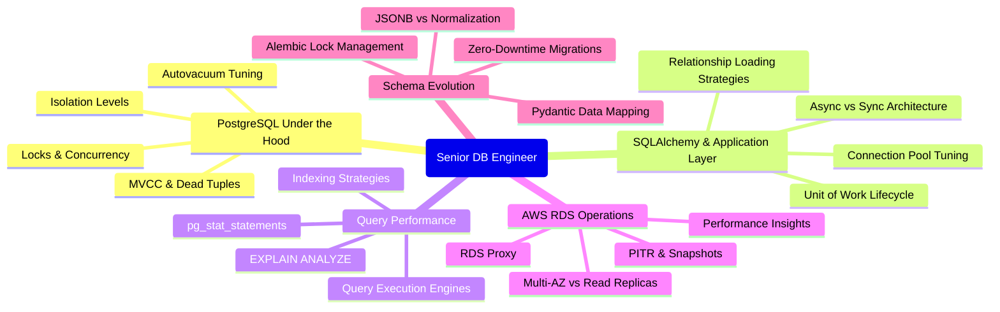

# relational-database-skills-lab

Relational Database Skills Roadmap (PostgreSQL, SQLAlchemy, FastAPI, RDS)

---

To operate at a senior level in a Python/PostgreSQL stack, your database knowledge must go far beyond writing CRUD queries and basic tables. A senior engineer must understand how the database engine works under the hood, how the application-to-database communication layer behaves, and how to design systems for high availability, zero downtime, and massive scale.

---

This roadmap details the essential database skills required for production-ready development, categorized by domain, complete with critical failure modes you will learn to prevent.

## 🗺️ Tech Skills Overview

## 1. Advanced Database Design & PostgreSQL Internals

A senior engineer designs schemas with execution plans, locking behavior, and hardware constraints in mind.

### Key Concepts to Master

- **Multi-Version Concurrency Control (MVCC) & Storage**:
    - How PostgreSQL handles updates and deletes under the hood (creating new row versions rather than in-place updates).
    - The nature of **Dead Tuples** and how **bloat** affects sequential scans and index size.
    - **Autovacuum Tuning**: Modifying `autovacuum_vacuum_scale_factor`, `autovacuum_vacuum_threshold`, and `vacuum_cost_limit` for write-heavy tables to prevent performance degradation.
- **Advanced Indexing (Beyond B-Trees)**:
    - **GIN (Generalized Inverted Index)**: Crucial for indexing **JSONB** documents and **full-text search**.
    - **BRIN (Block Range Index)**: Extremely useful for massive, **naturally ordered datasets** (e.g., timeseries data or log tables) to save disk space.
    - **Partial & Expression Indexes**: Optimizing queries like `WHERE active = true` or `WHERE LOWER(email) = ...` without indexing irrelevant rows.
- **Complex Data Types**:
    - **JSONB vs. Structured Tables**: Knowing when to use **document storage vs. normalization** (indexing JSONB using GIN, JSONB path operations).
    - **UUIDs**: Storing UUIDv4 vs. sequential UUIDs (like UUIDv7) to prevent index fragmentation in high-throughput inserts.
    - **Range Types & Array Types**: Using specialized types for temporal or interval-based queries.

> **IMPORTANT**
>
> **Production Failure Prevented**: Transaction ID Wraparound_. If Autovacuum is misconfigured or blocked by long-running transactions, the database will eventually stop accepting writes and go into emergency recovery mode to prevent data corruption.

## 2. SQLAlchemy 2.0 & Application Integration (FastAPI & Pydantic)

Bridging the gap between Python's object-oriented nature and relational databases requires high control over query generation and session states.

### Key Concepts to Master

- **Relationship Loading Strategies**:
    - Eliminating the **N+1 query problem** entirely.
    - `joinedload()`: Using SQL `JOIN` (best for 1-to-1 or Many-to-1 relationships).
    - `selectinload()`: Executing a second query using `IN` (best for 1-to-Many or Many-to-Many relationships).
    - `subqueryload()` vs. `selectinload()`: Understanding why `selectinload` is generally preferred in SQLAlchemy 2.0 due to performance and simpler execution.
- **Async Session Management in FastAPI**:
    - Lifecycle of `AsyncSession` using FastAPI's dependency injection (`Depends`).
    - Preventing session leakage across concurrent requests.
    - The internal mechanics of how SQLAlchemy wraps sync drivers in greenlets (via `asyncpg`).
- **Connection Pool Tuning**:
    - Settings: `pool_size`, `max_overflow`, `pool_recycle`, and `pool_pre_ping`.
    - Sizing calculation: (`Max Concurrent Workers * DB Connections Per Worker) + Headroom < Postgres max_connections`.
- **Pydantic v2 Serialization & Type Constraints**:
    - Using `model_validate(db_obj, from_attributes=True)` to convert ORM objects efficiently.
    - Decoupling schemas: Separate Pydantic schemas for **Request**, **Response**, and **Database representation**.
    - Validating complex JSONB columns dynamically in Python before persisting.

> **WARNING**
>
> **Production Failure Prevented: Connection Pool Exhaustion**. Misconfigured FastAPI async connections can cause the pool to fill up during traffic spikes, throwing TimeoutError: QueuePool limit of size X overflow Y reached and causing complete API outages.

## 3. Query Performance, Execution Plans & Diagnostics

You must be able to read the database's mind. A senior engineer does not guess why a query is slow; they ask the database.

### Key Concepts to Master

- **Reading** `EXPLAIN (ANALYZE, BUFFERS)`:
    - Understanding the difference between planning time and execution time.
    - Identifying scans: **Seq Scan** (table scans), **Index Scan**, **Index Only Scan**, and **Bitmap Index Scan**.
    - Recognizing join types: **Nested Loop** (small datasets), **Hash Join** (large unsorted datasets), and **Merge Join** (sorted datasets).
    - Analyzing **Buffers**: Measuring database cache hits vs. disk reads (`shared hit`, `read`, `written`).
- **Advanced Locking Mechanics**:
    - Row-level locks (`SELECT ... FOR UPDATE, FOR SHARE`).
    - Non-blocking queries: Using `SKIP LOCKED` or `NOWAIT` to build scalable, distributed processing/queue systems in Postgres.
    - Identifying deadlock patterns and writing transactional code that updates rows in a deterministic order.
- **Production Observability**:
    - Activating and querying `pg_stat_statements` to find the most expensive queries by total execution time or resource consumption.
    - Querying `pg_stat_activity` to diagnose active locks, blocked queries, and connection states.

| Scan Type      | Cache Friendly? | Cost Profile  | Best Used For                                                          |
| -------------- | --------------- | ------------- | ---------------------------------------------------------------------- |
| Idex Only Scan | YES             | Extremely Low | Queries where all requested columns are part of the index itself.      |
| Index Scan     | YES             | Low           | Fetching a small subset of rows from a large table.                    |
| Bitmap Scan    | Yes             | Medium        | Combining multiple conditions with indexes before pulling data blocks. |
| Seq Scan       | NO              | High          | Reading a significant percentage of the table or missing index         |

## 4. AWS RDS PostgreSQL Infrastructure & Reliability

Production databases run on managed infrastructure. A senior Python engineer must coordinate with DevOps/SRE to ensure high availability and recoverability.

## Key Concepts to Master

- **Scaling & Topology**:
    - **Multi-AZ Deployments**: Synchronous physical replication to a standby instance in another Availability Zone for automatic failover.
    - **Read Replicas**: Asynchronous logical/physical replication. Offloading reporting, analytics, and read-heavy FastAPI endpoints to replicas (using read/write routing in SQLAlchemy).
- **Connection Multiplexing (RDS Proxy / PgBouncer)**:
    - Why RDS Proxy is critical for serverless or highly concurrent containerized FastAPI architectures (pins connections, manages failovers gracefully, reduces memory overhead on PostgreSQL).
- **Backup & Disaster Recovery**:
    - Understanding **Point-in-Time Recovery (PITR)** and how **Write-Ahead Logs (WAL)** are shipped to S3.
    - Simulating disasters: Knowing the _recovery time objective (RTO)_ and _recovery point objective (RPO)_.
- **RDS Diagnostics**:
    - **AWS Performance Insights**: Analyzing DB Load using _Average Active Sessions (AAS)_ sliced by SQL, hosts, or locks.
    - Metric thresholds in CloudWatch: `FreeableMemory`, `WriteLatency`, `ReadLatency`, and `DiskQueueDepth`.

## 5. Schema Evolution & Zero-Downtime Migrations

Databases in production are moving trains. Changing the schema cannot stop the train.

### Key Concepts to Master

- **Alembic Lock Mitigation**:
    - Every DDL (Data Definition Language) change requires an exclusive lock on the table. If a migration blocks, all incoming application queries block behind it, causing cascading outages.
    - Setting a **lock timeout** in migration scripts (`SET lock_timeout = '2s'`) so migrations fail gracefully rather than taking down the app.
- **Safe vs. Unsafe Operations**:
    - **Unsafe**: Adding a column `NOT NULL` with a default value on a table with millions of rows (rewrites the table, locks it).
    - **Safe**: Add column as nullable -> backfill data in batches -> add `NOT NULL` constraint -> add validation.
    - **Unsafe**: Creating an index directly (**CREATE INDEX**).
    - **Safe**: Creating an index concurrently (**CREATE INDEX CONCURRENTLY**), which does not block writes (requires disabling transaction blocks in Alembic).
- **Renaming Columns/Tables**:
    - Accomplishing this using a multi-step migration (Expand/Contract phase) where the application code reads/writes to both the old and new columns/tables until the old one is deprecated.
