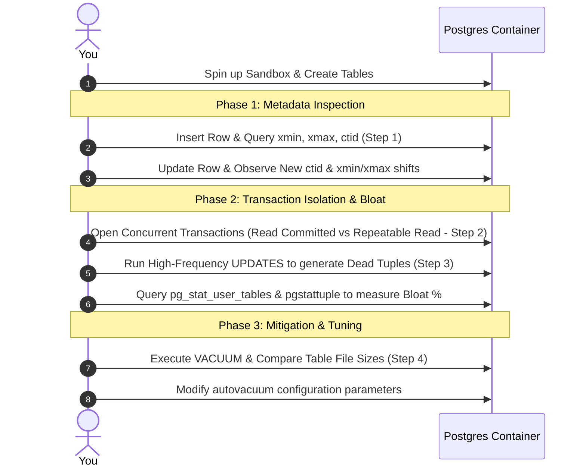

# Practical Lab: Mastering Multi-Version Concurrency Control (MVCC) and Storage

## 📌 Lab Overview & Objectives

Multi-Version Concurrency Control (MVCC) is the core mechanism PostgreSQL uses to handle concurrent read and write operations. Instead of locking rows and blocking readers, PostgreSQL keeps multiple versions of the same row simultaneously.
In this lab, you will peek under the hood of PostgreSQL to physically observe MVCC row versions, intentionally generate table bloat through transaction emulation, and practice diagnostic and mitigation strategies essential for high-throughput production environments.

### Key Skills You Will Master

- Inspecting physical row metadata using PostgreSQL hidden system columns (`xmin`, `xmax`, `ctid`).
- Analyzing how transactions isolate data at different isolation levels (`Read Committed` vs. `Repeatable Read`).
- Measuring and diagnosing "table bloat" caused by dead tuples.
- Tuning and monitoring manual `VACUUM` and automated `autovacuum` routines.

---

## 🛠️ Prerequisites & Environment Setup

This lab runs in an isolated local environment to allow intrusive diagnostics without risk.

- **Database Engine**: PostgreSQL 17 (via Docker)
- **Application Layer**: Python 3.13, SQLAlchemy 2.0+, and `psycopg3` (async/sync driver)
- **Dependencies**: Already specified in the workspace `pyproject.toml` and managed by `uv`

### Workspace Structure

Your lab folder is organized as follows:

```text
relational-database-skills-lab/
└── labs/
    └── 001-mvcc-internals/
        ├── pyproject.toml         # Lab-specific dependencies
        ├── docker-compose.yml     # PostgreSQL container setup
        ├── .env.example           # Environment variables template
        ├── app/
        │   ├── __init__.py
        │   ├── config.py          # Database configuration
        │   ├── dependencies.py    # SQLAlchemy session & connection management
        │   └── models.py          # ORM definitions with system columns
        ├── scripts/
        │   └── diagnostic.sql     # SQL queries to interrogate pg_catalog
        ├── lab_step_1.py          # Step 1: Metadata observation script
        ├── lab_step_2.py          # Step 2: Transaction isolation experiments
        ├── lab_step_3.py          # Step 3: Table bloat generation script
        └── README.md              # Lab workbook (This file)
```

### Initial Bootstrap:

1. Open your terminal and navigate to the lab folder:
    ```bash
    cd labs/001-mvcc-internals
    ```
2. Copy the environment variables template and configure if needed:
    ```bash
    cp .env.example .env
    ```
3. Launch the PostgreSQL database container in the background:
    ```bash
    docker compose up -d
    ```
4. From the project root, sync dependencies using `uv`:
    ```bash
    cd ../..
    uv sync --all-packages
    ```
5. Activate the virtual environment:
    ```bash
    source .venv/bin/activate
    ```
6. Verify the database is online and reachable:
    ```bash
    docker exec -it postgres pg_isready -U postgres -d mvcc_internals
    ```

---

## 📝 Lab Flow & Sequence



---

## 🔬 Core Lab Steps & Content

### Step 1: Visualizing Hidden Row Metadata (Physical Row Mechanics)

#### 📘 Step 1 Theory: Under the Hood of a PostgreSQL Row (Tuples & Pages)

In PostgreSQL, tables are physically stored on disk in files that are divided into fixed-size chunks called **Pages** (each page is exactly **8 Kilobytes** long).
Inside each 8KB page, PostgreSQL stores rows as physical records called **Tuples**. Because PostgreSQL is built on MVCC, multiple versions of the same row can physically exist in the same storage page at the exact same time.
To coordinate this without data corruption, PostgreSQL appends a **tuple header** to every single row. This header contains hidden, read-only system columns that we can query explicitly:

- **`ctid` (Physical Storage Pointer)**
    - **What it represents**: A tuple of `(page_number, tuple_offset)` indicating the physical coordinates of the row version on your hard drive.
    - **Why it matters**: `(0, 1)` means page 0, tuple slot 1. When a row is modified or recreated, its `ctid` changes, proving it has physically migrated to a new storage slot.
- **`xmin` (The Insertion Marker)**
    - **What it represents**: The unique Transaction ID (txid) of the transaction that **created/inserted** this physical row version.
    - **Why it matters**: A transaction will _only_ see this row if its own Transaction ID is greater than or equal to `xmin` (and if transaction `xmin` has successfully committed).
- **`xmax` (The Expiry/Deletion Marker)**
    - **What it represents**: The Transaction ID of the transaction that **deleted** or **updated** this row version.
    - **Why it matters**: If `xmax` is `0`, the row version is active and current. If `xmax` is filled with a Transaction ID (e.g., `1002`), it tells Postgres that the row is expired (deleted or updated) and should be hidden from future transactions.

#### The Anatomy of Database Operations:

- **`INSERT`**: PostgreSQL writes a tuple. `xmin` is marked with the active txid, `xmax` is set to `0`, and a `ctid` is assigned (e.g., `(0, 1)`).
- **`UPDATE` (Delete + Insert)**: PostgreSQL **never updates in-place**. Instead, it sets the `xmax` of the existing tuple to the active txid (marking it as expired). It then inserts a **brand-new physical tuple** in a new slot in the page, assigning it a fresh `ctid` (e.g., `(0, 2)`) and setting its `xmin` to the active txid.
- **`DELETE`**: The row is not physically deleted immediately. Its `xmax` is marked with the active txid. It remains stored on disk until a `VACUUM` process reclaims it.

#### 🧪 Step 1 Lab Execution

Run the pre-configured script that automates these transactions and displays physical properties at every stage.
Execute the script:

```bash
python labs/001-mvcc-internals/lab_step_1.py
```

> **Observe the output**: Pay close attention to how the `ctid` shifts from `(0, 1)` to `(0, 2)` during the `UPDATE` phase, and notice how the `xmax` shifts to show the active transaction ID during the `DELETE` phase before the final commit.

---

### Step 2: Transaction Isolation Levels

#### 📘 Step 2 Theory: Concurrency Control and Read Phenomena

When multiple transactions execute concurrently, the SQL standard defines four transaction isolation levels to balance performance against concurrency anomalies:

1. **Dirty Reads**: Reading uncommitted data from another transaction. (Prevented in Postgres by default).
2. **Non-Repeatable Reads**: Reading the same row twice in one transaction and getting different values because another transaction committed an update in between.
3. **Phantom Reads**: Querying a range of rows twice in one transaction and getting a different set of rows because another transaction inserted new rows in between.

PostgreSQL supports three isolation levels:

- `Read Committed` (Default): Each query inside a transaction only sees data committed _before the query started_. If another transaction commits changes during your transaction, subsequent queries will see those updates (allowing non-repeatable reads).
- `Repeatable Read`: A query inside a transaction only sees data committed _before the transaction started_. Even if other concurrent transactions commit changes, your transaction will observe the exact same snapshot of the database from the moment it began.
- `Serializable`: The strictest level. It emulates serial transaction execution, throwing serialization failures (`40001`) if concurrent transactions attempt to write to overlapping datasets.

#### 🧪 Step 2 Lab Execution

You will open two concurrent database shell sessions (Session A and Session B) using Docker to observe isolation behavior.

##### Setup: Boot two terminal windows and log into PostgreSQL

```bash
# Terminal A (Session A)
docker exec -it postgres psql -U postgres -d mvcc_internals
# Terminal B (Session B)
docker exec -it postgres psql -U postgres -d mvcc_internals
```

#### EXPERIMENT 1: The default `Read Committed` Behavior

Run these queries sequentially to see how read consistency behaves:

1. **Session A**: Create a record and check it.
    ```sql
    INSERT INTO users (username, balance) VALUES ('bob', 100.00);
    ```
2. **Session B**: Start a transaction and read Bob's balance.
    ```sql
    BEGIN TRANSACTION ISOLATION LEVEL READ COMMITTED;
    SELECT username, balance FROM users WHERE username = 'bob'; -- Returns 100.00
    ```
3. **Session A**: Update Bob's balance and commit it.
    ```sql
    UPDATE users SET balance = 200.00 WHERE username = 'bob';
    ```
4. **Session B**: Query Bob's balance again _inside the same transaction_.
    ```sql
    SELECT username, balance FROM users WHERE username = 'bob'; -- Returns 200.00! (Non-repeatable read occurred)
    COMMIT;
    ```

**Key Insight**: In Read Committed isolation, each query statement gets a fresh snapshot of the database that includes all transactions committed before that query started. This means that within a single transaction, different queries can see different versions of the same data if other transactions commit changes in between. This is called a **non-repeatable read** and is the expected behavior at this isolation level.

**Production Implications**:
- **Default behavior in PostgreSQL**: Most applications run at Read Committed, which provides good concurrency with minimal locking overhead.
- **Report generation risk**: If generating multi-query reports (e.g., calculating totals from multiple tables), intermediate commits from other transactions can cause inconsistent results within the same report.
- **State validation**: Business logic that reads a value, performs calculations, and then updates based on that value may see stale data if another transaction commits changes between the read and write.
- **Best for**: High-throughput OLTP systems where individual query consistency is acceptable and you use explicit row-level locks (`SELECT ... FOR UPDATE`) when strict consistency is required.

#### EXPERIMENT 2: The `Repeatable Read` Snapshot Isolation

1. **Session B**: Start a Repeatable Read transaction.
    ```sql
    BEGIN TRANSACTION ISOLATION LEVEL REPEATABLE READ;
    SELECT username, balance FROM users WHERE username = 'bob'; -- Returns 200.00
    ```
2. **Session A**: Update Bob's balance and commit it.
    ```sql
    UPDATE users SET balance = 300.00 WHERE username = 'bob';
    ```
3. **Session B**: Query Bob's balance again _inside the same transaction_.
    ```sql
    SELECT username, balance FROM users WHERE username = 'bob'; -- Still returns 200.00! (Snapshot is isolated)
    COMMIT;
    ```
4. **Session B**: Now query Bob outside the transaction.
    ```sql
    SELECT username, balance FROM users WHERE username = 'bob'; -- Returns 300.00 (Updated value visible now)
    ```

**Key Insight**: In Repeatable Read isolation, PostgreSQL takes a snapshot of the entire database at the moment the transaction starts (`BEGIN`). All queries within that transaction see the exact same consistent view of the database, even if other transactions commit changes during the lifetime of your transaction. This prevents non-repeatable reads and provides transaction-level consistency.

**Production Implications**:
- **Consistent reporting**: Ideal for generating multi-query reports, data exports, or analytical workloads that require a consistent point-in-time view across multiple queries.
- **Long-running transactions**: Be cautious with long-running Repeatable Read transactions—they hold references to old row versions, which prevents `VACUUM` from cleaning up dead tuples. This can cause table bloat.
- **Update conflicts**: If your transaction tries to UPDATE or DELETE a row that was modified by another committed transaction after your snapshot began, PostgreSQL will abort your transaction with a serialization error (`could not serialize access due to concurrent update`).
- **Phantom reads**: PostgreSQL's implementation of Repeatable Read actually prevents phantom reads (new rows appearing in range queries), which goes beyond the SQL standard requirement.
- **Best for**: Financial transactions, batch processing jobs, data consistency checks, and scenarios where you need a stable view of data across multiple operations.

#### EXPERIMENT 3: The `Serializable` Isolation - Detecting Write Conflicts

Serializable isolation is the strictest level. PostgreSQL actively monitors for serialization conflicts and will abort transactions that would violate serializability. This experiment demonstrates a classic **write skew anomaly** that Serializable isolation prevents.

**Scenario Setup**: Imagine a business rule: "The combined balance of Alice and Bob must always be at least $100."

1. **Setup**: Create two users with balances.
    ```sql
    -- In Session A or B (doesn't matter which)
    DELETE FROM users; -- Clear any existing data
    INSERT INTO users (username, balance) VALUES ('alice', 80.00), ('bob', 30.00);
    -- Combined balance is $110, which satisfies our constraint
    ```

2. **Session A**: Start a Serializable transaction and check if Alice can withdraw $20.
    ```sql
    BEGIN TRANSACTION ISOLATION LEVEL SERIALIZABLE;
    
    -- Check combined balance: 80 + 30 = 110
    SELECT SUM(balance) FROM users WHERE username IN ('alice', 'bob'); -- Returns 110.00
    
    -- Alice thinks: "110 - 20 = 90, which is still < 100, so my withdrawal is INVALID... wait, let me check again"
    -- Actually Alice calculates: "If I withdraw 20, leaving 60, Bob still has 30, total = 90... that violates the rule!"
    -- But let's say Alice miscalculates and proceeds anyway:
    -- She checks: "110 - 20 = 90... hmm that's less than 100. But wait, if Bob keeps his 30, we'd have 90 total."
    -- Let's say the app logic allows it based on current snapshot:
    UPDATE users SET balance = balance - 20 WHERE username = 'alice'; -- Alice now has 60
    
    -- Don't commit yet!
    ```

3. **Session B**: Start another Serializable transaction and check if Bob can withdraw $20.
    ```sql
    BEGIN TRANSACTION ISOLATION LEVEL SERIALIZABLE;
    
    -- Check combined balance: Still sees 80 + 30 = 110 (snapshot from start of transaction)
    SELECT SUM(balance) FROM users WHERE username IN ('alice', 'bob'); -- Returns 110.00
    
    -- Bob thinks: "110 - 20 = 90, hmm that's less than 100, but barely..."
    -- Bob's app logic also allows it based on his snapshot:
    UPDATE users SET balance = balance - 20 WHERE username = 'bob'; -- Bob now has 10
    
    -- Don't commit yet!
    ```

4. **Session A**: Try to commit first.
    ```sql
    COMMIT; -- This succeeds! Alice's transaction commits first.
    ```

5. **Session B**: Now try to commit.
    ```sql
    COMMIT; -- This FAILS with serialization error!
    ```
    
    **Expected Error**:
    ```
    ERROR:  could not serialize access due to read/write dependencies among transactions
    DETAIL:  Reason code: Canceled on identification as a pivot, during commit attempt.
    HINT:  The transaction might succeed if retried.
    ```

6. **Verification**: Check the final state.
    ```sql
    -- In either session (outside transaction):
    SELECT username, balance FROM users WHERE username IN ('alice', 'bob') ORDER BY username;
    -- Result: Alice has 60.00, Bob has 30.00 (total = 90.00)
    -- Session B was rolled back, preventing the violation!
    ```

**Key Insight**: In Serializable isolation, PostgreSQL detected that both transactions read overlapping data and then modified different rows in a way that would create an anomaly if both committed. By aborting Session B with error code `40001`, it ensures that the transactions execute as if they ran serially, one after the other.

**Production Implications**:
- Your application code must handle serialization failures (`SQLSTATE 40001`) and implement retry logic.
- Serializable isolation has higher overhead than Repeatable Read due to conflict detection.
- Use Serializable when business logic requires strict consistency guarantees that cannot be enforced with row-level locks alone.

##### Automated Lab Execution

Alternatively, you can run the automated Python script that demonstrates all three isolation level experiments using concurrent threads:

```bash
python labs/001-mvcc-internals/lab_step_2.py
```

This script will automatically:
- Run Experiment 1 (Read Committed) showing non-repeatable reads
- Run Experiment 2 (Repeatable Read) showing snapshot isolation
- Run Experiment 3 (Serializable) showing write skew detection and serialization errors

---

### Step 3: Intentionally Generating & Measuring Storage Bloat

#### 📘 Step 3 Theory: Why Dead Tuples Pile Up

Because of PostgreSQL's MVCC architecture, every `UPDATE` leaves an old version of the row behind as a **Dead Tuple**, and every `DELETE` marks a tuple as dead.
If a database undergoes high-frequency updates or deletes, thousands of dead tuples accumulate. These dead tuples continue to occupy space inside the physical 8KB pages. This causes a phenomenon called **Table Bloat**.

##### The Problems with Table Bloat:

1. **Wasted Disk Space**: The table file on disk grows larger and larger even if the actual active row count remains small.
2. **Degraded Query Performance**: When performing a `Sequential Scan` (`Seq Scan`), PostgreSQL must read the **entire file** from disk into memory, including all the pages containing dead tuples. A bloated table with 1 active row and 1,000,000 dead rows takes just as long to scan as a table with 1,000,001 active rows!
   To diagnose this, PostgreSQL maintains system statistics tables like `pg_stat_user_tables` to track `n_live_tup` (live tuples) and `n_dead_tup` (dead tuples). For deep storage inspection, we can use the **`pgstattuple`** extension to analyze the exact bytes inside physical pages.

#### 🧪 Step 3 Lab Execution

Generate intense table bloat using a Python script, then run administrative queries to measure it.

##### Execute the bloat generator:

```bash
python labs/001-mvcc-internals/lab_step_3.py
```

##### Measure the bloat inside PostgreSQL:

Connect to your database via psql:

```bash
docker exec -it postgres psql -U postgres -d mvcc_internals
```

Run these SQL diagnostics (from `scripts/diagnostic.sql`):

```sql
-- Enable the physical stats analyzer extension
CREATE EXTENSION IF NOT EXISTS pgstattuple;
-- Force statistics collection views to refresh
ANALYZE users;
-- Measure the bloat percentage
SELECT
    table_len AS total_file_bytes,
    pg_size_pretty(table_len) AS file_size_on_disk,
    dead_tuple_count,
    dead_tuple_len AS dead_tuple_bytes,
    round(dead_tuple_len * 100.0 / table_len, 2) AS bloat_percentage
FROM pgstattuple('users');
```

> **Observe**: You should see a massive `bloat_percentage` (typically > 95%) because the table consists almost entirely of dead tuples created by the update flood!

### Step 4: Reclaiming Storage & Tuning Autovacuum

#### 📘 Step 4 Theory: The Mechanics of Cleanup

To clean up the dead tuples generated by MVCC, PostgreSQL uses a maintenance process called **Vacuuming**. There are two primary vacuum commands, which behave completely differently in production:

##### 1. Standard `VACUUM`

- **How it works**: It scans the table pages, identifies dead tuples, and marks their physical slot coordinates as **empty/available** for future writes.
- **Storage effect**: It does **not** shrink the table file size on disk or return space to the Operating System. Instead, it makes the empty space available for _future_ inserts or updates inside that same table.
- **Concurrency lock**: Low-level lock (`SHARE UPDATE EXCLUSIVE`). It can run completely online while your application is reading and writing to the table.

##### 2. `VACUUM FULL`

- **How it works**: It physically copies only the active (live) tuples into a brand-new storage file, discarding all dead tuples, and deletes the old bloated file.
- **Storage effect**: It physically shrinks the table file size on disk and returns the reclaimed space back to the OS immediately.
- **Concurrency lock**: **`ACCESS EXCLUSIVE`**. It blocks all reads and writes to the table. If run on a large production table, it will cause an immediate application timeout/outage.

##### Autovacuum Tuning in Production:

PostgreSQL runs `autovacuum` in the background automatically. By default, it triggers a vacuum on a table when:
$$\text{Dead Tuples Threshold} = \text{autovacuum\_vacuum\_threshold} + (\text{autovacuum\_vacuum\_scale\_factor} \times \text{Table Rows})$$
The default settings are:

- `autovacuum_vacuum_threshold = 50` rows.
- `autovacuum_vacuum_scale_factor = 0.20` (20% of the table).
  On a table with 10,000,000 rows, default autovacuum only triggers after **2,000,050 dead tuples** accumulate. This causes massive, unnecessary bloat. A senior engineer overrides these settings for high-throughput tables.

#### 🧪 Step 4 Lab Execution

##### 1. Reclaim space for future writes (Standard VACUUM)

Log into your PostgreSQL container (`psql`) and run:

```sql
-- Check physical table size before vacuum
SELECT pg_size_pretty(pg_relation_size('users'));
-- Run standard VACUUM
VACUUM users;
-- Re-check physical table size
SELECT pg_size_pretty(pg_relation_size('users'));
```

> **Observe**: The physical file size on disk **remained exactly the same**. However, if you run the `pgstattuple` query from Step 3, you will see that `dead_tuple_count` dropped to 0 and `empty_space_ratio` skyrocketed. The space was cleared internally, ready for future inserts.

##### 2. Shrink file on disk (VACUUM FULL)

```sql
-- Run VACUUM FULL
VACUUM FULL users;
-- Re-check physical table size
SELECT pg_size_pretty(pg_relation_size('users'));
```

> **Observe**: The physical file size has now dramatically shrunk (likely to 8KB or 16KB) because the bloated file was destroyed and replaced with a compact one.

##### 3. Tune Autovacuum thresholds for high-write tables

Execute this DDL to make autovacuum extremely aggressive on the `users` table:

```sql
ALTER TABLE users SET (
    autovacuum_enabled = true,
    autovacuum_vacuum_scale_factor = 0.05, -- Trigger at 5% changes
    autovacuum_vacuum_threshold = 100       -- Trigger after 100 updates/deletes
);
```

---

## 🎯 Lab Outcomes & Verification Checklist

To successfully complete this lab, you must produce and verify the following results:

- [ ] **System Column Proof**: Record and compare the `ctid` coordinates before and after the update. Explain why they changed based on the physical page theory.
- [ ] **Isolation Behavior Verification**: Document what Session B observed during Experiment 1 (Step 2) vs Experiment 2 (Step 2). Why does snapshot isolation prevent non-repeatable reads?
- [ ] **Bloat Measurement**: Record the exact table bloat percentage before vacuuming.
- [ ] **Disk Size Comparison**: Note the table size on disk before and after standard `VACUUM` and `VACUUM FULL`. Show how standard `VACUUM` does not shrink disk files.

When you are finished with your local experiment, tear down your sandbox:

```bash
docker compose down -v
```

---

## ❓ Deep-Dive Self-Assessment

Formulate answers to these production-level questions based on your observations during this lab:

1. _Why does a high-write database experience slower sequential scans over time even if the total active row count remains constant?_
2. _If `VACUUM FULL` reclaims all disk space, why shouldn't we run it on a CRON job every night in a 24/7 production environment?_
3. _What happens to a long-running transaction (e.g., an export script running for 2 hours) regarding autovacuum and dead tuples?_
