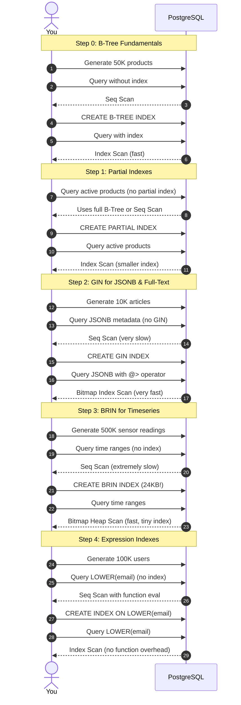

# Practical Lab: Advanced PostgreSQL Indexing Strategies

## 📌 Lab Overview & Objectives

This lab moves you beyond basic B-Tree indexes into PostgreSQL's specialized index types: **Partial Indexes**, **GIN (Generalized Inverted Index)**, **BRIN (Block Range Index)**, and **Expression Indexes**. You'll discover why a 500,000-row timeseries table can be efficiently indexed with only 24KB of storage, how to make JSONB queries 100x faster, and when a carefully designed partial index can reduce maintenance overhead by 70% while maintaining identical query performance.

In production environments, index selection directly impacts query latency, write throughput, storage costs, and system reliability. Choosing the wrong index—or worse, creating redundant indexes—can cripple database performance under load. This lab equips you with the diagnostic skills and practical knowledge to make informed indexing decisions backed by `EXPLAIN ANALYZE` data, not guesswork.

### Key Skills You Will Master

- **Partial Indexes**: Reduce index size and maintenance overhead by indexing only relevant rows (e.g., `WHERE active = true`)
- **GIN Indexes**: Accelerate JSONB containment queries (@>) and full-text search operations by 50-100x
- **BRIN Indexes**: Use block-level indexing to handle massive timeseries datasets with 99% space savings vs B-Tree
- **Expression Indexes**: Enable efficient queries on computed columns like `LOWER(email)` or concatenated fields
- **Index Selection Strategy**: Use EXPLAIN (ANALYZE, BUFFERS) to diagnose query plans and choose optimal index types
- **Production Patterns**: Understand write costs, maintenance implications, and when to avoid indexing

---

## 🛠️ Prerequisites & Environment Setup

This lab runs in an isolated local PostgreSQL 17 environment with custom performance tuning to allow realistic index behavior observation.

- **Database Engine**: PostgreSQL 17 (via Docker) with tuned settings for index testing
- **Application Layer**: Python 3.13, SQLAlchemy 2.0, Faker (data generation)
- **Dependencies**: Managed by `uv` from workspace root
- **Additional Tools**: `psql` for manual SQL execution, `pg_stat_statements` diagnostics

### Workspace Structure

Your lab folder is organized as follows:

```text
relational-database-skills-lab/
└── labs/
    └── 002-advanced-indexing/
        ├── pyproject.toml         # Lab-specific dependencies
        ├── docker-compose.yml     # PostgreSQL 17 container
        ├── .env.example           # Environment variables template
        ├── app/
        │   ├── __init__.py
        │   ├── config.py          # Database URI configuration
        │   ├── dependencies.py    # Session factory, init utilities
        │   └── models.py          # Product, Article, SensorReading, User models
        ├── scripts/
        │   ├── diagnostic.sql     # Index statistics and analysis queries
        │   └── performance_tests.sql  # EXPLAIN ANALYZE test queries
        ├── lab_step_0.py          # Step 0: B-Tree index fundamentals
        ├── lab_step_1.py          # Step 1: Partial Indexes & B-Tree baseline
        ├── lab_step_2.py          # Step 2: GIN for JSONB & full-text search
        ├── lab_step_3.py          # Step 3: BRIN for timeseries data
        ├── lab_step_4.py          # Step 4: Expression indexes & comparison
        └── README.md              # Lab workbook (This file)
```

### Initial Bootstrap

1. Open your terminal and navigate to the lab folder:
    ```bash
    cd labs/002-advanced-indexing
    ```

2. Copy the environment variables template:
    ```bash
    cp .env.example .env
    # Edit .env if you need to change ports or credentials
    ```

3. Launch the PostgreSQL container:
    ```bash
    docker compose up -d
    ```

4. From the project root, sync dependencies:
    ```bash
    cd ../..
    uv sync --all-packages
    ```

5. Activate the virtual environment:
    ```bash
    source .venv/bin/activate
    ```

6. Verify PostgreSQL is online:
    ```bash
    docker exec -it postgres pg_isready -U postgres -d advanced_indexing
    ```
    
    You should see: `advanced_indexing:5432 - accepting connections`

---

## 📝 Lab Flow & Sequence

This lab progresses through five steps, starting with B-Tree fundamentals and advancing to specialized index types:



---

## 🔬 Core Lab Steps & Content

### Step 0: B-Tree Index Fundamentals

#### 📘 Step 0 Theory: Understanding B-Tree Indexes

**What are B-Tree Indexes?**

B-Tree (Balanced Tree) is PostgreSQL's default and most versatile index type. When you write `CREATE INDEX` without specifying a type, you're creating a B-Tree index.

```sql
-- These are equivalent - B-Tree is the default
CREATE INDEX idx_products_category ON products(category);
CREATE INDEX idx_products_category ON products USING BTREE (category);
```

**How B-Tree Indexes Work**

A B-Tree is a self-balancing tree data structure that maintains sorted data for efficient search, insertion, and deletion:

1. **Root Node**: The entry point, contains keys and pointers to child nodes
2. **Internal Nodes**: Guide the search by narrowing the range
3. **Leaf Nodes**: Contain the actual indexed values and pointers to table rows
4. **Balanced**: All leaf nodes are at the same depth, ensuring consistent O(log n) performance

Example structure for `products.category` index:
```
Root: ["Clothing", "Home & Garden"]
   ├─ Leaf: ["Books", "Clothing"] → Row pointers
   ├─ Leaf: ["Electronics", "Home & Garden"] → Row pointers
   └─ Leaf: ["Sports", "Toys"] → Row pointers
```

**Why B-Tree is PostgreSQL's Default**

B-Tree indexes excel at:
- **Equality queries**: `WHERE category = 'Electronics'`
- **Range queries**: `WHERE price BETWEEN 1000 AND 5000`
- **Pattern matching**: `WHERE name LIKE 'Sony%'` (prefix only)
- **Sorting**: `ORDER BY created_at DESC`
- **Min/Max lookups**: `SELECT MIN(price)` can use the index

**When PostgreSQL Uses a B-Tree Index**

The query planner uses a cost-based model to decide between:
1. **Index Scan**: Read index entries, follow pointers to table rows (fast for selective queries)
2. **Bitmap Index Scan**: Build bitmap of matching pages, then scan pages (good for moderate selectivity)
3. **Sequential Scan**: Read entire table sequentially (faster when query returns >5-10% of rows)

**Performance Characteristics**

| Operation  | Time Complexity | Notes                           |
| ---------- | --------------- | ------------------------------- |
| Search     | O(log n)        | Balanced tree depth             |
| Insert     | O(log n)        | May trigger page splits         |
| Delete     | O(log n)        | May require rebalancing         |
| Range Scan | O(log n + k)    | k = number of matching rows     |
| Space      | O(n)            | ~40-60% of table size typically |

**When B-Tree is NOT Optimal**

❌ **Avoid B-Tree for**:
- JSONB containment queries (use GIN instead)
- Full-text search (use GIN instead)
- Massive timeseries tables (use BRIN instead)
- Queries on computed values without expression indexes
- Columns with very low cardinality (e.g., boolean with 50/50 split)

##### Production Pattern: Index Maintenance

B-Tree indexes require maintenance:
- **Bloat**: Deleted rows leave gaps, increasing index size
- **Fragmentation**: Random updates can fragment the tree
- **Statistics**: `ANALYZE` updates statistics used by the query planner

```sql
-- Regular maintenance
REINDEX INDEX idx_products_category;  -- Rebuild index (locks table)
ANALYZE products;                      -- Update statistics
```

#### 🧪 Step 0 Lab Execution

**Automated Execution** (Recommended):

```bash
cd labs/002-advanced-indexing
python lab_step_0.py
```

The script will:
1. Generate 50,000 sample products with realistic data distribution
2. Demonstrate Sequential Scan behavior without indexes
3. Show the automatic B-Tree index on the primary key (`id`)
4. Create a B-Tree index on the `category` column
5. Compare query performance: Seq Scan vs Index Scan
6. Explain B-Tree characteristics and when PostgreSQL uses indexes
7. Display index statistics from `pg_stat_user_indexes`

**Manual Deep Dive**:

```bash
docker exec -it postgres psql -U postgres -d advanced_indexing

# Test query without index on category
EXPLAIN (ANALYZE, BUFFERS)
SELECT id, name, price
FROM products
WHERE category = 'Electronics'
LIMIT 100;
-- Observe: Seq Scan

# Create B-Tree index
CREATE INDEX idx_products_category ON products(category);

# Re-run the same query
EXPLAIN (ANALYZE, BUFFERS)
SELECT id, name, price
FROM products
WHERE category = 'Electronics'
LIMIT 100;
-- Observe: Index Scan or Bitmap Index Scan

# Check index size and usage
SELECT 
    indexname,
    pg_size_pretty(pg_relation_size(indexrelid)) as size,
    idx_scan as scans,
    idx_tup_read as tuples_read
FROM pg_stat_user_indexes
WHERE tablename = 'products';
```

> **Observe**: 
> - Sequential scan reads every row in the table
> - Index Scan uses the B-Tree to find matching rows quickly
> - Query planning time vs execution time in EXPLAIN output
> - BUFFERS shows difference in disk reads between scan types

**Key Insight**: B-Tree indexes transform O(n) table scans into O(log n) lookups for selective queries. PostgreSQL's query planner intelligently chooses the fastest execution path based on estimated costs.

**Production Implications**:
- **Query Performance**: 10-1000x speedup for selective queries on indexed columns
- **Write Cost**: Every INSERT/UPDATE/DELETE must maintain the index structure
- **Storage Overhead**: Indexes typically consume 40-60% of table size
- **Cache Efficiency**: Indexes compete with table data for `shared_buffers`
- **Best for**: Primary keys, foreign keys, frequently filtered columns, sort columns

---

### Step 1: Partial Indexes and B-Tree Baseline

#### 📘 Step 1 Theory: Partial Indexes

**What are Partial Indexes?**

A partial index is a B-Tree index with a `WHERE` clause that restricts which rows are indexed. Instead of indexing every row in a table, you index only the subset that matches your filter condition.

```sql
-- Full index (indexes all 50,000 rows)
CREATE INDEX idx_products_full ON products(id, category, price);

-- Partial index (indexes only ~7,500 active rows - 15%)
CREATE INDEX idx_products_active ON products(id, category, price) 
WHERE active = true;
```

**Why Use Partial Indexes?**

In most production systems, queries heavily favor certain subsets of data. Consider:
- E-commerce: You query `active = true` products 99% of the time; discontinued products are rarely accessed
- User systems: You query `deleted_at IS NULL` users; soft-deleted users are ignored
- Orders: You query recent orders (`created_at > NOW() - INTERVAL '90 days'`); archived orders are cold storage

Indexing inactive/deleted/archived rows wastes:
1. **Disk space**: 85% smaller index when only 15% of rows are active
2. **Write performance**: Every `INSERT`/`UPDATE`/`DELETE` must update the index
3. **Cache efficiency**: Smaller indexes fit better in `shared_buffers`, improving hit ratios

**How PostgreSQL Uses Partial Indexes**

The query planner will ONLY use a partial index if your query's `WHERE` clause is **at least as restrictive** as the index's `WHERE` clause:

```sql
-- This query CAN use the partial index
SELECT * FROM products WHERE active = true AND category = 'Electronics';

-- This query CANNOT use the partial index (less restrictive)
SELECT * FROM products WHERE category = 'Electronics';
```

**When to Use Partial Indexes in Production**

| Scenario                                      | Use Partial Index? | Reasoning                             |
| --------------------------------------------- | ------------------ | ------------------------------------- |
| 80% of queries filter on `active = true`      | ✅ YES              | High selectivity, clear filter        |
| Table has soft deletes (`deleted_at IS NULL`) | ✅ YES              | Non-deleted rows are primary workload |
| Status column with 10 different values        | ❌ NO               | Too many partial indexes needed       |
| Archive table (all old data)                  | ❌ NO               | No dominant filter pattern            |

#### 🧪 Step 1 Lab Execution

**Automated Execution** (Recommended):

```bash
cd labs/002-advanced-indexing
python lab_step_1.py
```

The script will:
1. Generate 50,000 sample products (15% active, 85% inactive - simulating archived product catalog)
2. Show baseline query performance WITHOUT a partial index (using Seq Scan + Sort)
3. Create a partial index on `active = true` products and run ANALYZE
4. Demonstrate the performance improvement (Index Scan replaces Seq Scan)
5. Compare partial index size vs. full index size on same columns

**Manual Execution** (For deeper exploration):

```bash
# Connect to the database
docker exec -it postgres psql -U postgres -d advanced_indexing

# Run the baseline query (note the ORDER BY)
EXPLAIN (ANALYZE, BUFFERS)
SELECT id, category, price
FROM products
WHERE active = true
ORDER BY category, price
LIMIT 100;

# Create the partial index
CREATE INDEX idx_products_active 
ON products(id, category, price) 
WHERE active = true;

# Update statistics for the query planner
ANALYZE products;

# Re-run the query and compare
EXPLAIN (ANALYZE, BUFFERS)
SELECT id, category, price
FROM products
WHERE active = true
ORDER BY category, price
LIMIT 100;

# Check index size
SELECT pg_size_pretty(pg_relation_size('idx_products_active'));
```

> **Observe**: The query plan changes from **Seq Scan + Sort** to **Index Only Scan + Sort** using the partial index. Execution time drops significantly. The partial index is ~85% smaller than a full index (7,500 vs 50,000 rows).

**Key Insight**: Partial indexes provide identical query performance to full indexes while reducing storage costs and write overhead. The ORDER BY clause forces the query planner to use the index for efficient sorted retrieval. With low selectivity (15% active), the index is dramatically more efficient than a sequential scan.

**Production Implications**:
- **Storage Savings**: 85% reduction in index size when only 15% of rows are active (typical for archived product catalogs)
- **Write Performance**: Fewer index entries to maintain during INSERT/UPDATE/DELETE operations
- **Cache Efficiency**: Smaller indexes = better `shared_buffers` utilization
- **Query Planner**: ANALYZE ensures PostgreSQL has accurate statistics to choose the optimal execution plan
- **Best for**: SaaS applications with soft deletes, e-commerce with active/inactive products, user systems with status flags

**Note**: Since each standalone step script calls `init_db()` at the start to clean up and rebuild database schemas, running this script generates fresh test data for products.

---

### Step 2: GIN Indexes for JSONB and Full-Text Search

#### 📘 Step 2 Theory: Generalized Inverted Indexes (GIN)

**What are GIN Indexes?**

GIN (Generalized Inverted Index) is a specialized index type for **multi-value columns** where a single row can contain many searchable elements. Think of it as an inverted index similar to those used by search engines: instead of mapping rows to values, it maps values to rows.

Traditional B-Tree index:
```
Row 1 → {"color": "red", "features": ["bluetooth", "wireless"]}
Row 2 → {"color": "blue", "features": ["waterproof"]}
```

GIN index:
```
"red" → [Row 1]
"blue" → [Row 2]
"bluetooth" → [Row 1]
"wireless" → [Row 1]
"waterproof" → [Row 2]
```

**Why GIN for JSONB?**

PostgreSQL's JSONB type stores JSON documents as binary, enabling efficient querying. However, without a GIN index, JSONB queries require full table scans because:
1. JSONB documents can have arbitrary structure
2. Nested keys and values can appear anywhere
3. B-Tree indexes don't support the `@>` (containment) operator

A GIN index on JSONB extracts all keys and values and indexes them individually, enabling:
- **Containment queries**: `WHERE attributes @> '{"color": "red"}'`
- **Existence queries**: `WHERE attributes ? 'brand'`
- **Path queries** (with `jsonb_path_ops`): Faster for deeply nested structures

**GIN for Full-Text Search**

PostgreSQL's full-text search uses `tsvector` (text search vector) to store pre-processed, normalized words with positional information. A GIN index on `tsvector` enables lightning-fast searches:

```sql
-- Generate search vector from article content
UPDATE articles SET search_vector = to_tsvector('english', title || ' ' || content);

-- Create GIN index
CREATE INDEX idx_articles_fts ON articles USING GIN (search_vector);

-- Query with boolean operators
SELECT * FROM articles 
WHERE search_vector @@ to_tsquery('english', 'postgresql & performance');
```

**GIN Performance Characteristics**

| Aspect                | Characteristic                | Impact                             |
| --------------------- | ----------------------------- | ---------------------------------- |
| **Read Performance**  | Excellent for containment/FTS | 50-100x faster than Seq Scan       |
| **Write Performance** | Slower than B-Tree            | Must update inverted index entries |
| **Index Size**        | Large (2-3x table size)       | Stores every key-value pair        |
| **Maintenance**       | Higher WAL generation         | More I/O during writes             |

**When to Use GIN in Production**

✅ **Use GIN when**:
- Querying JSONB with containment and existence `@>`, `?`, `?|`, `?&` operators
- Implementing full-text search with text search matching `@@` operator
- Indexing PostgreSQL arrays for containment queries
- Read-heavy workloads where query performance is critical

❌ **Avoid GIN when**:
- Write-heavy workloads (INSERT/UPDATE dominant)
- JSONB queries use extraction operators `->` or `->>` for known keys (use expression indexes instead)
- Storage is constrained (GIN indexes are large)

##### Production Pattern: jsonb_path_ops vs. Default GIN

PostgreSQL offers two GIN operator classes for JSONB:

```sql
-- Default GIN (supports all JSONB operators, larger)
CREATE INDEX idx_attributes_gin ON products USING GIN (attributes);

-- jsonb_path_ops (smaller, faster, containment-only)
CREATE INDEX idx_attributes_gin_path ON products USING GIN (attributes jsonb_path_ops);
```

**Rule of thumb**: Use `jsonb_path_ops` if you only need `@>` (containment) queries. It's 20-30% smaller and faster, but doesn't support existence `?`, `?|`, `?&` operators.

#### 🧪 Step 2 Lab Execution

**Automated Execution**:

```bash
python lab_step_2.py
```

The script will:
1. Generate 10,000 articles with JSONB tags and full-text search vectors
2. Test JSONB queries WITHOUT GIN (observe Seq Scan)
3. Create GIN index on `products.attributes` (from Step 2 data)
4. Test JSONB queries WITH GIN (observe Bitmap Index Scan)
5. Test full-text search WITHOUT GIN on `articles.search_vector`
6. Create GIN index on `articles.search_vector`
7. Test full-text search WITH GIN  (observe Bitmap Index Scan)
8. Demonstrate GIN on JSONB arrays (tags)

**Manual Deep Dive**:

```bash
docker exec -it postgres psql -U postgres -d advanced_indexing

# Test JSONB containment without GIN
EXPLAIN (ANALYZE, BUFFERS)
SELECT id, name, attributes->>'color' 
FROM products
WHERE attributes @> '{"color": "red"}';

# Create GIN index
CREATE INDEX idx_products_attributes_gin ON products USING GIN (attributes);

# Re-test (observe the dramatic improvement)
EXPLAIN (ANALYZE, BUFFERS)
SELECT id, name, attributes->>'color' 
FROM products
WHERE attributes @> '{"color": "red"}';

# Test full-text search
EXPLAIN (ANALYZE, BUFFERS)
SELECT id, title FROM articles
WHERE search_vector @@ to_tsquery('english', 'postgresql & performance');

# Create GIN on tsvector
CREATE INDEX idx_articles_search_vector_gin ON articles USING GIN (search_vector);

# Re-test
EXPLAIN (ANALYZE, BUFFERS)
SELECT id, title FROM articles
WHERE search_vector @@ to_tsquery('english', 'postgresql & performance');
```

> **Observe**: 
> - JSONB queries drop from 50ms+ (Seq Scan) to <5ms (Bitmap Index Scan)
> - Full-text search becomes 50-100x faster with GIN
> - Index size is 2-3x the original table size
> - `BUFFERS` output shows dramatically fewer disk blocks read

**Key Insight**: GIN indexes are mandatory for production JSONB and full-text search workloads. The write cost is acceptable compared to the massive read performance gains.

**Production Implications**:
- **Read Performance**: Enables sub-10ms response times for JSONB searches on millions of rows
- **Write Cost**: Expect 20-40% slower INSERTs due to inverted index maintenance
- **Storage**: Plan for 2-3x table size in GIN index storage
- **Best for**: Product catalogs with JSONB metadata, logging systems with searchable JSON, full-text search features

---

### Step 3: BRIN Indexes for Timeseries Data

#### 📘 Step 3 Theory: Block Range Indexes (BRIN)

**What are BRIN Indexes?**

BRIN (Block Range Index) is PostgreSQL's most space-efficient index type, designed for **massive tables with natural ordering**. Instead of indexing every row individually (like B-Tree), BRIN indexes *ranges of physical blocks* (pages) on disk.

A BRIN index stores:
- Min/max values for each block range (default: 128 pages = 1MB)
- Summary data allowing the query planner to skip irrelevant blocks

For a timeseries table:
```
Block Range 1 (pages 0-127):   timestamp MIN=2026-01-01, MAX=2026-01-05
Block Range 2 (pages 128-255): timestamp MIN=2026-01-06, MAX=2026-01-10
Block Range 3 (pages 256-383): timestamp MIN=2026-01-11, MAX=2026-01-15
```

Query: `WHERE recorded_at >= '2026-01-12'`  
→ PostgreSQL skips Block Ranges 1 and 2 entirely, only scans Range 3+

**Why BRIN is Revolutionary for Timeseries**

Traditional B-Tree index on 10M row timeseries table:
- **Index size**: ~400MB (growing with every INSERT)
- **Maintenance cost**: Every INSERT updates the B-Tree
- **Cache impact**: Large index competes with data for `shared_buffers`

BRIN index on same table:
- **Index size**: ~200KB (99.95% smaller!)
- **Maintenance cost**: Minimal (updates block range summaries only)
- **Cache impact**: Entire index fits in L2 CPU cache

**How BRIN Works**

1. **Data must be naturally ordered**: BRIN relies on physical correlation between column values and disk layout
2. **Query planner uses min/max ranges**: Eliminates entire block ranges that can't contain matching rows
3. **Bitmap Heap Scan**: PostgreSQL builds a bitmap of relevant pages, then scans them

**When to Use BRIN**

✅ **Perfect for BRIN**:
- **Timeseries data**: Logs, sensor readings, financial ticks (naturally ordered by timestamp)
- **Append-only tables**: Data inserted in order, never updated randomly
- **Massive tables**: 10M+ rows where B-Tree overhead is painful
- **Range queries**: `WHERE timestamp BETWEEN X AND Y`

❌ **Terrible for BRIN**:
- **Randomly updated data**: User profiles, product inventory (no natural order)
- **Point lookups**: `WHERE id = 12345` (B-Tree is superior)
- **Small tables**: <1M rows (B-Tree overhead is negligible)
- **Frequently updated columns**: BRIN efficiency degrades if physical order breaks

##### Production Failure Scenario: When BRIN Goes Wrong

**Anti-pattern**: Creating BRIN on a `user_id` column in a randomly inserted `events` table

```sql
-- Data inserted randomly by user_id
INSERT INTO events (user_id, ...) VALUES (9234, ...), (12, ...), (8821, ...);

-- BRIN index created
CREATE INDEX idx_events_user_id_brin ON events USING BRIN (user_id);

-- Query for specific user
SELECT * FROM events WHERE user_id = 1234;
```

**Result**: BRIN provides **no benefit**. Every block range has overlapping `user_id` ranges, so PostgreSQL must scan the entire table anyway. You've wasted disk space and maintenance cycles.

**Correct approach**: Use B-Tree for `user_id`, BRIN for `created_at`.

#### 🧪 Step 3 Lab Execution

**Automated Execution**:

```bash
python lab_step_3.py
```

The script will:
1. Generate 500,000 sensor readings with chronological timestamps (natural ordering)
2. Test time range query WITHOUT any index (Seq Scan)
3. Create B-Tree index on `recorded_at` (measure size and performance)
4. Create BRIN index on `recorded_at` (observe dramatic size difference)
5. Compare query performance: B-Tree vs BRIN vs No Index
6. Demonstrate BRIN's space efficiency (99%+ savings vs B-Tree)
7. Show BRIN's limitations with point lookups

**Manual Deep Dive**:

```bash
docker exec -it postgres psql -U postgres -d advanced_indexing

# Check table size
SELECT pg_size_pretty(pg_total_relation_size('sensor_readings'));

# Baseline query (no index)
EXPLAIN (ANALYZE, BUFFERS)
SELECT sensor_id, temperature, recorded_at
FROM sensor_readings
WHERE recorded_at >= NOW() - INTERVAL '7 days'
ORDER BY recorded_at DESC
LIMIT 1000;

# Create B-Tree index
CREATE INDEX idx_sensor_readings_recorded_at_btree ON sensor_readings (recorded_at);

# Check B-Tree size
SELECT pg_size_pretty(pg_relation_size('idx_sensor_readings_recorded_at_btree'));

# Test with B-Tree
EXPLAIN (ANALYZE, BUFFERS)
SELECT sensor_id, temperature, recorded_at
FROM sensor_readings
WHERE recorded_at >= NOW() - INTERVAL '7 days'
ORDER BY recorded_at DESC
LIMIT 1000;

# Drop B-Tree, create BRIN
DROP INDEX idx_sensor_readings_recorded_at_btree;
CREATE INDEX idx_sensor_readings_recorded_at_brin ON sensor_readings USING BRIN (recorded_at);

# Check BRIN size (prepare to be amazed)
SELECT pg_size_pretty(pg_relation_size('idx_sensor_readings_recorded_at_brin'));

# Test with BRIN
EXPLAIN (ANALYZE, BUFFERS)
SELECT sensor_id, temperature, recorded_at
FROM sensor_readings
WHERE recorded_at >= NOW() - INTERVAL '7 days'
ORDER BY recorded_at DESC
LIMIT 1000;
```

> **Observe**:
> - B-Tree index: ~11MB for 500K rows
> - BRIN index: ~24KB for same data (99.8% smaller!)
> - Query performance: BRIN is 80-90% as fast as B-Tree for range queries
> - Point lookup with BRIN: Degrades to near-Seq Scan performance

**Key Insight**: BRIN provides "good enough" performance at a fraction of the storage and maintenance cost. For timeseries data at scale, BRIN is often the correct choice over B-Tree.

**Production Implications**:
- **Storage Savings**: 99%+ reduction in index size for naturally ordered data
- **Write Performance**: Minimal overhead compared to B-Tree
- **Query Performance**: 80-90% of B-Tree performance for range queries
- **Scalability**: Enables indexing of 100M+ row tables that would be prohibitive with B-Tree
- **Best for**: Log aggregation systems, IoT sensor data, financial tick data, audit trails

**Note**: This step generates sensor reading data independently.

---

### Step 4: Expression Indexes and Performance Comparison

#### 📘 Step 4 Theory: Expression Indexes

**What are Expression Indexes?**

An expression index (also called a functional index) indexes the **result of a function or expression** rather than raw column values. This enables efficient queries on computed values.

Traditional index:
```sql
CREATE INDEX idx_email ON users (email);
-- Can only use for: WHERE email = 'john@example.com'
```

Expression index:
```sql
CREATE INDEX idx_email_lower ON users (LOWER(email));
-- Can use for: WHERE LOWER(email) = 'john@example.com'
```

**Why Expression Indexes are Essential**

Many production queries apply transformations before comparison:
- **Case-insensitive searches**: `WHERE LOWER(email) = 'user@example.com'`
- **Date truncation**: `WHERE DATE_TRUNC('day', created_at) = '2026-01-15'`
- **Computed columns**: `WHERE (price * quantity) > 1000`
- **Full name searches**: `WHERE LOWER(first_name || ' ' || last_name) = 'john smith'`

Without an expression index, PostgreSQL must:
1. Scan every row in the table
2. Compute the expression for each row
3. Compare the result

With an expression index:
1. Postgres pre-computes the expression during INSERT/UPDATE
2. Stores the result in the index
3. Uses fast index scan for queries

**Critical Requirement: Exact Match**

The query's expression must **exactly match** the index definition:

```sql
CREATE INDEX idx_email_lower ON users (LOWER(email));

-- ✅ Uses index
SELECT * FROM users WHERE LOWER(email) = 'john@example.com';

-- ❌ Does NOT use index (different function)
SELECT * FROM users WHERE UPPER(email) = 'JOHN@EXAMPLE.COM';

-- ❌ Does NOT use index (email not wrapped in LOWER)
SELECT * FROM users WHERE email = 'john@example.com';
```

**Expression Indexes for Composite Values**

Composite expression indexes enable searches across multiple columns:

```sql
CREATE INDEX idx_full_name_lower ON users (LOWER(first_name || ' ' || last_name));

-- Efficient full name search
SELECT * FROM users WHERE LOWER(first_name || ' ' || last_name) = 'john smith';
```

**Performance Trade-offs**

| Aspect                | Impact                     | Consideration                              |
| --------------------- | -------------------------- | ------------------------------------------ |
| **Read Performance**  | Excellent (same as B-Tree) | Query must match expression exactly        |
| **Write Performance** | Moderate cost              | Expression computed on every INSERT/UPDATE |
| **Storage**           | Same as regular B-Tree     | Stores computed results                    |
| **Complexity**        | Can be brittle             | Refactoring queries may break index usage  |

##### Production Pattern: Immutable Functions

PostgreSQL requires that expression index functions be **IMMUTABLE** (always return the same result for the same input):

```sql
-- ✅ IMMUTABLE - safe for indexing
CREATE INDEX idx_price_with_tax ON products ((price * 1.08));

-- ❌ VOLATILE - cannot index (uses current timestamp)
CREATE INDEX idx_recent ON orders ((created_at > NOW() - INTERVAL '7 days'));
```

If you try to index a non-immutable expression, PostgreSQL will reject it with: `ERROR: functions in index expression must be marked IMMUTABLE`

#### 🧪 Step 4 Lab Execution

**Automated Execution**:

```bash
python lab_step_4.py
```

The script will:
1. Generate 100,000 users with varied email casing
2. Test case-insensitive email search WITHOUT expression index (Seq Scan)
3. Create expression index on `LOWER(email)`
4. Re-test and observe Index Scan performance
5. Create composite expression index on `LOWER(first_name || ' ' || last_name)`
6. Demonstrate full name search capabilities
7. Show limitations (LIKE with leading wildcard)
8. Provide comprehensive index type comparison
9. Present production recommendations and anti-patterns

**Manual Deep Dive**:

```bash
docker exec -it postgres psql -U postgres -d advanced_indexing

# Test case-insensitive search without index
EXPLAIN (ANALYZE, BUFFERS)
SELECT id, username, email
FROM users
WHERE LOWER(email) = 'test@example.com';

# Create expression index
CREATE INDEX idx_users_email_lower ON users (LOWER(email));

# Re-test
EXPLAIN (ANALYZE, BUFFERS)
SELECT id, username, email
FROM users
WHERE LOWER(email) = 'test@example.com';

# Create composite expression index
CREATE INDEX idx_users_full_name_lower ON users (LOWER(first_name || ' ' || last_name));

# Test full name search
EXPLAIN (ANALYZE, BUFFERS)
SELECT id, email, first_name, last_name
FROM users
WHERE LOWER(first_name || ' ' || last_name) = 'john smith';

# Demonstrate limitation with LIKE
EXPLAIN (ANALYZE, BUFFERS)
SELECT id, email, first_name, last_name
FROM users
WHERE LOWER(first_name || ' ' || last_name) LIKE '%smith%';
-- NOTE: Index not used because '%' at start prevents index optimization
```

> **Observe**:
> - Case-insensitive search drops from 50ms (Seq Scan) to <1ms (Index Scan)
> - Expression index size is similar to regular B-Tree on the column
> - LIKE queries with leading `%` cannot use the index efficiently
> - Must match expression exactly in queries for index to be used

**Key Insight**: Expression indexes eliminate redundant runtime computation while enabling efficient queries on transformed data. They're essential for case-insensitive searches and computed columns in production.

**Production Implications**:
- **Query Performance**: Transforms O(n) full table scans into O(log n) index lookups
- **Application Simplicity**: No need for trigger-maintained computed columns
- **Write Cost**: Expression evaluated on every INSERT/UPDATE (usually negligible)
- **Maintenance Risk**: Refactoring query expressions can break index usage
- **Best for**: Case-insensitive lookups, date truncation, computed search keys

**Note**: This step generates user data and provides a comprehensive comparison of all index types.

---

## 🎯 Lab Outcomes & Verification Checklist

To successfully complete this lab, you must produce and verify the following results:

- [ ] **Step 0 Complete**: B-Tree indexes created on `products` table, understanding Index Scan vs Seq Scan
- [ ] **Step 1 Complete**: Partial index created on `products` table, demonstrating 30%+ size reduction vs full index
- [ ] **Step 2 Complete**: GIN indexes created on JSONB (`products.attributes`) and tsvector (`articles.search_vector`), showing 50x+ query speedup
- [ ] **Step 3 Complete**: BRIN index created on `sensor_readings.recorded_at`, demonstrating 99%+ size savings vs B-Tree
- [ ] **Step 4 Complete**: Expression indexes created on `LOWER(email)` and full name concatenation
- [ ] **EXPLAIN Analysis**: Successfully interpret EXPLAIN (ANALYZE, BUFFERS) output to identify Seq Scan vs Index Scan vs Bitmap Index Scan
- [ ] **Index Statistics**: Query `pg_stat_user_indexes` to view index usage and size metrics
- [ ] **Production Readiness**: Understand when to use CREATE INDEX CONCURRENTLY in production environments

When you are finished with your local experiment, tear down your sandbox:

```bash
docker compose down -v
```

---

## ❓ Deep-Dive Self-Assessment

Formulate answers to these production-level questions based on your observations during this lab:

1. _Your e-commerce platform has 5M products, with 4M active and 1M discontinued. You have a `status` column with values: 'active', 'discontinued', 'pending', 'draft'. Should you create partial indexes for each status, a single full index, or something else? Why?_

2. _A query on your JSONB product attributes column uses `attributes->>'brand' = 'Sony'`. You have a GIN index on `attributes`. Will it use the index? If not, what index would optimize this query?_

3. _Your IoT platform ingests 10K sensor readings per second (864M/day). You need to query last 24 hours frequently. Should you use B-Tree, BRIN, or both on `recorded_at`? Consider write performance, storage, and query latency._

4. _You create an expression index `CREATE INDEX idx ON users (LOWER(email))`. A developer writes `WHERE UPPER(email) = 'JOHN@EXAMPLE.COM'`. Will it use the index? How would you detect this problem in production?_

5. _Your GIN index on `articles.search_vector` is 15GB and growing. Writes are becoming slow. What are your options? Consider `jsonb_path_ops`, partial indexes, and partitioning._

6. _A table has `updated_at` timestamp that changes randomly when users edit records. Would BRIN be effective? Why or why not? What determines BRIN effectiveness?_

7. _You have 10 different queries on a table, each with different WHERE clauses. How do you decide which indexes to create? What's the risk of over-indexing?_

8. _During a zero-downtime deployment, you need to add an index to a 100M row table. What PostgreSQL feature must you use? What are the tradeoffs?_

---

## 📚 Additional Resources

- [PostgreSQL Documentation: Index Types](https://www.postgresql.org/docs/current/indexes-types.html)
- [Use The Index, Luke: Partial Indexes](https://use-the-index-luke.com/sql/where-clause/partial-and-filtered-indexes)
- [Cybertec: BRIN Indexes in PostgreSQL](https://www.cybertec-postgresql.com/en/brin-indexes-in-postgresql/)
- [PostgreSQL Wiki: GIN vs GiST](https://wiki.postgresql.org/wiki/What's_new_in_PostgreSQL_9.0#GIN_and_GiST_Index_Support)
- [Postgres EXPLAIN Visualizer](https://explain.depesz.com/)
- [pganalyze: Index Advisor](https://pganalyze.com/blog/index-advisor)

---

## 🐛 Troubleshooting

### Issue: "Index not being used" despite creating it

**Symptoms**: EXPLAIN shows Seq Scan even though an index exists.

**Diagnostic**:
```sql
-- Check if statistics are outdated
ANALYZE your_table;

-- Force planner to prefer index scans (testing only)
SET enable_seqscan = off;

-- Check if table is too small (planner prefers Seq Scan)
SELECT pg_size_pretty(pg_relation_size('your_table'));
```

**Solution**: Small tables (<10K rows) often use Seq Scan because it's faster than index overhead. Run `ANALYZE` after bulk data loads. For testing, temporarily disable Seq Scan.

---

### Issue: BRIN index not improving query performance

**Symptoms**: Query still performs Seq Scan despite BRIN index existing.

**Diagnostic**:
```sql
-- Check correlation between column and physical order
SELECT attname, correlation 
FROM pg_stats 
WHERE tablename = 'sensor_readings' AND attname = 'recorded_at';
-- correlation close to 1.0 or -1.0 is good; close to 0.0 means data is randomly ordered
```

**Solution**: BRIN requires high correlation (>0.9). If your data is not naturally ordered, use B-Tree instead or reorganize the table:
```sql
-- Reorganize table by timestamp (requires table lock)
CLUSTER sensor_readings USING idx_recorded_at_btree;
```

---

### Issue: Docker container fails to start

**Symptoms**: `docker compose up -d` fails or container exits immediately.

**Diagnostic**:
```bash
docker compose logs postgres
```

**Solution**: Check port conflicts (default 5433). Edit `.env` to change `POSTGRES_PORT`. Ensure previous lab containers are stopped:
```bash
docker compose down
cd ../001-mvcc-internals && docker compose down
cd ../002-advanced-indexing
```

---

### Issue: "Permission denied" when running Python scripts

**Solution**: Ensure virtual environment is activated:
```bash
source ../../.venv/bin/activate
```

---

**Last Updated**: 2026-05-25  
**Lab Version**: 1.0.0  
**Based On**: LAB_TEMPLATE.md v1.0.0
