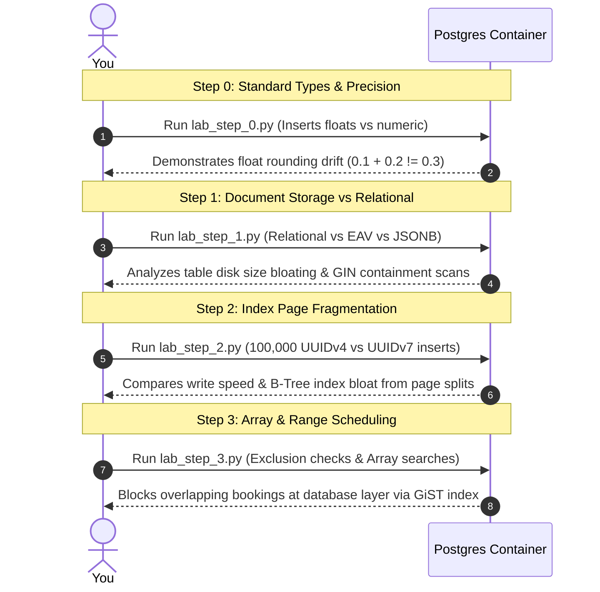

# Practical Lab: Mastering Complex Data Types (JSONB, UUIDv7, Ranges & Arrays)

## 📌 Lab Overview & Objectives

In production environments, choosing the correct column data types directly impacts database performance, disk storage overhead, locking behavior, and data integrity. While standard relational modeling covers basic fields (Integers, Strings, Booleans), a senior database engineer must know how to leverage PostgreSQL's specialized and complex data types to solve complex architectural challenges.

This lab provides hands-on mastery over both standard and complex data types. You will discover the critical rounding pitfalls of binary floating-point numbers in financial tables, benchmark structured relational schemas against flexible `JSONB` documents and Entity-Attribute-Value (EAV) patterns, analyze the B-Tree leaf page fragmentation (index bloating) caused by random `UUIDv4` primary keys compared to time-ordered sequential `UUIDv7` keys, and implement temporal booking schedules utilizing specialized Range types (`tstzrange` with GiST exclusion constraints) and Array types (`text[]` with GIN indexing).

### Key Skills You Will Master

- **Standard Types Precision**: Diagnosing and preventing floating-point rounding errors in decimal computations by mastering `NUMERIC` vs. `DOUBLE PRECISION`.
- **JSONB vs. Normalization**: Designing semi-structured document databases in PostgreSQL, comparing EAV patterns vs. `JSONB` storage size, and indexing documents using GIN.
- **Sequential UUIDv7 Keys**: Simulating high-volume database inserts to measure B-Tree index fragmentation and disk I/O savings when switching from random `UUIDv4` to sequential `UUIDv7` primary keys.
- **Range and Array Operations**: Enforcing non-overlapping reservation periods at the database layer using GiST exclusion constraints on `tstzrange` fields, and indexing list values with GIN on array columns.

---

## 🛠️ Prerequisites & Environment Setup

This lab runs in an isolated local environment using Docker and a Python virtual environment to allow deep database inspection and benchmarking without risk.

- **Database Engine**: PostgreSQL 17 (via Docker)
- **Application Layer**: Python 3.13 (managed via `uv`)
- **Core Libraries**: SQLAlchemy 2.0, Psycopg 3, Faker

### Workspace Structure

Your lab directory is organized as follows:

```text
relational-database-skills-lab/
└── labs/
    └── 003-complex-data-types/
        ├── pyproject.toml         # Dependency declarations
        ├── docker-compose.yml     # PostgreSQL container infrastructure
        ├── .env                   # Local configuration
        ├── .env.example           # Environment template
        ├── app/
        │   ├── __init__.py
        │   ├── config.py          # Configuration manager
        │   ├── dependencies.py    # singleton DB Engine and session context
        │   └── models.py          # SQLAlchemy Models (Standard, Relational, UUID, Range)
        ├── lab_step_0.py          # Step 0: Standard types & float drift simulation
        ├── lab_step_1.py          # Step 1: JSONB vs Relational vs EAV benchmarks
        ├── lab_step_2.py          # Step 2: UUIDv4 vs UUIDv7 index page splits
        ├── lab_step_3.py          # Step 3: Arrays, Range types, and GiST exclusion
        └── README.md              # Lab workbook (This file)
```

### Initial Bootstrap

1. Navigate to the lab directory:
    ```bash
    cd labs/003-complex-data-types
    ```
2. Copy the environment template:
    ```bash
    cp .env.example .env
    ```
3. Start the PostgreSQL container:
    ```bash
    docker compose up -d
    ```
4. Sync dependencies from the root directory:
    ```bash
    cd ../..
    uv sync --all-packages
    ```
5. Activate the virtual environment:
    ```bash
    source .venv/bin/activate
    ```
6. Verify PostgreSQL is online:
    ```bash
    docker exec -it postgres-complex-data-types pg_isready -U postgres -d complex_data_types
    ```
    *(You should see: `complex_data_types:5432 - accepting connections`)*

---

## 📝 Lab Flow & Sequence

Each step in this workbook is designed as a standalone benchmark verifying specific database internals:



---

## 🔬 Core Lab Steps & Content

### Step 0: Standard Data Types Overview & Rounding Pitfalls

#### 📘 Step 0 Theory: Standard Types and Numeric Precision
PostgreSQL provides highly optimized standard data types for primitive structures. Choosing the correct type is vital to prevent memory bloat and calculation errors:
*   **Integers**: `SMALLINT` (2 bytes, up to 32,767), `INTEGER` (4 bytes, up to 2.14B), and `BIGINT` (8 bytes, up to 9.22 Quintillion).
*   **Character Types**: `CHAR(n)` (fixed length, pads spaces), `VARCHAR(n)` (variable length with a limit), and `TEXT` (unlimited length). In modern PostgreSQL, there is no performance penalty for using `TEXT` instead of `VARCHAR(n)`; the engine treats them identically under the hood, and limits are enforced merely as data validation.
*   **Decimals (Floats vs. Numerics)**:
    *   `REAL` / `DOUBLE PRECISION` are **inexact, variable-precision floating-point types** (conforming to the IEEE 754 standard). They are incredibly fast for physical/scientific calculations but cannot represent fractional decimals precisely (like `0.1`).
    *   `NUMERIC` / `DECIMAL` is an **exact, user-specified precision type**. It stores values as binary-coded decimals and performs calculations with exact accuracy. This is **mandatory** for monetary, financial, and accounting databases where rounding errors are legally unacceptable.

#### 🧪 Step 0 Lab Execution

Run the automated Python script to inspect standard types and observe floating-point arithmetic drift:

```bash
python labs/003-complex-data-types/lab_step_0.py
```

> **Observe**: Notice how summing `10,000` micro-transactions of `0.1` cents in a `DOUBLE PRECISION` column results in a mathematical drift (e.g., `1000.00000000015`), whereas the `NUMERIC` column evaluates to exactly `1000.00`.

**Key Insight**: Inexact floating point types introduce binary representation drift. Always default to `NUMERIC` for monetary columns!

---

### Step 1: JSONB vs. Normalization (Document Storage vs. Structured)

#### 📘 Step 1 Theory: Schema Flexibility and GIN Document Indexes
Modern databases frequently handle unstructured or highly variable schemas (like product catalog characteristics, sensor metrics, or third-party API payloads). In PostgreSQL, you can model this in three ways:
1.  **Relational Columns**: Normalize all attributes into distinct columns. (Fastest, enforces data integrity, but rigid and hard to modify).
2.  **Entity-Attribute-Value (EAV) Pattern**: Standard relational workaround consisting of an attributes table mapping product IDs to keys and values. (Highly flexible, but results in severe table bloat, slow multiple self-joins, and complete lack of data types).
3.  **JSONB (Binary JSON)**: Storing attributes in a single binary JSON document column. (Highly flexible, compact, and fully indexable using GIN).

##### Default GIN (`jsonb_ops`) vs. Path GIN (`jsonb_path_ops`)
PostgreSQL offers two operator classes for GIN indexes on JSONB:
*   `jsonb_ops` (Default): Indexes every key, value, and nested sub-key individually. Supports all JSONB operators (`@>`, `?`, `?|`, `?&`), but is larger.
*   `jsonb_path_ops` (Path GIN): Indexes complete key-value paths (hashes of paths). It is **20-30% smaller** and faster, but only supports containment queries (`@>`).

#### 🧪 Step 1 Lab Execution

Run the comparative benchmarking script for Step 1:

```bash
python labs/003-complex-data-types/lab_step_1.py
```

> **Observe**: 
> - **Table size comparison**: EAV table storage is significantly larger than JSONB or Relational schemas.
> - **Query plans with GIN**: The default GIN index resolves containment queries (`@>`) via a `Bitmap Index Scan` in sub-millisecond times, but is ignored for key-extraction queries using the `->>` operator, which revert to slow `Seq Scans`!

**Production Implications**:
*   Use `JSONB` for sparse, highly variable attributes, and index them with `jsonb_path_ops` GIN if you only need containment filters.
*   Avoid EAV patterns in modern PostgreSQL; they are obsolete compared to JSONB performance and storage efficiency.
*   Never use `->` or `->>` in the `WHERE` clauses of highly trafficked JSONB queries without creating a dedicated **Expression Index** on that specific key.

---

### Step 2: UUIDv4 vs. Sequential UUIDv7 (Index Fragmentation)

#### 📘 Step 2 Theory: Index Page Splits & Write Amplification
Primary keys in highly concurrent databases are frequently generated as UUIDs to prevent sequential ID enumerations and coordinate distributed database writes.
*   **UUIDv4 (Random)**: Generated using random number generators. While highly secure against duplication, they have **zero natural sorting**.
*   **UUIDv7 (Time-Ordered)**: Generated by embedding a 48-bit UNIX millisecond timestamp at the beginning of the UUID, followed by variant/version bits and random entropy bytes. They are **lexicographically sortable** by creation time.

##### Under-The-Hood: B-Tree Leaf Page Splits
PostgreSQL primary keys are indexed using B-Trees, which store sorted keys in physical pages on disk.
*   **Random UUIDv4**: Since keys are random, a new insert can land on any leaf page in the B-Tree. If a targeted leaf page is full (8KB page limit), PostgreSQL must split it in half (**page split**), moving 50% of the keys to a newly allocated page. This leaves massive empty space (fragmentation), causing index bloat, heavy write amplification, and high disk I/O thrashing.
*   **Sequential UUIDv7**: Since keys are sequential, new inserts always land on the rightmost leaf page of the B-Tree. Leaf pages fill up systematically to 90-95% capacity without triggers for middle-page splits, preserving index compact size and maintaining high cache hits.

```
UUIDv4 Inserts (Random):
Page A (Full):  [ 2, 8, 14, 25 ]  ==> Insert 10 ==> Page Split!
Page A (50%):   [ 2, 8, 10 ]      (Empty space left)
Page B (New):   [ 14, 25 ]        (Empty space left)

UUIDv7 Inserts (Sequential):
Page A (Full):  [ 100, 101, 102, 103 ] ==> Insert 104 ==> Append to right!
Page B (New):   [ 104, ... ]           (Page A remains 100% compact)
```

#### 🧪 Step 2 Lab Execution

Run the simulation writing 100,000 rows into both UUID tables:

```bash
python labs/003-complex-data-types/lab_step_2.py
```

> **Observe**: Contrast the execution speeds and final index sizes. Notice how the B-Tree index size for `LogUUIDv4` primary keys grows significantly larger (fragmented) compared to the clean, time-ordered sequential B-Tree index of `LogUUIDv7`!

**Production Implications**:
*   For high-write tables (e.g., audit logs, events, metrics) that require UUIDs, **always select UUIDv7**. It protects your index from bloat and preserves disk I/O bandwith.
*   UUIDv7 maintains high caching efficiency, ensuring the primary key B-Tree index fits entirely within `shared_buffers` as the table grows to millions of rows.

---

### Step 3: Range Types & Array Types (Specialized Data Types)

#### 📘 Step 3 Theory: Multi-valued Arrays and Temporal Scheduling Ranges
PostgreSQL supports rich specialized composite structures directly at the database layer:
*   **Array Types (`text[]`, `integer[]`)**: Stores lists of values directly inside a single row. Extremely useful for tag lists, features, or category attributes, bypassing the need for a separate join table. Arrays can be indexed using GIN.
*   **Range Types (`tsrange`, `tstzrange`, `int4range`)**: Represents an interval of values with a defined start and end bound (can be inclusive `[` or exclusive `)`). Ideal for intervals of time (bookings, subscriptions, temporal validity).
*   **GiST Exclusion Constraints**: In scheduling tables, preventing overlapping bookings is a major concurrency challenge. A standard unique constraint cannot prevent overlapping intervals. PostgreSQL solves this using **Exclusion Constraints** (`EXCLUDE USING gist`), which tell the database engine: *"Reject any new row if its room_name is equal (=) and its booking_period overlaps (&&) with an existing record."* This blocks double-bookings at the physical database storage layer, completely immune to application-level race conditions!

#### 🧪 Step 3 Lab Execution

Run the automated booking simulation:

```bash
python labs/003-complex-data-types/lab_step_3.py
```

> **Observe**: 
> - **Double-Booking Blocked**: Notice how attempting to book Room 'Ada' for an overlapping time range (`10:00 - 13:00`) instantly raises a database `IntegrityError` (ExclusionViolation) and is blocked by PostgreSQL.
> - **Explain Plans**: Observe the `Bitmap Index Scan` on `idx_room_bookings_amenities` during array searches (`@>`), and the GiST Index Scan on `exclude_overlapping_room_bookings` during range overlap queries (`&&`).

**Production Implications**:
*   Use `ExcludeConstraint` on range types to handle room bookings, table reservations, subscription validities, or car rentals. This eliminates the need for expensive and buggy application-level locking.
*   Use array columns and GIN indexes for simple multi-valued lists (like product tags or access permissions) when you do not need complex foreign key relationships.

---

## 🎯 Lab Outcomes & Verification Checklist

To successfully complete this lab, you must produce and verify the following results:

- [ ] **Step 0 Complete**: Verify `float_val` arithmetic drift on `standard_types_demo` table, observing the accumulation of fractional decimals in float sums vs exact values in numeric.
- [ ] **Step 1 Complete**: Verify product catalog schemas, demonstrating EAV disk bloat and running a JSONB GIN bitmap containment scan (`@>`).
- [ ] **Step 2 Complete**: Verify write speeds and B-Tree index size differences between random `UUIDv4` and sequential `UUIDv7` tables, logging index sizes.
- [ ] **Step 3 Complete**: Verify double-booking prevention in the database by catching the `psycopg.errors.ExclusionViolation` during overlapping bookings on `tstzrange`.

When you are finished with your local experiment, tear down your sandbox:

```bash
docker compose down -v
```

---

## ❓ Deep-Dive Self-Assessment

Formulate answers to these production-level questions based on your observations during this lab:

1.  _Why does Postgres text type perform identically to varchar(n) under the hood, and under what circumstances should you still use varchar(n)?_
2.  _Explain why GIN indexes cannot optimize JSONB key-extraction queries using the extraction operator ->> (e.g., attributes->>'brand' = 'Sony'). What index should be created to optimize this query instead?_
3.  _Why do random UUIDv4 keys cause page splitting in B-Trees, and how does this affect write throughput and memory caching (shared_buffers) on tables with billions of rows?_
4.  _How does an Exclusion Constraint with GiST (using room_name = and booking_period &&) prevent double-bookings compared to running SELECT FOR UPDATE in a standard serializable transaction? What are the concurrency tradeoffs?_

---

## 🐛 Troubleshooting

### Issue: Exclusion constraint creation fails with `operator class "gist" does not exist` or `data type uuid has no default operator class`

**Solution**: This happens because GiST indexes do not natively support standard types (like `VARCHAR`, `INTEGER`, or `UUID`) out-of-the-box. You must enable the **`btree_gist`** extension in PostgreSQL, which implements btree-equivalent operator classes for GiST:
```sql
CREATE EXTENSION IF NOT EXISTS btree_gist;
```
This extension is automatically loaded during the initialization phase (`init_db()`) of `lab_step_3.py`.
