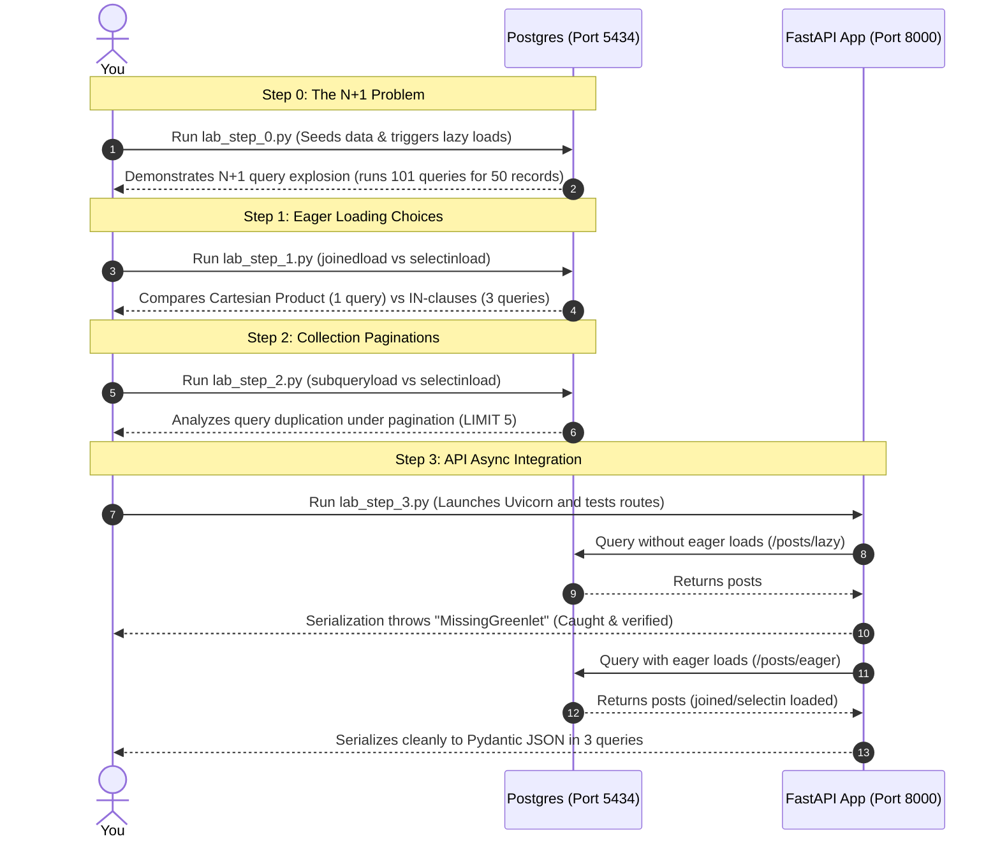

# Practical Lab 004: Mastering SQLAlchemy 2.0 Relationship Loading & FastAPI Integration

## 📌 Lab Overview & Objectives

Bridges between object-oriented code and relational databases (ORMs like SQLAlchemy) provide high levels of developer velocity, but they hide the underlying SQL queries. If an application developer is not highly conscious of how database relationships are loaded, it is extremely easy to write code that behaves performantly in development but completely collapses under real-world production volumes.

The most common database-to-application failure mode is the **N+1 Query Problem**. This happens when a query to fetch $N$ parent records is executed, and then the application sequentially fires an additional database query for *each* of the $N$ records to fetch its related data. This turns a single page render into hundreds of database round-trips, saturating connection pools and inflating API latencies from 5 milliseconds to several seconds.

This lab provides hands-on mastery over **SQLAlchemy 2.0 Relationship Loading Strategies** and **FastAPI integration**. You will diagnose and measure the N+1 query problem, benchmark different eager loading strategies (`joinedload`, `selectinload`, `subqueryload`), understand the mathematical performance impact of the **Cartesian Product** during eager joins on multiple collections, and deep-dive into FastAPI's asynchronous lifecycle to diagnose and solve the common `MissingGreenlet` exception during Pydantic v2 serialization.

### Key Skills You Will Master

- **N+1 Diagnosis**: Detecting and counting database round-trips caused by lazy-loaded relationships.
- **Joined Eager Loading (`joinedload`)**: Using outer joins to load 1-to-1 or Many-to-1 relationships in a single SQL query.
- **Select-in Collection Loading (`selectinload`)**: Executing clean, index-optimized `IN` clause queries to eager-load 1-to-Many and Many-to-Many relationships without generating massive Cartesian products.
- **Pagination Optimization**: Analyzing why `subqueryload` fails or degrades performance under pagination (`LIMIT`) compared to `selectinload`.
- **FastAPI Integration**: Mastering `AsyncSession` management and resolving the `MissingGreenlet` serialization error during Pydantic ORM mapping.
- **Fail-Fast Development**: Configuring relationship definitions (like `lazy='raise'`) to catch N+1 queries during local testing before they hit production.

---

## 🛠️ Prerequisites & Environment Setup

This lab runs in an isolated local environment using Docker and a Python virtual environment to allow deep database inspection and benchmarking without risk.

- **Database Engine**: PostgreSQL 17 (via Docker)
- **Application Layer**: Python 3.13, FastAPI 0.110+, SQLAlchemy 2.0
- **Driver Architecture**: `asyncpg` (Asynchronous driver wrapper)

### Workspace Structure

Your lab directory is organized as follows:

```text
relational-database-skills-lab/
└── labs/
    └── 004-relationship-loading/
        ├── pyproject.toml         # Dependency declarations
        ├── docker-compose.yml     # PostgreSQL container infrastructure
        ├── .env                   # Local configuration
        ├── .env.example           # Environment template
        ├── app/
        │   ├── __init__.py
        │   ├── config.py          # Configuration loader
        │   ├── dependencies.py    # Singleton DB Engine, session factories, query listeners
        │   ├── models.py          # SQLAlchemy models (User, Profile, Post, Comment, Tag)
        │   ├── schemas.py         # Pydantic v2 schemas
        │   └── main.py            # FastAPI async application and route handlers
        ├── lab_step_0.py          # Step 0: Lazy loading N+1 simulation
        ├── lab_step_1.py          # Step 1: joinedload vs selectinload benchmarks
        ├── lab_step_2.py          # Step 2: subqueryload vs selectinload under pagination
        ├── lab_step_3.py          # Step 3: FastAPI async session & MissingGreenlet verification
        └── README.md              # Lab workbook (This file)
```

### Initial Bootstrap

1. Navigate to the lab directory:
    ```bash
    cd labs/004-relationship-loading
    ```
2. Copy the environment template:
    ```bash
    cp .env.example .env
    ```
3. Start the PostgreSQL container:
    ```bash
    docker compose up -d
    ```
4. Sync dependencies from the root directory:
    ```bash
    cd ../..
    uv sync --all-packages
    ```
5. Activate the virtual environment:
    ```bash
    source .venv/bin/activate
    ```
6. Verify PostgreSQL is online:
    ```bash
    docker exec -it postgres-relationship-loading pg_isready -U postgres -d relationship_loading
    ```
    *(You should see: `relationship_loading:5432 - accepting connections`)*

---

## 📝 Lab Flow & Sequence

Each step in this workbook is designed as a standalone script verifying specific relationship loading internals:



---

## 🔬 Core Lab Steps & Content

### Step 0: The N+1 Query Problem & Default Lazy Loading

#### 📘 Step 0 Theory: Default Lazy Loading (`lazy='select'`)

By default, unless configured otherwise, SQLAlchemy defines relationships as **lazy loaded** (`lazy='select'`).
*   **What**: When you query a model (e.g. `Post`), SQLAlchemy only retrieves columns belonging to the `posts` table. It does *not* fetch related tables like `users` (author) or `comments`.
*   **How**: When you later access the relationship in Python (e.g. accessing `post.author.username`), SQLAlchemy intercepts the property call and dynamically fires a **new** SQL query to fetch that specific author's record from the database.
*   **The Trap**: If you load $N$ posts, accessing `post.author` for each post results in:
    *   **1 query** to fetch the list of $N$ posts.
    *   **$N$ queries** to fetch the author for each post individually.
    *   **Total Queries**: $N + 1$. 

If $N = 1,000$ posts, this triggers **1,001 database queries** sequentially! If each query takes 2ms, the database roundtrips alone will take over 2 seconds, destroying API performance.

#### 🧪 Step 0 Lab Execution

Run the automated script to seed the database and simulate the N+1 query explosion:

```bash
python labs/004-relationship-loading/lab_step_0.py
```

> **Observe**: 
> * How seeding creates a standard relational structure.
> * The log prints each executed SQL query under the hood.
> * Notice the final warning summary mapping the N+1 explosion: fetching 50 posts results in **101 queries** because accessing both the `author` and the author's `profile` (1-to-1) triggers independent, sequential lookups!

**Key Insight**: Default lazy-loading hides massive database traffic. An application accessing properties in a loop turns a simple list view into a resource-starved bottleneck.

---

### Step 1: Eager Loading with `joinedload()` vs. `selectinload()`

#### 📘 Step 1 Theory: Joined vs. Select-in Eager Loading

To solve the N+1 problem, we use **Eager Loading**, which tells SQLAlchemy to fetch related models upfront during the initial query. SQLAlchemy 2.0 provides two primary eager loading strategies:

##### 1. Joined Eager Loading (`joinedload()`)
*   **Mechanism**: Uses a SQL `LEFT OUTER JOIN` to fetch the parent table and child table in a single SQL query.
*   **Best For**: **1-to-1** (`UserProfile`) or **Many-to-1** (`User`) relationships.
*   **The Cartesian Product Gotcha**: While joinedload achieves exactly 1 query, **you must never use it on multiple collections (1-to-Many or Many-to-Many)**. 
    If you outer-join a post with its `comments` and `tags`, the database returns the Cartesian product. If a post has 10 comments and 10 tags, the database returns **100 rows** for that single post, transmitting massive duplicate columns across the network and forcing SQLAlchemy to parse and deduplicate them in CPU memory.

##### 2. Select-in Eager Loading (`selectinload()`)
*   **Mechanism**: Executes a second, highly-optimized query using an `IN` operator.
    *   *Query 1*: Fetch posts (`SELECT * FROM posts`).
    *   *Query 2*: Fetch comments using the IDs from Query 1 (`SELECT * FROM comments WHERE post_id IN (1, 2, 3...)`).
*   **Best For**: **1-to-Many** (`comments`) and **Many-to-Many** (`tags`) collections. It completely avoids Cartesian product multiplication by querying related data in clean, parallel, index-optimized steps.

#### 🧪 Step 1 Lab Execution

Run the benchmark script comparing these strategies:

```bash
python labs/004-relationship-loading/lab_step_1.py
```

> **Observe**: 
> * The query counter prints that **Lazy Loading** took **121 queries**.
> * **Joined Eager Loading** resolved everything in **exactly 1 query** by joining all tables.
> * **Select-in Eager Loading** resolved everything in **exactly 3 clean queries** (1 for posts, 1 for comments, 1 for tags).
> * Compare the latencies and notice how selectinload achieves optimal speed without generating duplicate Cartesian data blocks.

**Key Insight**: Use `joinedload()` for scalar relationships (1-to-1, Many-to-1) and `selectinload()` for collections (1-to-Many, Many-to-Many).

---

### Step 2: Collection Loading with `subqueryload()` vs. `selectinload()`

#### 📘 Step 2 Theory: Subquery Loading vs. Selectin Loading

In older SQLAlchemy versions, `subqueryload()` was commonly used for collections.
*   **What**: It executes a second query to load collections, but instead of using a simple `IN` clause with concrete IDs, it duplicates the entire original query as a subquery.
    *   *Selectinload Query*: `SELECT * FROM comments WHERE post_id IN (1, 2, 3, 4, 5)`
    *   *Subqueryload Query*: `SELECT * FROM comments WHERE post_id IN (SELECT id FROM posts LIMIT 5)`
*   **The Pagination Pitfall**: Under pagination (`LIMIT` and `OFFSET` clauses), `subqueryload` duplicates the original query, forcing PostgreSQL to re-evaluate joins, filters, and sort orderings inside the subquery, leading to heavy planning overhead and potentially incorrect results if sorting values are not unique.

#### 🧪 Step 2 Lab Execution

Run the pagination comparison script:

```bash
python labs/004-relationship-loading/lab_step_2.py
```

> **Observe**: 
> * Notice the SQL logs generated by `subqueryload`. The second query contains a complete duplicate of the main select query inside an `IN (SELECT id FROM posts LIMIT 5)` block.
> * Contrast this with the lightweight query executed by `selectinload`, which simply injects the concrete IDs `IN (1, 2, 3, 4, 5)`.

**Key Insight**: `selectinload()` is the modern, faster, and more robust standard in SQLAlchemy 2.0. Avoid `subqueryload()` unless the target database lacks composite `IN` clause support.

---

### Step 3: FastAPI AsyncSession & Pydantic Serialization

#### 📘 Step 3 Theory: Asynchronous Sessions and `MissingGreenlet`

FastAPI relies on asynchronous route handlers to handle massive concurrent traffic.
*   **Asynchronous Database Access**: Under an `AsyncSession`, SQLAlchemy relies on the `asyncpg` driver. Because the event loop cannot block, any query execution must be awaited (`await session.execute(...)`).
*   **The Synchronous Serialization Trap**: Pydantic serialization (converting ORM objects to JSON responses) is a **synchronous** process. When Pydantic reads fields like `post.author.username` during serialization, it triggers a synchronous attribute access.
*   **The Failure**: Under an `AsyncSession`, SQLAlchemy cannot perform synchronous lazy loading because it cannot await a database call inside a synchronous property access. Since there is no active asynchronous greenlet context available during Pydantic's serialization loop, SQLAlchemy aborts and raises a **`MissingGreenlet`** exception.

To resolve this, you **must** eagerly load all relationships inside your async queries so that Pydantic only accesses already-cached, loaded attributes.

#### 🧪 Step 3 Lab Execution

Run the automated FastAPI integration test script:

```bash
python labs/004-relationship-loading/lab_step_3.py
```

> **Observe**:
> * The script spins up the FastAPI app in a background thread.
> * It queries `/posts/lazy` (which fetches posts without eager loading) and catches the resulting `MissingGreenlet` error thrown by Pydantic during serialization.
> * It queries `/posts/eager` (which uses optimized joined/selectin loading) and successfully serializes the nested data in only **3 database queries**, return a clean JSON payload.
> * The concurrent load test completes 10 concurrent requests without failure or database pool exhaustion.

**Key Insight**: In asynchronous FastAPI applications, lazy loading is not just slow—it physically fails. Eager loading is mandatory to allow clean Pydantic serialization.

---

## 🚀 Production Implications & Best Practices

### 1. Fail-Fast in Development with `lazy='raise'`
To prevent developers from accidentally writing lazy-loading queries that trigger N+1 loops in production, you can configure your relationships to **fail fast** by default:

```python
class Post(Base):
    __tablename__ = "posts"
    # ...
    # lazy='raise' will immediately throw an exception during development
    # if you attempt to access 'author' without eagerly loading it first!
    author = relationship("User", back_populates="posts", lazy="raise")
```

This forces your test suites and local environments to catch missing eager loads immediately, before the code is merged.

### 2. Sizing Your Connection Pool
Connection pool settings prevent connection starvation:
*   `pool_size`: The base number of connections to keep open (e.g. 5–10).
*   `max_overflow`: The maximum number of temporary connections that can be opened under sudden spikes (e.g. 10–20).
*   `pool_pre_ping=True`: Fires a lightweight test query (`SELECT 1`) to check connection liveness before handing it to a worker, preventing "broken pipe" errors.

---

## ❓ Challenge Questionnaire (Self-Assessment)

1. **Why does `joinedload()` require a call to `.unique()` when querying a collection?**
   *(Hint: Consider what a SQL `LEFT JOIN` on a 1-to-Many collection does to the row result count).*
2. **If you have a `Post` model that has a `comments` collection (1-to-Many) and a `tags` collection (Many-to-Many), what is the optimal query definition to eager load both?**
3. **What is the exact exception raised when accessing an unloaded relationship inside a FastAPI async route during Pydantic serialization? How do you explain its underlying cause?**
4. **How does the `lazy='raise'` relationship configuration improve codebase quality in a team setting?**

---

### Congratulations! You have successfully completed Practical Lab 004! 🚀
