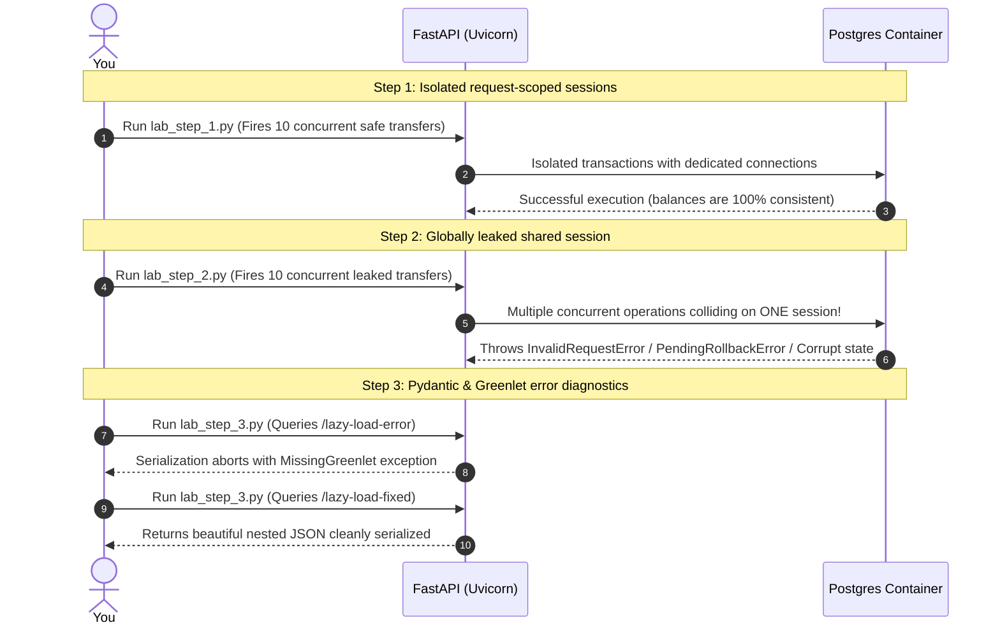

# Practical Lab: Asynchronous Session Lifecycle & FastAPI Integration

## 📌 Lab Overview & Objectives

In highly concurrent web applications built with FastAPI and SQLAlchemy 2.0, connection management and transaction boundaries are the most critical factors for system reliability, data integrity, and performance. Unlike traditional synchronous applications where thread-local storage isolates database sessions, asynchronous Python runtimes execute concurrent requests on a single thread using an event loop. If database sessions are misconfigured or leaked across async request handlers, it leads to severe race conditions, transaction mixing, data corruption, and catastrophic system crashes.

This lab provides hands-on mastery over **SQLAlchemy Asynchronous Session Management** in FastAPI. You will implement the correct request-scoped `AsyncSession` dependency injection flow using FastAPI's `Depends` and Python's async generator yield lifecycle. Next, you will deliberately leak a globally shared singleton database session and trigger a high-concurrency request benchmark to witness real-world database failures, including `InvalidRequestError` and `PendingRollbackError`, and observe silent balance corruption. Finally, you will deep-dive under the hood of SQLAlchemy's async driver wrapping to analyze how greenlets bridge synchronous ORM operations with asynchronous IO, diagnosing and resolving the notorious `MissingGreenlet` error during Pydantic ORM serialization.

### Key Skills You Will Master

- **Request-Scoped Session Management**: Building bulletproof async database session factories that isolate transactions per request and guarantee clean connection release.
- **Session Leakage Diagnostics**: Simulating high-concurrency race conditions to diagnose `PendingRollbackError` and `InvalidRequestError` caused by sharing a database session across event loop tasks.
- **Greenlet Execution Mechanics**: Understanding how SQLAlchemy bridges the sync-async gap via `asyncpg` and standard python event loop scheduling under the hood.
- **Solving Serialization Errors**: Resolving and preventing `MissingGreenlet` exceptions during Pydantic response parsing using proactive eager-loading strategies (`selectinload` and `joinedload`).

---

## 🛠️ Prerequisites & Environment Setup

This lab runs in an isolated local environment using Docker and a Python virtual environment to allow deep database inspection and benchmarking without risk.

- **Database Engine**: PostgreSQL 17 (via Docker)
- **Application Layer**: Python 3.13 (managed via `uv`)
- **Core Libraries**: FastAPI, SQLAlchemy 2.0, Asyncpg, Uvicorn, Httpx

### Workspace Structure

Your lab directory is organized as follows:

```text
relational-database-skills-lab/
└── labs/
    └── 005-async-session-management/
        ├── pyproject.toml         # Dependency declarations
        ├── docker-compose.yml     # PostgreSQL container infrastructure
        ├── .env                   # Local configuration
        ├── .env.example           # Environment template
        ├── app/
        │   ├── __init__.py
        │   ├── config.py          # Configuration manager
        │   ├── dependencies.py    # Request-scoped & Leaked session providers
        │   ├── models.py          # SQLAlchemy Models (User, BankAccount)
        │   ├── schemas.py         # Pydantic schemas (Transfer, AccountDetails)
        │   └── main.py            # FastAPI API server
        ├── lab_step_1.py          # Step 1: Safe request-scoped session concurrency
        ├── lab_step_2.py          # Step 2: Leaked shared session failures simulation
        ├── lab_step_3.py          # Step 3: Lazy loading Greenlet error and fix
        └── README.md              # Lab workbook (This file)
```

### Initial Bootstrap

1. Navigate to the lab directory:
    ```bash
    cd labs/005-async-session-management
    ```
2. Start the PostgreSQL container:
    ```bash
    docker compose up -d
    ```
3. Sync dependencies from the root directory:
    ```bash
    cd ../..
    uv sync --all-packages
    ```
4. Activate the virtual environment:
    ```bash
    source .venv/bin/activate
    ```
5. Verify PostgreSQL is online and accepting connections on port `5435`:
    ```bash
    docker exec -it postgres-async-sessions pg_isready -U postgres -d async_session_db
    ```
    *(You should see: `/var/run/postgresql:5432 - accepting connections` inside the container)*

---

## 📝 Lab Flow & Sequence

Each step in this workbook is designed as a standalone benchmark verifying specific database and event loop behavior:



---

## 🔬 Core Lab Steps & Content

### Step 1: Request-Scoped AsyncSession Lifecycle and Concurrency

#### 📘 Step 1 Theory: Request-Scoped Sessions

In a synchronous web framework like Flask or Django, each incoming request is processed on an isolated operating system thread. This model permits developers to bind database sessions to a thread local context, ensuring that concurrent requests never share a session. 

FastAPI, however, is a modern asynchronous framework. It processes thousands of concurrent requests inside a single OS thread by running them on an **event loop**. When an async route awaits an operation (like database IO), the event loop yields control and switches to another concurrent request. If two concurrent requests share the same `AsyncSession` object, their database queries and transactional statements will execute overlappingly on the same physical database connection!

To prevent this collision, the industry standard is the **Request-Scoped Session Lifecycle** pattern:
1. **Fresh Session Per Request**: Every request triggers FastAPI's dependency injection to instantiate a new `AsyncSession` from the engine's `async_sessionmaker`.
2. **Context Isolation**: Each `AsyncSession` owns its unique transaction boundary and maps to an isolated physical connection in the pool.
3. **Clean Automatic Teardown**: An `async with` block or an async generator `try...finally` block guarantees that no matter whether the route succeeds or throws an HTTP exception, the session is committed/rolled back and returned cleanly to the pool.

#### 🧪 Step 1 Lab Execution

Run the automated script to spin up the FastAPI app and fire 10 concurrent requests to transfer $10.00 from Alice to Bob using the safe, isolated request-scoped session endpoint `/transfer/safe`:

```bash
python labs/005-async-session-management/lab_step_1.py
```

> **Observe**: Notice the logs. Ten concurrent API requests overlap in time, but because each request has an isolated, request-scoped session, PostgreSQL processes them securely using row-level locking (`SELECT ... FOR UPDATE`). All 10 requests succeed cleanly (10/10), and the final account balances are exactly $900.00 and $600.00, representing 100% data consistency.

**Key Insight**: Request-scoped sessions maintain clean execution boundaries even when running concurrently on a single-threaded Python event loop.

---

### Step 2: Global Session Leakage and Concurrency Failures

#### 📘 Step 2 Theory: Session Leakage Hazards

A common antipattern in FastAPI codebases occurs when developers attempt to treat the SQLAlchemy `AsyncSession` as a global singleton, or register it as a singleton inside a dependency injection container. 

Sharing a single `AsyncSession` across multiple concurrent requests leads to two major production hazards:

1. **Internal State Machine Corruption (`InvalidRequestError`)**:
   An `AsyncSession` is strictly **not thread-safe** and **not task-safe**. It is a state machine that expects sequential execution:
   ```text
   Begin Transaction -> Execute Queries -> Flush/Commit -> Close Session
   ```
   If Task A begins a query and awaits its completion, the event loop yields. Task B immediately calls `execute()` on the *same* session object. SQLAlchemy detects that an operation is already active on this session and throws:
   `sqlalchemy.exc.InvalidRequestError: Method 'execute()' can't be called when another transaction/query is active.`

2. **Cascading Failures (`PendingRollbackError`)**:
   If an exception occurs inside a transaction (for example, a foreign key violation or connection timeout), the transaction is immediately marked as failed by PostgreSQL. Before any more statements can be executed on that connection, an explicit rollback must be called.
   If Task A triggers a database error on the shared session, the connection enters a failed state. When Task B (completely healthy and unrelated) tries to query the database, it receives:
   `sqlalchemy.exc.PendingRollbackError: This Session's transaction has been rolled back due to a previous exception during flush.`
   This causes one user's failure to cascade and block all other concurrent users!

3. **Silent Data Corruption**:
   If some queries overlap without raising exceptions, their transaction boundaries get mixed. Task A may commit a transaction, inadvertently saving the incomplete, half-finished modifications made by Task B!

#### 🧪 Step 2 Lab Execution

Run the automated script to fire 10 concurrent requests to the leaked global shared-session endpoint `/transfer/leaked`:

```bash
python labs/005-async-session-management/lab_step_2.py
```

> **Observe**: Examine the resulting failure distribution in the console log. You will see several occurrences of `InvalidRequestError` and `PendingRollbackError`. Furthermore, notice the final bank balances: due to transaction overlaps and mixed states, Alice and Bob's balances are highly inconsistent and corrupted (silent balance drift).

**Production Implications**:
* Never share an `AsyncSession` across concurrent event-loop tasks or declare it as a global variable.
* Always bind your session factory to a request dependency yielding the context.

---

### Step 3: Greenlet Internals and Pydantic Serialization Errors

#### 📘 Step 3 Theory: Greenlets, asyncpg, and MissingGreenlet

Under an asynchronous database driver (like `asyncpg`), network operations must be explicitly awaited using the `await` keyword. However, standard object-relational mapping patterns involve **lazy-loading attributes**:
```python
# Synchronous property access triggers a database query on the fly:
posts = parent.posts 
```
In Python, accessing an attribute or property (`parent.posts`) is a **synchronous operation** and cannot be awaited.

To solve this, SQLAlchemy's async extension uses the **`greenlet`** library. Greenlets are micro-threads that allow cooperative task switching. When SQLAlchemy needs to run a synchronous-looking query (such as lazy-loading an relationship) inside an async session, it spawns a greenlet to run the call, intercepting the database access and awaiting the asynchronous query on the event loop behind the scenes.

**The Failure Mode**:
When FastAPI returns a database entity, it passes it to a Pydantic schema for serialization. Pydantic iterates over every nested field, accessing attributes synchronously. 
If an attribute is lazy-loaded (i.e. not pre-loaded in the original SQL query), SQLAlchemy tries to trigger a database call. But because Pydantic serialization runs outside of SQLAlchemy's active asynchronous greenlet execution context, the driver cannot simulate asynchronous IO. 

SQLAlchemy is forced to abort the operation, raising the infamous exception:
`sqlalchemy.exc.MissingGreenlet: greenlet_spawn has not been called; can't call await_only() here.`

#### 🧪 Step 3 Lab Execution

Run the automated script to query the `/lazy-load-error` endpoint (which triggers `MissingGreenlet`) followed by `/lazy-load-fixed` (which uses eager loading `selectinload`):

```bash
python labs/005-async-session-management/lab_step_3.py
```

> **Observe**: 
> * The `/lazy-load-error` request fails with a `500 Internal Server Error`, and our FastAPI handler logs the precise `MissingGreenlet` message.
> * The `/lazy-load-fixed` request executes successfully, yielding beautiful, complete nested JSON data.

**Best practices for Async SQLAlchemy**:
* Use **Eager Loading** (`selectinload()` for collections, `joinedload()` for 1-to-1 or Many-to-1) on all queries whose fields will be serialized.
* Set `lazy="raise"` in your relationship configurations to catch un-eager loaded dependencies during testing, rather than having them crash your production FastAPI endpoints.

---

## 🎯 Lab Outcomes & Verification Checklist

To successfully complete this lab, you must produce and verify the following results:

- [ ] **Step 1 execution**: Run `lab_step_1.py` and verify that all 10 safe concurrent requests succeed (10/10) with perfect balance integrity.
- [ ] **Step 2 execution**: Run `lab_step_2.py` and capture the `InvalidRequestError` and `PendingRollbackError` exceptions caused by the leaked shared session.
- [ ] **Step 3 execution**: Run `lab_step_3.py` and verify that accessing lazy-loaded user fields during Pydantic serialization throws a `MissingGreenlet` error, and that eager loading resolves it.

When you are finished with your local experiment, tear down your sandbox:

```bash
docker compose down -v
```

---

## ❓ Deep-Dive Self-Assessment

Based on your observations during this lab, formulate answers to these production-level questions:

1. **Why does a database error in a shared-session architecture crash completely unrelated requests?**
2. **If we want to perform lazy loading in an async route, how would we do it explicitly using the session without triggering a `MissingGreenlet` error?**
3. **What is the difference in connection pooling settings between `pool_size` and `max_overflow`, and how does this affect FastAPI under high concurrent traffic spikes?**
4. **How does setting `lazy="raise"` or `lazy="raise_on_sql"` on relationships protect code quality during code reviews?**

---

## 📚 Additional Resources

- [SQLAlchemy 2.0 Asynchronous ORM Documentation](https://docs.sqlalchemy.org/en/20/orm/extensions/asyncio.html)
- [FastAPI Dependency Injection Guide](https://fastapi.tiangolo.com/tutorial/dependencies/)
- [Understanding Greenlets and Cooperative Multitasking](https://greenlet.readthedocs.io/en/latest/)
