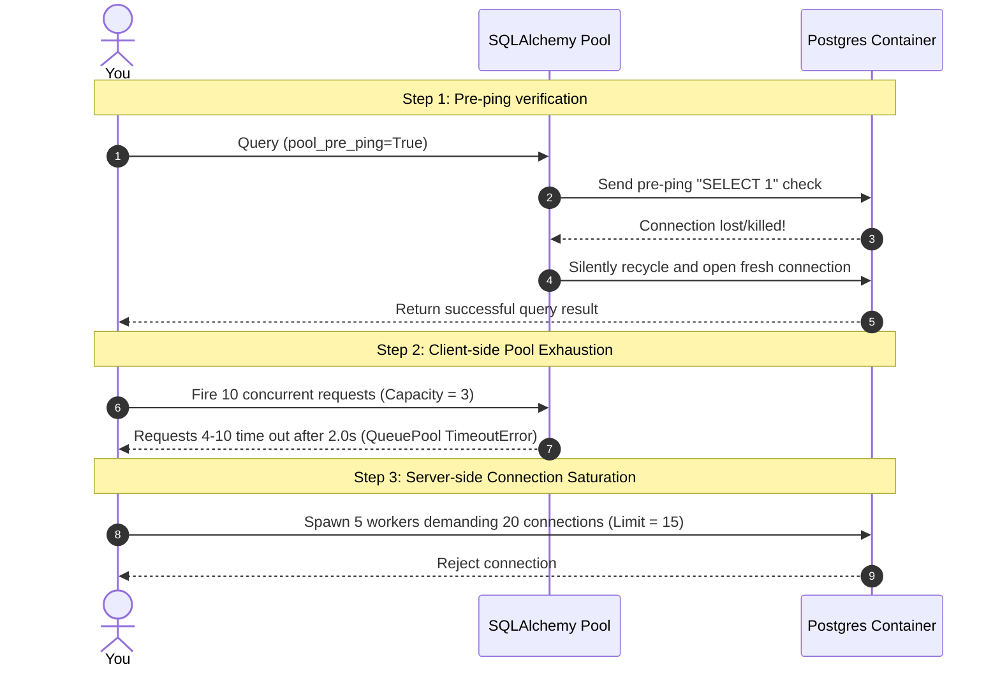

# Practical Lab: Connection Pool Tuning & Concurrency Sizing

## 📌 Lab Overview & Objectives

In modern web applications, the application-to-database communication layer is a major bottleneck. Opening a physical TCP connection to a database server like PostgreSQL is an expensive operation—it requires network handshakes, process allocation on the database server, user authentication, and transaction initialization. To avoid this overhead, connection pools are utilized to maintain a warm cache of persistent database connections that are checked out, reused, and returned dynamically.

However, misconfigured connection pools can lead to catastrophic production outages. If the client pool is too small, incoming requests block waiting for connections, eventually timing out and causing api outages. If the client pool is too large or scaled horizontally without coordination, the database server itself runs out of connection slots, crashing and rejecting all incoming transactions.

This lab provides hands-on mastery over **SQLAlchemy Connection Pool Tuning and Concurrency Sizing**. You will configure and trace connection checkout/checkin cycles, analyze how `pool_pre_ping` prevents "broken pipe" errors by dynamically verifying connection health, trigger and catch a client-side `TimeoutError` by simulating slow queries, and saturate a PostgreSQL database's `max_connections` limit to witness server-side exhaustion.

### Key Skills You Will Master

- **Configuring Connection Parameters**: Understanding the exact roles and tradeoffs of `pool_size`, `max_overflow`, `pool_recycle`, and `pool_pre_ping`.
- **Handling Disconnections Gracefully**: Tuning engines with `pool_pre_ping` to silently recover from dropped connections without impacting user transactions.
- **QueuePool Diagnostics**: Calculating concurrent connection limits and catching client-side `TimeoutError` when pool thresholds are exceeded.
- **Server Concurrency Sizing**: Coordinating client-side pool allocations with database server limits (`max_connections`) and explaining connection multiplexing solutions (e.g. PgBouncer, RDS Proxy).

---

## 🛠️ Prerequisites & Environment Setup

This lab runs in an isolated local environment using Docker and a Python virtual environment to allow deep database inspection and benchmarking without risk.

- **Database Engine**: PostgreSQL 17 (via Docker, configured with `max_connections=15`)
- **Application Layer**: Python 3.13 (managed via `uv`)
- **Core Libraries**: FastAPI, SQLAlchemy 2.0, Psycopg 3, Uvicorn, Httpx

### Workspace Structure

Your lab directory is organized as follows:

```text
relational-database-skills-lab/
└── labs/
    └── 006-connection-pool-tuning/
        ├── pyproject.toml         # Dependency declarations
        ├── docker-compose.yml     # PostgreSQL container capped at max_connections=15
        ├── .env                   # Local configuration
        ├── .env.example           # Environment template
        ├── app/
        │   ├── __init__.py
        │   ├── config.py          # Configuration manager
        │   ├── dependencies.py    # Custom engine factory & pool event listeners
        │   ├── models.py          # SQLAlchemy Models (Product)
        │   └── main.py            # FastAPI API server with slow query endpoints
        ├── lab_step_1.py          # Step 1: pool_pre_ping validation & disconnect recovery
        ├── lab_step_2.py          # Step 2: Client-side QueuePool exhaustion benchmark
        ├── lab_step_3.py          # Step 3: Server-side database max_connections saturation
        └── README.md              # Lab workbook (This file)
```

### Initial Bootstrap

1. Navigate to the lab directory:
    ```bash
    cd labs/006-connection-pool-tuning
    ```
2. Start the PostgreSQL container:
    ```bash
    docker compose up -d
    ```
3. Sync dependencies from the root directory:
    ```bash
    cd ../..
    uv sync --all-packages
    ```
4. Activate the virtual environment:
    ```bash
    source .venv/bin/activate
    ```
5. Verify PostgreSQL is online and accepting connections:
    ```bash
    docker exec -it postgres-pool-tuning pg_isready -U postgres -d pool_tuning_db
    ```

---

## 📝 Lab Flow & Sequence

Each step in this workbook is designed as a standalone benchmark verifying specific communication layer behaviors:



---

## 🔬 Core Lab Steps & Content

### Step 1: Connection Checkout Cycles & pool_pre_ping Connectivity Tests

#### 📘 Step 1 Theory: Eager Testing with pool_pre_ping

In highly dynamic cloud environments (such as Kubernetes, AWS, or GCP), database connections can be suddenly dropped or disconnected. A fire-wall might close inactive TCP sockets, a load balancer might recycle connections, or the PostgreSQL server itself might restart or close idle backends.

When a database connection is dropped server-side, it is called a **stale connection**. 
By default, SQLAlchemy connection pools do not verify connection health until they attempt to execute a query. When a stale connection is checked out of the pool and a query is issued, the socket fails, throwing a raw **`OperationalError`** (e.g. `Connection lost`, `Broken pipe`, or `Server closed connection unexpectedly`). This results in a raw 500 error for whichever unlucky user request triggered it.

**The Solution: `pool_pre_ping=True` (The "Pessimistic" Test-on-Return Strategy)**:
When `pool_pre_ping=True` is enabled, SQLAlchemy executes a lightweight query (`SELECT 1`) on the checked-out connection *before* handing it to the application code.
* **If it succeeds**: The connection is immediately handed over. The overhead is negligible (typically less than a fraction of a millisecond).
* **If it fails**: SQLAlchemy catches the error, discards the stale connection, recycles the pool slot, and opens a brand new healthy connection silently, preventing the user request from ever seeing a failure!

#### 🧪 Step 1 Lab Execution

Run the automated script to test pool behavior when disconnections are simulated, comparing `pool_pre_ping=False` with `pool_pre_ping=True`:

```bash
# Set dynamic library path if running inside Flox
python labs/006-connection-pool-tuning/lab_step_1.py
```

> **Observe**: 
> * In **Test 1 (`pool_pre_ping=False`)**, when active connections are terminated on the Postgres server, the subsequent query immediately crashes with an `OperationalError` with `psycopg` driver or `ConnectionDoesNotExistError` with `asyncpg` driver which SQLAlchemy wraps in the more generic `DBAPIError` - because it attempts to reuse the stale socket.
> * In **Test 2 (`pool_pre_ping=True`)**, when active connections are terminated, the subsequent query is completed cleanly and silently! Under the hood, SQLAlchemy's pre-ping detected the dead connection, discarded it, opened a new physical connection, and executed the query safely.

---

### Step 2: QueuePool Exhaustion and TimeoutError Diagnostics

#### 📘 Step 2 Theory: QueuePool Timeout Limits

When using SQLAlchemy's default pool manager (`QueuePool`), the maximum number of concurrent database connections is governed by three primary settings:

1. **`pool_size`**: The number of persistent database connections held open in the pool.
2. **`max_overflow`**: The number of additional, temporary connections that can be opened beyond `pool_size` under sudden spikes. These overflow connections are closed immediately when returned to the pool.
3. **`pool_timeout`**: The duration in seconds that a thread will wait to check out a connection if all pool and overflow connections are currently active.

$$\text{Total Pool Capacity} = \text{pool\_size} + \text{max\_overflow}$$

If the total capacity is fully checked out by slow queries or long transactions, any new request attempting to acquire a connection must block and wait. If the wait time exceeds the configured `pool_timeout`, the request fails, throwing the infamous exception:

`sqlalchemy.exc.TimeoutError: QueuePool limit of size X overflow Y reached, connection timed out, timeout Z`

#### 🧪 Step 2 Lab Execution

We have configured our FastAPI app with a restricted connection capacity (`pool_size=2`, `max_overflow=1`, and `pool_timeout=2.0`). Run the automated script to spin up the FastAPI app and fire 10 concurrent requests to `/products/slow` (each request holds its connection open for 1.0 seconds):

```bash
python labs/006-connection-pool-tuning/lab_step_2.py
```

> **Observe**: 
> * The first 3 concurrent requests checkout the 2 pool connections and 1 overflow connection immediately and proceed safely.
> * The next 3 requests block and wait. Since the active queries take 1.0 second to release, these requests are unblocked after 1.0 second, well within the 2.0s `pool_timeout` threshold, and succeed!
> * The tail-end requests (Requests 7-10) wait for more than 2.0 seconds. They exceed the `pool_timeout` and immediately crash with a `QueuePoolTimeoutError`, which our FastAPI handler gracefully translates into a detailed `500 Internal Server Error`.

**Production Implications**:
* In write-heavy or high-traffic systems, keeping transactions short is mandatory to ensure connections are returned immediately.
* Monitor queue checkout latency to proactively adjust `pool_size` and `max_overflow`.

---

### Step 3: Server-Side Connection Saturation & OperationalError

#### 📘 Step 3 Theory: Server-Side max_connections Capping

Every relational database has a hard limit on the total number of simultaneous physical connections it can accept. In PostgreSQL, this is governed by the `max_connections` setting.

A common senior developer pitfall is sizing connection pools on a **single client-side instance** (e.g. `pool_size=10`) without considering the **horizontal scale** of the application. 

$$\text{Total Potential Server Connections} = \text{Worker Nodes} \times (\text{pool\_size} + \text{max\_overflow})$$

If you have 10 application containers running in a Kubernetes pod cluster, and each is configured with `pool_size=10, max_overflow=5`, the cluster can potentially demand up to **150 simultaneous connections**. If your PostgreSQL server has `max_connections` set to **100**, the database will saturate, rejecting new connections with a fatal operational error:

`sqlalchemy.exc.OperationalError: (psycopg.OperationalError) FATAL: remaining connection slots are reserved for non-replication superuser connections`

This takes down healthy application nodes and prevents the cluster from recovering.

**Solving Connection Saturation**:
To scale beyond physical connection limits, highly concurrent architectures utilize **Connection Multiplexers** (such as **PgBouncer** or **AWS RDS Proxy**). These proxies sit between the application and the database. They maintain a very small pool of physical connections to PostgreSQL and transparently multiplex thousands of fast client connections over them, significantly reducing memory and connection overhead on the database engine.

#### 🧪 Step 3 Lab Execution

We have configured our PostgreSQL sandbox server with `max_connections=15`. Run the automated script to simulate 5 horizontally scaled workers each attempting to check out 4 connections concurrently (Total = 20):

```bash
python labs/006-connection-pool-tuning/lab_step_3.py
```

> **Observe**: 
> * The first 15 connections are checked out successfully.
> * The 16th checkout immediately crashes with a `FATAL` connection error because the database server connection limit is completely saturated!

---

## 🎯 Lab Outcomes & Verification Checklist

To successfully complete this lab, you must produce and verify the following results:

- [ ] **Step 1 Execution**: Run `lab_step_1.py` and verify that `pool_pre_ping=False` throws `OperationalError` on terminated backends, while `pool_pre_ping=True` recovers cleanly.
- [ ] **Step 2 Execution**: Run `lab_step_2.py` and capture the `QueuePoolTimeoutError` on concurrent slow requests when client-side pool limits are exceeded.
- [ ] **Step 3 Execution**: Run `lab_step_3.py` and capture the server-side database saturation error when horizontal scaling demands exceed the `max_connections` threshold.

When you are finished with your local experiment, tear down your sandbox:

```bash
docker compose down -v
```

---

## ❓ Deep-Dive Self-Assessment

Formulate answers to these production-level questions based on your observations during this lab:

1. **What are the pros and cons of using `pool_pre_ping=True` in production? Does it add network overhead?**
2. **Why is calling `time.sleep()` or waiting on external APIs inside a database transaction block an architectural hazard?**
3. **If a microservice cluster scales from 5 to 50 nodes during a traffic surge, how should you dynamically calculate or adjust the client-side `pool_size` settings?**
4. **How do connection proxies like PgBouncer or AWS RDS Proxy multiplex connections? What is the difference between Session pinning and Transaction pinning?**

---

## 📚 Additional Resources

- [SQLAlchemy 2.0 Connection Pooling Guide](https://docs.sqlalchemy.org/en/20/core/pooling.html)
- [PostgreSQL max_connections Documentation](https://www.postgresql.org/docs/current/runtime-config-connection.html)
- [AWS RDS Proxy Architectural Best Practices](https://aws.amazon.com/rds/proxy/)
