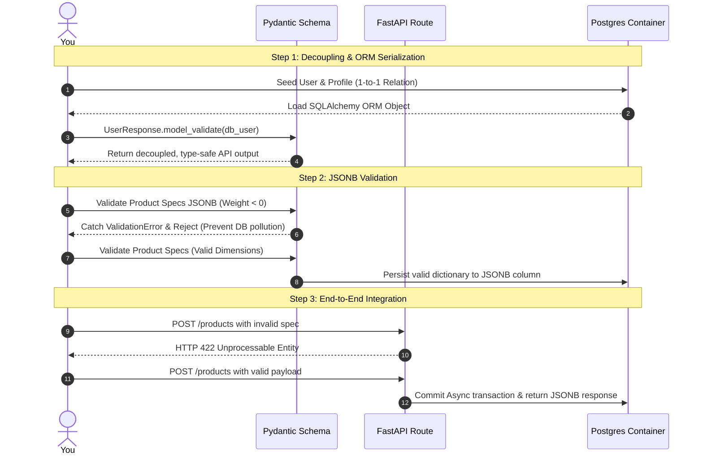

# Practical Lab: FastAPI & Pydantic v2 Serialization & Type Constraints

## 📌 Lab Overview & Objectives

In modern cloud architectures, building highly available and type-safe backend services requires seamless integration between Python's object-oriented application code, the web APIs, and the persistent relational database layer. 

Directly exposing database ORM models to the client side is a major architectural hazard. It couples your database schema directly to your API contract, leaks internal database columns (like password hashes or system IDs), and fails to validate complex hierarchical inputs cleanly. To build production-ready applications, a senior engineer must establish **schema decoupling**, separating data representations into **Request**, **Response**, and **Database ORM** representations.

Furthermore, with the rise of document and semi-structured storage, relational databases like PostgreSQL are frequently used to store flexible JSON payloads via the `JSONB` data type. However, storing raw, unvalidated JSON leads to database pollution and silent runtime exceptions. 

This lab provides hands-on mastery over **FastAPI & Pydantic v2 Application Integration**. You will configure decoupled API schemas using Pydantic v2's modern `from_attributes=True` and `model_validate` capabilities, enforce dynamic type and value validation constraints over PostgreSQL `JSONB` columns, and integrate a complete asynchronous database transaction session lifecycle in FastAPI endpoints.

### Key Skills You Will Master

- **Schema Decoupling**: Structuring independent schemas for request payloads, response payloads, and database layers to safeguard internal representations.
- **ORM Serialization via Pydantic v2**: Utilizing `model_validate` and `from_attributes=True` to efficiently serialize complex, nested SQLAlchemy ORM objects and relationships.
- **JSONB Document Validation**: Building strict Pydantic nested models (e.g. Dimensions, Specifications) to validate and serialize semi-structured database columns before persisting.
- **FastAPI Asynchronous Dependency Injection**: Managing `AsyncSession` transactional boundaries in asynchronous API routers using FastAPI dependencies.

---

## 🛠️ Prerequisites & Environment Setup

This lab runs in an isolated local environment using Docker and a Python virtual environment to allow deep integration testing without risking production data.

- **Database Engine**: PostgreSQL 17 (via Docker)
- **Application Layer**: Python 3.13 (managed via `uv`)
- **Core Libraries**: FastAPI, Pydantic v2, SQLAlchemy 2.0, Asyncpg, Httpx

### Workspace Structure

Your lab directory is organized as follows:

```text
relational-database-skills-lab/
└── labs/
    └── 007-pydantic-serialization-type-constraints/
        ├── pyproject.toml         # Dependency declarations
        ├── docker-compose.yml     # PostgreSQL container mapped to port 5437
        ├── .env.example           # Environment template
        ├── app/
        │   ├── __init__.py
        │   ├── config.py          # Database URI compiler
        │   ├── dependencies.py    # Sync/Async Engines and AsyncSession injection dependency
        │   ├── models.py          # SQLAlchemy 2.0 ORM Models (User, UserProfile, Product)
        │   ├── schemas.py         # Decoupled Request/Response & JSONB Pydantic schemas
        │   └── main.py            # FastAPI API server with transactional routes
        ├── lab_step_1.py          # Step 1: ORM Serialization & Decoupling Benchmark
        ├── lab_step_2.py          # Step 2: Dynamic JSONB Validation Benchmark
        ├── lab_step_3.py          # Step 3: FastAPI Async End-to-End API Integration
        └── README.md              # Lab workbook (This file)
```

### Initial Bootstrap

1. Navigate to the lab directory:
    ```bash
    cd labs/007-pydantic-serialization-type-constraints
    ```
2. Copy the environment template:
    ```bash
    cp .env.example .env
    ```
3. Start the PostgreSQL container:
    ```bash
    docker compose up -d
    ```
4. Sync dependencies from the root directory:
    ```bash
    cd ../..
    uv sync --all-packages
    ```
5. Activate the virtual environment:
    ```bash
    source .venv/bin/activate
    ```
6. Verify PostgreSQL is online and accepting connections:
    ```bash
    docker exec -it postgres-pydantic-integration pg_isready -U postgres -d pydantic_serialization
    ```

---

## 📝 Lab Flow & Sequence

Each step in this workbook is designed as a standalone benchmark verifying specific application-to-database boundaries:



---

## 🔬 Core Lab Steps & Content

### Step 1: Decoupling Schemas & Pydantic v2 `from_attributes` Serialization

#### 📘 Step 1 Theory: Eager Serialization & Decoupling

In production environments, directly exposing database ORM models (e.g. returning `User` directly in your API responses) is a high-risk security hazard. 
* **Leakage of Internal State**: You might accidentally leak sensitive database columns (like password hashes, soft-delete flags, or internal primary keys) to the client side.
* **Tight Coupling**: Any minor change to your database table forces an immediate, breaking change to your public API contract, breaking frontends and external integrations.

**The Solution: Decoupled Data Representations**:
To prevent this, you should structure separate Pydantic schemas for your API contract:
1. **Request Schemas** (e.g. `UserCreate`): Enforce validation rules on inputs (e.g., matching email regex, character length bounds, required inputs).
2. **Database ORM Models** (e.g. `User`): Manage relations, foreign keys, constraints, and tables.
3. **Response Schemas** (e.g. `UserResponse`): Explicitly define the *only* fields that are allowed to leave the API boundary.

**ORM to Schema: Pydantic v2 `from_attributes=True`**:
Pydantic v2 allows schemas to load values directly from rich Python objects (like SQLAlchemy ORM models) instead of dictionaries. By configuring `from_attributes = True` inside the Pydantic `model_config`, we can run:

```python
response = UserResponse.model_validate(db_user)
```

This single command tells Pydantic to walk the attributes of the database object `db_user`. If the schema has a nested model (like `profile: ProfileResponse`), Pydantic will dynamically fetch `db_user.profile`, walk its attributes, validate them against the `ProfileResponse` constraints, and serialize them into a type-safe JSON structure.

#### 🧪 Step 1 Lab Execution

Run the automated script to test schema decoupling and ORM-to-Pydantic relationship validation:

```bash
python labs/007-pydantic-serialization-type-constraints/lab_step_1.py
```

> **Observe**: 
> * Mypy checks that your Pydantic schemas and SQLAlchemy models are cleanly isolated.
> * The script successfully inserts a `User` and `UserProfile` within a transaction.
> * Pydantic's `model_validate` walks the SQLAlchemy relationship and converts the ORM entity into a clean, decoupled JSON response.

**Key Learning**: Decoupling your database schemas from your public API contracts guarantees that internal changes do not cause breaking public API failures, while `from_attributes` simplifies the serialization boundary.

---

### Step 2: Dynamic JSONB Column Validation with Pydantic

#### 📘 Step 2 Theory: Guarding the JSONB Column

Postgres `JSONB` is a powerful column type. It stores parsed binary JSON documents, allowing you to store semi-structured or flexible payloads (like product specifications, telemetry data, or dynamic settings) while still query-indexing them using GIN index paths.

However, JSONB columns lack strict database-level schema constraints by default. Without a guardrail, a bug in your application code could write invalid structures, misspelled keys, or wrong data types (e.g., writing `"weight_kg": "heavy"` instead of a floating-point number) straight into the database. This turns the database into a "garbage bin," causing runtime crashes when other services read the data.

**The Solution: Dynamic Pydantic JSONB Guards**:
Instead of treating JSONB as an untyped dictionary `dict[Any, Any]`, we map the JSONB column to a nested Pydantic model at the application boundary:

1. **Strict Specifications Schema** (`ProductSpecs`): We define the strict type and value constraints of the JSON document in a dedicated Pydantic model (e.g., requiring positive float dimensions, a warranty duration between 0 and 10 years).
2. **Ingress Validation**: Validate incoming payloads against this model *before* hitting the database. If it fails, Pydantic raises a `ValidationError` at the door.
3. **Egress Parsing**: When fetching records from the database, the raw dict is parsed back into a rich, structured Pydantic object, ensuring type-safe access throughout our codebase.

#### 🧪 Step 2 Lab Execution

Run the automated script to verify how Pydantic guards the JSONB boundaries:

```bash
python labs/007-pydantic-serialization-type-constraints/lab_step_2.py
```

> **Observe**: 
> * In the first test, submitting invalid specs (like a negative weight or a 15-year warranty) is caught immediately at the Pydantic schema validation boundary. The error detail lists the exact coordinate path of the violation.
> * In the second test, valid specifications are converted into a dictionary via `.model_dump()` and persisted directly into the Postgres JSONB column.
> * When loaded back, the raw dictionary is seamlessly parsed into a rich, nested `ProductResponse` model, providing strict type-safety for nested objects.

**Key Learning**: Enforcing strict Pydantic schemas on JSONB columns before database insertion protects your database integrity while maintaining the runtime flexibility of document databases.

---

### Step 3: FastAPI Async End-to-End API Integration

#### 📘 Step 3 Theory: Asynchronous Request/Response Lifecycles

In highly concurrent web applications (like FastAPI), database interactions should be fully asynchronous. Managing the lifecycle of these asynchronous database sessions (`AsyncSession`) is crucial:
* **Connection Management**: A database connection should be acquired from the pool when a request arrives, used for queries, committed upon completion, and returned to the pool immediately.
* **Leaking Sessions**: If sessions are shared across requests or are not closed on error, you will leak connections and experience thread collisions, quickly exhausting the connection pool.

FastAPI handles this elegantly using **Dependency Injection** and async generators:

```python
async def get_db_session() -> AsyncGenerator[AsyncSession, None]:
    async with AsyncSessionLocal() as session:
        try:
            yield session
            await session.commit()
        except Exception:
            await session.rollback()
            raise
```

By injecting `db: AsyncSession = Depends(get_db_session)` into endpoint signatures:
1. FastAPI automatically instantiates a dedicated `AsyncSession` when the request arrives.
2. The endpoint executes queries asynchronously.
3. Once the endpoint returns, the dependency commits the transaction. If an exception occurs, the dependency catches it, rolls back, and closes the session cleanly.

#### 🧪 Step 3 Lab Execution

Run the automated script to test the E2E API server integration:

```bash
python labs/007-pydantic-serialization-type-constraints/lab_step_3.py
```

> **Observe**: 
> * The script boots up a local FastAPI server inside a background thread.
> * Using `httpx`, it fires concurrent requests simulating valid and invalid registrations.
> * The API server automatically executes async database transactions and returns Pydantic-validated JSON payloads.

---

## 🎯 Lab Outcomes & Verification Checklist

To successfully complete this lab, you must produce and verify the following results:

- [ ] **Step 1 Execution**: Run `lab_step_1.py` and verify nested relationship ORM-to-Pydantic serialization works.
- [ ] **Step 2 Execution**: Run `lab_step_2.py` and verify Pydantic catches invalid JSONB structures and parses raw database JSONB back into strict schemas.
- [ ] **Step 3 Execution**: Run `lab_step_3.py` and verify HTTP validation responses (221 vs 422) via the FastAPI server.
- [ ] **Type & Quality Checks**: Run `make check` from the project root and verify all Ruff, formatting, and strict Mypy checks pass perfectly.

When you are finished with your local experiment, tear down your sandbox:

```bash
docker compose down -v
```

---

## ❓ Deep-Dive Self-Assessment

Formulate answers to these production-level questions based on your observations during this lab:

1. **Why is exposing internal ORM models directly in your FastAPI path parameters or response fields a major security and design hazard?**
2. **What is the difference between Pydantic's `model_dump()` and `model_dump_json()`? When should you use each one when interacting with SQLAlchemy?**
3. **If you have a JSONB column with millions of rows, what are the indexing strategies (e.g. GIN index) to ensure query paths like `specs -> 'dimensions' ->> 'width'` are executed in microseconds instead of sequential table scans?**
4. **How does FastAPI's dependency injection (`Depends(get_db_session)`) guarantee that a database connection is not leaked if an unhandled Exception is raised inside your endpoint logic?**

---

## 📚 Additional Resources

- [SQLAlchemy 2.0 Asyncio Documentation](https://docs.sqlalchemy.org/en/20/orm/extensions/asyncio.html)
- [Pydantic v2 Serialization Guide](https://docs.pydantic.dev/latest/concepts/serialization/)
- [PostgreSQL JSONB Types & Path Indexing](https://www.postgresql.org/docs/current/datatype-json.html)
- [FastAPI Dependency Injection Tutorial](https://fastapi.tiangolo.com/tutorial/dependencies/)
