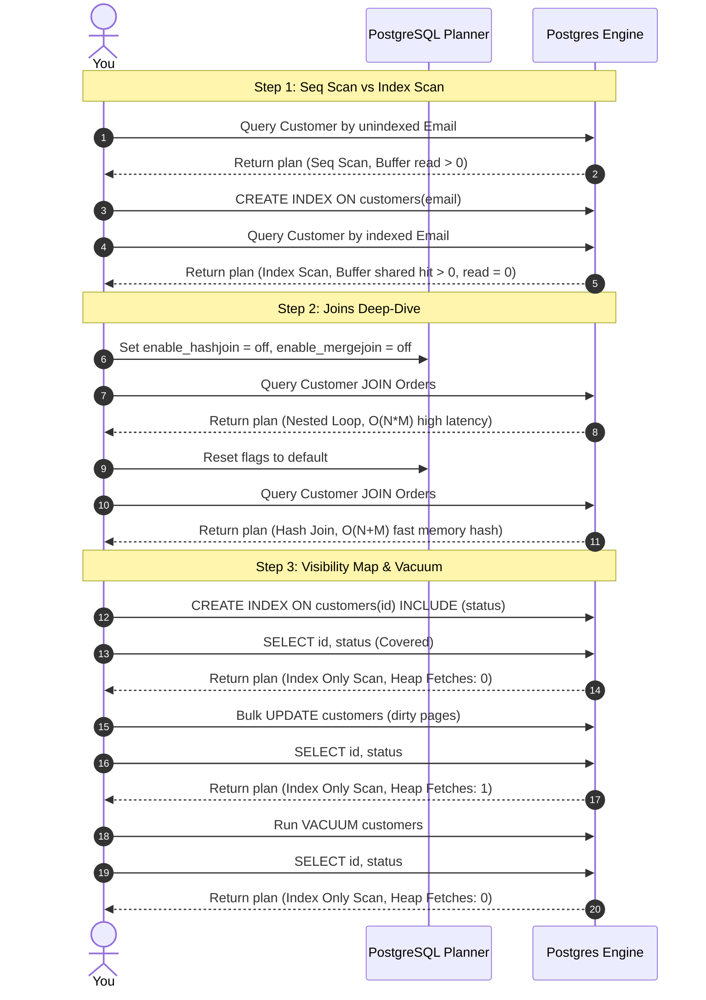

# Practical Lab: Query Performance, Execution Plans & Diagnostics

## 📌 Lab Overview & Objectives

In production environments, a senior database engineer does not guess why a query is slow; they ask the database. Writing optimal SQL or designing models is only half the battle. When queries scale to millions of rows under heavy transactional loads, you must be able to read the database engine's mind by analyzing its **Execution Plan**.

PostgreSQL generates an execution plan for every query using its query planner/optimizer. By prefixing a query with `EXPLAIN (ANALYZE, BUFFERS)`, you receive a detailed, runtime breakdown of the planning decisions and physical database execution steps:
1. **Planning vs. Execution Time**: The overhead of formulating the plan compared to executing it.
2. **Scan Types**: How Postgres accesses row blocks on disk/memory (e.g. `Seq Scan`, `Index Scan`, `Index Only Scan`, `Bitmap Index Scan`).
3. **Join Strategies**: How tables are matched (e.g. `Nested Loop`, `Hash Join`, `Merge Join`).
4. **Buffer Statistics**: The efficiency of the Shared Buffer Cache (measuring `shared hit` cache accesses vs `read` hard disk IO reads).

This lab provides hands-on mastery over **PostgreSQL Query Performance & Execution Plans**. You will seed a large order catalog (20,000 customers, 50,000 orders), execute lookups and joins under deep plan diagnostics, capture and interpret plan details, force the planner to use specific join methods to analyze their memory/latency profiles, and inspect covering indexes and the **Visibility Map** under dirty heap updates and `VACUUM` runs.

### Key Skills You Will Master

- **Interpreting EXPLAIN (ANALYZE, BUFFERS)**: Parsing cost, timing, scans, joins, and buffer metrics in complex PostgreSQL plans.
- **Differentiating Scan Strategies**: Explaining when and why Postgres uses Sequential scans, Index scans, Index Only scans, and Bitmap Heap scans.
- **Evaluating Join Types**: Describing the performance profiles and memory constraints of Nested Loops, Hash Joins, and Merge Joins.
- **Covering Indexes & Visibility Maps**: Designing indexes using the `INCLUDE` clause to achieve `Heap Fetches: 0` and describing how table updates and `VACUUM` heal the visibility map.

---

## 🛠️ Prerequisites & Environment Setup

This lab runs in an isolated local environment using Docker and a Python virtual environment to allow deep database inspection and vacuum operations without risk.

- **Database Engine**: PostgreSQL 17 (via Docker)
- **Application Layer**: Python 3.13 (managed via `uv`)
- **Core Libraries**: SQLAlchemy 2.0, Psycopg 3, Faker, Loguru

### Workspace Structure

Your lab folder is organized as follows:

```text
relational-database-skills-lab/
└── labs/
    └── 008-explain-analyze-buffers/
        ├── pyproject.toml         # Dependency declarations
        ├── docker-compose.yml     # PostgreSQL container mapped to port 5438
        ├── .env.example           # Environment template
        ├── app/
        │   ├── __init__.py
        │   ├── config.py          # Database URI loader
        │   ├── dependencies.py    # Database session factories and Faker seeder
        │   └── models.py          # SQLAlchemy 2.0 ORM Models (Customer, Order)
        ├── lab_step_1.py          # Step 1: Scans & Shared Buffers Diagnostics
        ├── lab_step_2.py          # Step 2: Join Strategies Deep-Dive (Nested Loop, Hash, Merge)
        ├── lab_step_3.py          # Step 3: Covering Indexes & Visibility Map Egress
        └── README.md              # Lab workbook (This file)
```

### Initial Bootstrap

1. Navigate to the lab directory:
    ```bash
    cd labs/008-explain-analyze-buffers
    ```
2. Copy the environment template:
    ```bash
    cp .env.example .env
    ```
3. Start the PostgreSQL container:
    ```bash
    docker compose up -d
    ```
4. Sync dependencies from the root directory:
    ```bash
    cd ../..
    uv sync --all-packages
    ```
5. Activate the virtual environment:
    ```bash
    source .venv/bin/activate
    ```
6. Verify PostgreSQL is online and accepting connections:
    ```bash
    docker exec -it postgres-explain-analyze pg_isready -U postgres -d explain_lab
    ```

---

## 📝 Lab Flow & Sequence

Each step in this workbook targets a core area of database diagnostics:



---

## 🔬 Core Lab Steps & Content

### Step 1: Seq Scan vs. Index Scan & Analyzing Buffers

#### 📘 Step 1 Theory: Scans and Shared Buffers

PostgreSQL stores table data in fixed-size blocks (typically **8KB pages**). When you query the database, it must read these pages into memory.

When analyzing a plan using `EXPLAIN (ANALYZE, BUFFERS)`, you must inspect how pages are loaded:
1. **`shared hit`**: The page was already loaded in PostgreSQL's **Shared Buffer Cache** (RAM). This is extremely fast (nanoseconds/microseconds) and consumes zero disk IO.
2. **`shared read`**: The page was not in memory, forcing PostgreSQL to perform a physical disk read to load the 8KB page. This is relatively slow (milliseconds) and consumes disk IOPS.

##### Scan Strategies:
* **`Seq Scan` (Sequential Scan)**: Postgres scans every page in the table from first to last. If you lookup an unindexed customer email in a table with 20,000 rows, it reads every customer page from disk.
* **`Index Scan`**: Postgres checks a B-Tree index structure (O(log N)), retrieves the exact tuple ID (TID) containing the physical row address, and reads *only* that specific page from the table heap.
* **`Index Only Scan`**: The query selects *only* columns that are stored directly inside the index itself. If the index contains all needed information, Postgres doesn't read the table heap at all!

#### 🧪 Step 1 Lab Execution

Run the automated script to test sequential scans vs index scans:

```bash
python labs/008-explain-analyze-buffers/lab_step_1.py
```

> **Observe**: 
> * **Test 1**: Runs lookups on the unindexed `email` column. Observe `Seq Scan` in the plan with `Buffers: read=218` (values may vary). The planning time is negligible, but execution time is slow.
> * **Test 2**: After creating `idx_customers_email`, observe the query shifts to `Index Scan` (or `Index Only Scan`), and the buffers read statistic changes to `shared hit=3` and `read=0`. The execution time drops to microseconds.

---

### Step 2: Joins Deep-Dive: Nested Loop vs. Hash Join vs. Merge Join

#### 📘 Step 2 Theory: Join Algorithms

When joining two tables (e.g. `customers` and `orders`), the PostgreSQL optimizer dynamically chooses one of three algorithms depending on table sizes, indexes, and sorting constraints:

##### 1. **`Nested Loop` (Complexity: $O(N \times M)$)**
* **How it works**: For every row in the outer table, it loops and searches the inner table.
* **Best for**: Small tables or when the inner table has an index on the join key.
* **Production Hazard**: If both tables are large (e.g. joining 20,000 customers with 50,000 orders) and there is no index, a Nested Loop is catastrophically slow, performing up to $1,000,000,000$ loop operations.

##### 2. **`Hash Join` (Complexity: $O(N + M)$)**
* **How it works**: Postgres reads the smaller table into memory and builds a high-speed **Hash Table** keyed by the join attribute. It then scans the larger table, hashing its join key, and matches it against the in-memory hash table.
* **Best for**: Large, unsorted tables.
* **Constraint**: Requires enough in-memory `work_mem` to hold the hash table, otherwise it spills to disk, degrading performance.

##### 3. **`Merge Join` (Complexity: $O(N \log N + M \log M)$)**
* **How it works**: Both tables are sorted by the join key first. Once sorted, Postgres scans both in parallel, merging matching rows in a single pass.
* **Best for**: Large tables that are already sorted (e.g. sorted by an index).

#### 🧪 Step 2 Lab Execution

Run the automated script to force different join strategies and compare their metrics:

```bash
python labs/008-explain-analyze-buffers/lab_step_2.py
```

> **Observe**: 
> * **Test 1 (Default)**: The planner chooses a **Hash Join** which executes in milliseconds by hashing customer records.
> * **Test 2 (Forced Nested Loop)**: Disabling Hash and Merge joins forces a **Nested Loop**. Observe the cost calculation and execution time skyrocket.
> * **Test 3 (Forced Merge Join)**: Disabling Hash and Nested Loop forces a **Merge Join**. Postgres sorts both datasets before merging them.

---

### Step 3: Covering Indexes & The Visibility Map

#### 📘 Step 3 Theory: The Visibility Map and Heap Fetches

An **`Index Only Scan`** is the gold standard of query optimization. Because the index contains all columns requested in the `SELECT` clause, the database does not need to fetch the row from the physical table heap, saving RAM and IO.

However, in PostgreSQL, an `Index Only Scan` must still guarantee **transaction visibility (ACID)**:
* How does Postgres know if the row stored in the index is visible to your current transaction (i.e. not modified or deleted by another concurrent transaction)?
* Normally, it must check the table row header (the heap) to check `xmin` and `xmax` visibility transactions.

##### The Visibility Map (VM):
To prevent checking the heap on every index scan, Postgres uses a bitmapped file called the **Visibility Map**. 
* If all rows in an 8KB page are old and have been committed, Postgres marks that page as **clean/visible** in the Visibility Map.
* During an `Index Only Scan`, Postgres checks the VM. If the page is marked clean, it skips the heap fetch entirely! This results in **`Heap Fetches: 0`**.
* If a row on that page is **updated, inserted, or deleted**, the page is marked **dirty**, and the VM bit is cleared. 
* Any subsequent `Index Only Scan` on that page is forced to fetch the heap block to verify visibility, resulting in **`Heap Fetches: 1`** or more, degrading performance.
* **`VACUUM`** is the only process that rebuilds the Visibility Map, re-marking unmodified pages as clean.

#### 🧪 Step 3 Lab Execution

Run the automated script to witness covering indexes and Visibility Map healing in action:

```bash
python labs/008-explain-analyze-buffers/lab_step_3.py
```

> **Observe**: 
> * **Test 1**: A standard index scan on `id` requires reading from the index and then fetching the `status` from the heap table.
> * **Test 2**: Creating a Covering Index (`INCLUDE (status)`) shifts the query to `Index Only Scan` with `Heap Fetches: 0` because all pages are clean.
> * **Test 3**: Updating status values in a target range dirties the heap pages. Re-running the query still shows `Index Only Scan`, but with **`Heap Fetches: 1`** because the page is dirty!
> * **Test 4**: Running `VACUUM customers` rebuilds the Visibility Map. Re-running the query restores **`Heap Fetches: 0`**!

---

## 🎯 Lab Outcomes & Verification Checklist

To successfully complete this lab, you must produce and verify the following results:

- [ ] **Step 1 Execution**: Run `lab_step_1.py` and verify `Seq Scan` shifts to `Index Scan` with buffer cache hits replacing disk reads.
- [ ] **Step 2 Execution**: Run `lab_step_2.py` and compare the cost and latency profiles of Hash Join, forced Nested Loop, and forced Merge Join.
- [ ] **Step 3 Execution**: Run `lab_step_3.py` and demonstrate covering indexes, dirty page heap fetches, and `VACUUM` Visibility Map healing.
- [ ] **Type & Quality Checks**: Run `make check` from the project root and verify all Ruff, formatting, and strict Mypy checks pass perfectly.

When you are finished with your local experiment, tear down your sandbox:

```bash
docker compose down -v
```

---

## ❓ Deep-Dive Self-Assessment

Formulate answers to these production-level questions based on your observations during this lab:

1. **Why does PostgreSQL's unique constraint (like `unique=True` on a column) automatically create an index? Why did we have to remove it to demonstrate a raw `Seq Scan` on `email`?**
2. **What is the difference between `Planning Time` and `Execution Time` in an EXPLAIN ANALYZE plan? In what scenarios (e.g. dynamic queries, partition pruning) might `Planning Time` exceed `Execution Time`?**
3. **If a Hash Join spills to disk (indicated by `temp read` and `temp write` in execution logs), what PostgreSQL parameter should you adjust, and what are the system-wide memory tradeoffs?**
4. **Why is `VACUUM` essential for maintaining the performance of `Index Only Scans` on write-heavy tables? What happens if autovacuum is turned off or severely throttled?**

---

## 📚 Additional Resources

- [PostgreSQL EXPLAIN Documentation](https://www.postgresql.org/docs/current/sql-explain.html)
- [Using EXPLAIN (ANALYZE, BUFFERS) - Depesz Guide](https://explain.depesz.com/)
- [SQLAlchemy 2.0 Core Query Execution](https://docs.sqlalchemy.org/en/20/core/connections.html)
- [PostgreSQL Visibility Map Internals](https://www.postgresql.org/docs/current/storage-vm.html)
