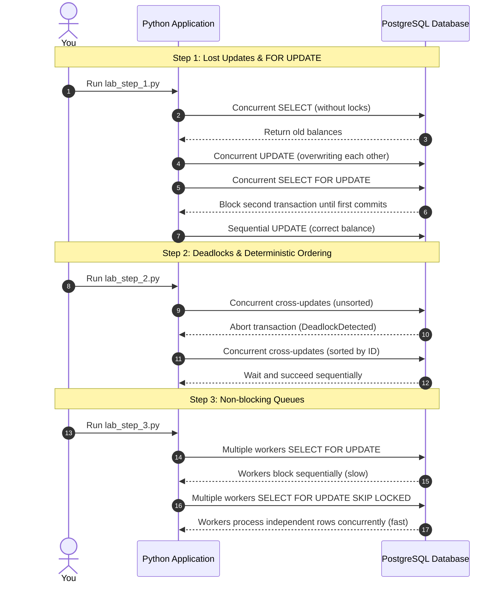

# Practical Lab: Advanced Locking Mechanics

## 📌 Lab Overview & Objectives

In highly concurrent production environments, many transactions will attempt to read and write the exact same rows simultaneously. If not handled correctly, this leads to race conditions (Lost Updates), deadlocks, or severe performance bottlenecks. A senior engineer must understand how to manually command PostgreSQL's row-level locking mechanisms to guarantee ACID compliance while maximizing throughput.

This lab explores how to safely update concurrent balances, how to identify and prevent circular dependency deadlocks, and how to use non-blocking database locks to build highly scalable background job queues.

### Key Skills You Will Master

- Identifying and preventing the "Lost Update" anomaly using `SELECT ... FOR UPDATE`.
- Understanding why and how `psycopg.errors.DeadlockDetected` occurs.
- Designing deterministic locking patterns to prevent deadlocks entirely.
- Building distributed, concurrent worker queues in Postgres using `SKIP LOCKED`.

---

## 🛠️ Prerequisites & Environment Setup

This lab runs in an isolated local environment to allow intrusive experimentation with multi-threaded database connections.

- **Database Engine**: PostgreSQL 17 (via Docker)
- **Application Layer**: Python 3.13, SQLAlchemy 2.0, Psycopg 3
- **Dependencies**: Managed by `uv` (see `pyproject.toml`)

### Workspace Structure

Your lab folder is organized as follows:

```text
relational-database-skills-lab/
└── labs/
    └── 009-advanced-locking-mechanics/
        ├── pyproject.toml         # Lab-specific dependencies
        ├── docker-compose.yml     # PostgreSQL 17 container
        ├── .env.example           # Environment variables template
        ├── app/
        │   ├── __init__.py
        │   ├── config.py          # Environment loader
        │   ├── dependencies.py    # Session factory & DB initialization
        │   └── models.py          # Account & Job tables
        ├── lab_step_1.py          # Step 1: Row-Level Locks
        ├── lab_step_2.py          # Step 2: Deadlocks
        ├── lab_step_3.py          # Step 3: SKIP LOCKED Queues
        └── README.md              # Lab workbook (This file)
```

### Initial Bootstrap:

1. Open your terminal and navigate to the lab folder:
    ```bash
    cd labs/009-advanced-locking-mechanics
    ```
2. Copy the environment variables template:
    ```bash
    cp .env.example .env
    ```
3. Launch the Postgres container in the background:
    ```bash
    docker compose up -d
    ```
4. From the project root, sync dependencies using `uv`:
    ```bash
    cd ../..
    uv sync --all-packages
    ```
5. You are ready to run the lab steps!

---

## 📝 Lab Flow & Sequence

The following diagram illustrates the interaction flow across the three core steps of this lab:



---

## 🔬 Core Lab Steps & Content

### Step 1: Row-Level Locks (Lost Updates & FOR UPDATE)

#### 📘 Step 1 Theory: Row-Level Locks

By default, PostgreSQL allows multiple transactions to read the same row concurrently. If two transactions read `balance = 100`, and both add `50` and write back `150`, one transaction effectively erases the other's work. This is the **Lost Update Anomaly**.

To fix this, you must explicitly lock the row during the read phase. 
- `SELECT ... FOR UPDATE` locks the rows so that any other transaction trying to execute a `FOR UPDATE` or `UPDATE` on those rows must wait until the first transaction commits or rolls back.
- `SELECT ... FOR SHARE` allows other transactions to read the row, but prevents them from updating it.

#### 🧪 Step 1 Lab Execution

Run the automated Python script to observe concurrent threads triggering a lost update, followed by the `FOR UPDATE` fix:

```bash
python labs/009-advanced-locking-mechanics/lab_step_1.py
```

> **Observe**: In Test 1, both workers read `100` at the same time and update to `150`. The final balance is wrong. In Test 2, Worker 4 is forced to wait until Worker 3 commits, ensuring the final balance is `200`.

**Production Implications**:
- **Financial Systems**: Always use `with_for_update()` when checking balances prior to a transfer.
- **Performance**: Row locks hold until the end of the transaction. Keep the transaction block as short as possible to avoid degrading concurrent throughput.

---

### Step 2: Deadlocks & Deterministic Ordering

#### 📘 Step 2 Theory: Deadlocks

A deadlock occurs when Transaction A holds a lock on Row 1 and waits for Row 2, while Transaction B holds a lock on Row 2 and waits for Row 1. Neither can proceed. PostgreSQL runs a background deadlock detector that automatically aborts one of the transactions to break the cycle.

The solution is not to retry indefinitely, but to lock resources in a **deterministic order** (e.g., always sort accounts by ID and lock the lowest ID first).

#### 🧪 Step 2 Lab Execution

Run the deadlock simulation:

```bash
python labs/009-advanced-locking-mechanics/lab_step_2.py
```

> **Observe**: Test 1 crashes with `psycopg.errors.DeadlockDetected`. Test 2 succeeds because both workers sort the IDs and lock Account 1 before Account 2.

**Production Implications**:
- Always sort primary keys when executing bulk updates or multi-row transfers.

---

### Step 3: Non-blocking Queues (NOWAIT & SKIP LOCKED)

#### 📘 Step 3 Theory: SKIP LOCKED

If multiple background workers poll a `jobs` table using `FOR UPDATE`, they will serialize: Worker 2 blocks completely waiting for Worker 1 to finish processing its locked rows. 

By adding `SKIP LOCKED`, Worker 2 will instantly bypass any rows locked by Worker 1 and grab the next available unlocked rows. This turns a standard table into a highly scalable, parallelized queue.

#### 🧪 Step 3 Lab Execution

Run the queue processor:

```bash
python labs/009-advanced-locking-mechanics/lab_step_3.py
```

> **Observe**: Test 1 takes 3 seconds because the workers process sequentially. Test 2 takes 1 second because the workers process simultaneously!

---

## 🎯 Lab Outcomes & Verification Checklist

To successfully complete this lab, you must produce and verify the following results:

- [ ] **Lost Update Prevented**: Verified that `with_for_update()` correctly serialized concurrent writes.
- [ ] **Deadlock Resolved**: Successfully caught a `DeadlockDetected` exception and resolved it via ID sorting.
- [ ] **Queue Scaled**: Observed parallel execution time drop by 66% when using `skip_locked=True`.

When you are finished with your local experiment, tear down your sandbox:

```bash
docker compose down -v
```

---

## ❓ Deep-Dive Self-Assessment

1. _If two transactions execute `SELECT ... FOR SHARE` on the same row, do they block each other? What if one tries to `UPDATE`?_
2. _Why is `NOWAIT` usually a bad idea for queue processing compared to `SKIP LOCKED`?_
3. _In SQLAlchemy, when exactly is a row lock acquired via `with_for_update()` released?_
