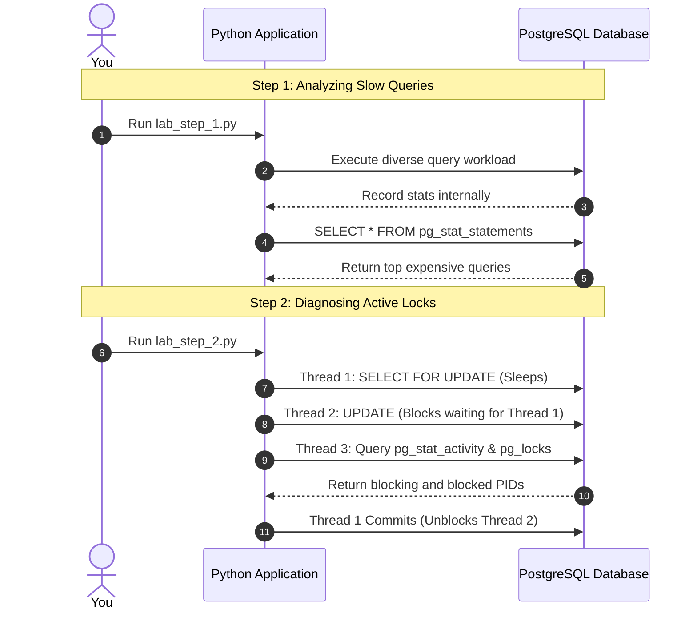

# Practical Lab: Production Observability

## 📌 Lab Overview & Objectives

In a production environment, you cannot afford to guess why the database is slow or why an API endpoint timed out. A senior engineer relies on direct database instrumentation and observability tools. PostgreSQL provides powerful systemic views through `pg_stat_statements` and `pg_stat_activity` to diagnose slow queries and blocked transactions in real-time.

This lab explores how to identify your system's most expensive queries and how to pinpoint exactly which transaction is causing a lock cascade.

### Key Skills You Will Master

- Enabling and using `pg_stat_statements` to find queries consuming the most cumulative time.
- Differentiating between frequently-run fast queries and infrequently-run slow queries.
- Using `pg_stat_activity` combined with `pg_locks` to instantly diagnose blocked queries and find the offending PID.

---

## 🛠️ Prerequisites & Environment Setup

This lab runs in an isolated local environment with the `pg_stat_statements` extension enabled at the container level.

- **Database Engine**: PostgreSQL 17 (via Docker)
- **Application Layer**: Python 3.13, SQLAlchemy 2.0
- **Dependencies**: Managed by `uv`

### Workspace Structure

Your lab folder is organized as follows:

```text
relational-database-skills-lab/
└── labs/
    └── 010-production-observability/
        ├── pyproject.toml         # Lab-specific dependencies
        ├── docker-compose.yml     # Database with pg_stat_statements enabled
        ├── .env.example           # Environment variables template
        ├── app/
        │   ├── __init__.py
        │   ├── config.py          
        │   ├── dependencies.py    # Includes extension creation
        │   └── models.py          
        ├── lab_step_1.py          # Step 1: Slow query diagnostics
        ├── lab_step_2.py          # Step 2: Blocked query diagnostics
        └── README.md              # Lab workbook (This file)
```

### Initial Bootstrap:

1. Open your terminal and navigate to the lab folder:
    ```bash
    cd labs/010-production-observability
    ```
2. Copy the environment variables template and configure if needed:
    ```bash
    cp .env.example .env
    ```
3. Launch the Postgres container in the background:
    ```bash
    docker compose up -d
    ```
4. From the project root, sync dependencies using `uv`:
    ```bash
    cd ../..
    uv sync --all-packages
    ```
5. You are ready to run the lab steps!

---

## 📝 Lab Flow & Sequence

The following diagram illustrates the interaction flow across the two core steps of this lab:



---

## 🔬 Core Lab Steps & Content

### Step 1: Analyzing Slow Queries with `pg_stat_statements`

#### 📘 Step 1 Theory: `pg_stat_statements`

`pg_stat_statements` is a PostgreSQL extension that tracks planning and execution statistics of all SQL statements executed by a server. It normalizes queries (replacing literal values with parameters) so you can see aggregate performance.

When optimizing a database, you must look at **Total Execution Time**, not just individual query speed. A query that takes 1ms but runs 1,000,000 times a day consumes far more database resources than a query that takes 500ms but runs 5 times a day.

#### 🧪 Step 1 Lab Execution

Run the automated Python script to generate a workload and then query the statistics:

```bash
python labs/010-production-observability/lab_step_1.py
```

> **Observe**: The script resets the stats, runs three different types of queries at varying frequencies, and then asks Postgres which query consumed the most time. Look at how the `calls`, `total_time_ms`, and `mean_time_ms` metrics relate to each other.

**Key Insight**: The most expensive query overall might be a fast query that is called aggressively, or a slow query that is called occasionally. `pg_stat_statements` immediately gives you the "villain" to focus on optimizing.

**Production Implications**:
- **Continuous Monitoring**: In AWS RDS, Performance Insights uses `pg_stat_statements` under the hood. You should routinely review the top 5 most expensive queries in your production cluster.

---

### Step 2: Diagnosing Active Locks and Blocking Queries

#### 📘 Step 2 Theory: `pg_stat_activity` and `pg_locks`

When a database suddenly spikes in connection count and APIs start timing out, it is often due to a lock cascade: Transaction A locks a row and stalls (perhaps doing a slow network request), Transaction B waits for A, Transaction C waits for B, until the connection pool is exhausted.

You can combine `pg_stat_activity` (which shows what each connection is currently doing) with `pg_locks` (which tracks acquired and waiting locks) to instantly identify the root cause of the blockage.

#### 🧪 Step 2 Lab Execution

Run the deadlock/blocking simulation script:

```bash
python labs/010-production-observability/lab_step_2.py
```

> **Observe**: The script spawns three threads. Thread 1 locks a row and sleeps. Thread 2 attempts to update that row and gets blocked. Thread 3 swoops in and queries the system catalogs to find exactly which PID is blocking which PID.

**Key Insight**: By joining `pg_locks` with `pg_stat_activity`, you can trace a stalled query back to the exact transaction that is holding the lock, allowing you to manually terminate it if necessary.

**Production Implications**:
- **SRE Tooling**: This diagnostic query should be in every senior engineer's playbook. If the database is locked up, running this query will give you the `blocking_pid`.
- **Mitigation**: You can forcefully kill the offending transaction using `SELECT pg_terminate_backend(<blocking_pid>);`.

---

## 🎯 Lab Outcomes & Verification Checklist

To successfully complete this lab, you must produce and verify the following results:

- [ ] **pg_stat_statements Output**: Successfully viewed the aggregated statistics of the generated workload, noting total time vs mean time.
- [ ] **Blocker Identified**: Successfully ran the diagnostic query to see the PID of the sleeping transaction that was blocking the `UPDATE` statement.

When you are finished with your local experiment, tear down your sandbox:

```bash
docker compose down -v
```

---

## ❓ Deep-Dive Self-Assessment

Formulate answers to these production-level questions based on your observations during this lab:

1. _Why does `pg_stat_statements` replace actual values (like `WHERE id = 5`) with parameterized symbols (like `WHERE id = $1`) in its output?_
2. _If you identify a query with a very high `mean_time` but a low `calls` count, what steps would you take to optimize it?_
3. _When running `pg_terminate_backend()` to kill a blocking query, what happens to the data that transaction was modifying?_

---

## 📚 Additional Resources

- [PostgreSQL Documentation: pg_stat_statements](https://www.postgresql.org/docs/current/pgstatstatements.html)
- [PostgreSQL Documentation: pg_stat_activity](https://www.postgresql.org/docs/current/monitoring-stats.html#MONITORING-PG-STAT-ACTIVITY-VIEW)
