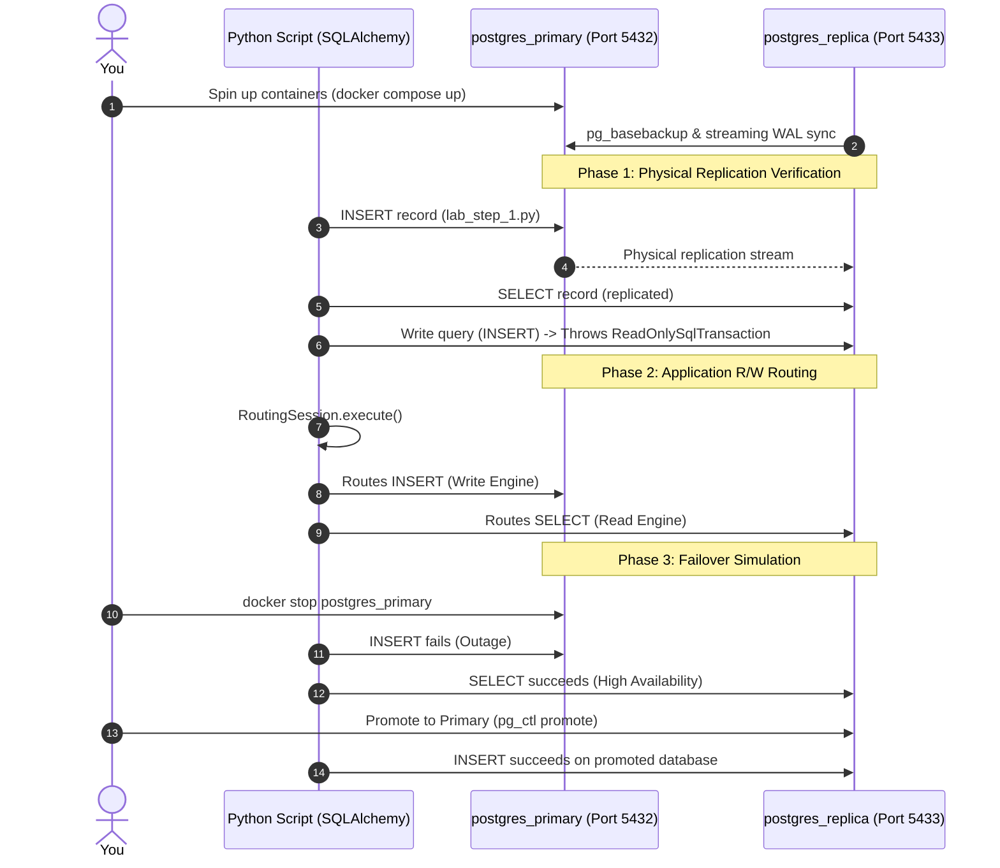

# Practical Lab 011: PostgreSQL Scaling & Topology

## 📌 Lab Overview & Objectives

In production environments, databases cannot run on a single instance without exposing the application to significant risk. A single-node database represents a single point of failure (SPOF) and restricts the system's ability to scale horizontally. To build resilient and scalable backend architectures, developers must understand and coordinate with SRE/DevOps to implement primary-replica setups, route database queries efficiently at the application level, and handle automated or manual failovers gracefully.

This lab simulates a physical PostgreSQL **Streaming Replication** setup locally using Docker Compose, containing a Primary (writer) database and a Replica (hot standby reader) database. You will implement a custom SQLAlchemy `Session` subclass that dynamically routes reads and writes, observe how PostgreSQL manages replication states, and simulate a primary node failure and subsequent replica promotion.

### Key Skills You Will Master

- Setting up and configuring PostgreSQL physical streaming replication inside a Docker Compose network.
- Querying and reading replication metadata from `pg_catalog` (e.g., `pg_stat_replication`, `pg_is_in_recovery()`).
- Trapping and handling read-only transaction database exceptions (`ReadOnlySqlTransaction`) at the Python application layer.
- Designing and implementing dynamic database query routing (Read/Write splitting) in SQLAlchemy 2.0.
- Resolving session cache inconsistencies (identity map cache issues) when querying read replicas.
- Simulating database failover outages, promoting a replica database to read-write mode, and managing client-side database re-routing.

---

## 🛠️ Prerequisites & Environment Setup

This lab runs in an isolated local environment using Docker.

- **Database Engine**: PostgreSQL 17 (via Docker)
- **Application Layer**: Python 3.13, SQLAlchemy 2.0+, and `psycopg3` (async/sync driver)
- **Dependencies**: Already specified in the lab's `pyproject.toml` and synchronized using `uv`.

### Workspace Structure

Your lab folder is organized as follows:

```text
labs/011-scaling-topology/
├── pyproject.toml               # Lab-specific dependencies
├── docker-compose.yml           # PostgreSQL Primary & Replica container configuration
├── .env.example                 # Connection URI configuration template
├── app/
│   ├── __init__.py
│   ├── config.py                # Configuration management for database URIs
│   ├── dependencies.py          # SQLAlchemy engine and RoutingSession factories
│   └── models.py                # ORM model for testing (UserAccount)
├── scripts/
│   ├── init-primary.sh          # Primary node bootstrapper (creates replicator user)
│   ├── init-replica.sh          # Replica node bootstrapper (pg_basebackup)
│   └── check_lag.sql            # Diagnostic SQL script for replication lag
├── lab_step_1.py                # Step 1: Replication flow verification script
├── lab_step_2.py                # Step 2: Read/Write routing demonstration
├── lab_step_3.py                # Step 3: Replica promotion & failover simulation
└── README.md                    # Lab workbook (This file)
```

### Initial Bootstrap:

1. Open your terminal and navigate to the lab folder:
    ```bash
    cd labs/011-scaling-topology
    ```
2. Copy the environment variables template:
    ```bash
    cp .env.example .env
    ```
3. Launch the database containers in the background:
    ```bash
    docker compose up -d
    ```
4. Sync dependencies from the project root:
    ```bash
    cd ../..
    uv sync --all-packages
    ```
5. Activate the virtual environment:
    ```bash
    source .venv/bin/activate
    ```
6. Verify both database nodes are online and running:
    ```bash
    docker exec -it postgres_primary pg_isready -U postgres -d scaling_topology
    docker exec -it postgres_replica pg_isready -U postgres -d scaling_topology
    ```

---

## 📝 Lab Flow & Sequence



---

## 🔬 Core Lab Steps & Content

### Step 1: Physical Replication Verification

#### 📘 Step 1 Theory: Physical Streaming Replication
PostgreSQL streaming replication is a record-based physical replication mechanism. The Primary server continuously streams Write-Ahead Log (WAL) records to the Replica server over a TCP connection. 

There are two primary modes of physical streaming replication:
1. **Asynchronous Replication (Default)**: The Primary commits transactions locally and immediately returns success to the client before the WAL records are transmitted or written to the Replica. This provides low latency but risks a small window of data loss if the Primary crashes before WAL shipping.
2. **Synchronous Replication**: The Primary blocks transaction commits until one or more replicas acknowledge that they have written the WAL data to disk. This guarantees zero data loss but introduces network latency to every write operation.

Under physical replication, the replica's database state is an identical byte-for-byte copy of the primary. As a result, the replica is locked in **hot standby** mode—allowing read-only transactions but rejecting any commands that alter the database state (e.g., `INSERT`, `UPDATE`, `DELETE`, `DDL`). If a write query hits the replica, the engine throws a `ReadOnlySqlTransaction` error.

#### 🧪 Step 1 Lab Execution

Run the automated script to verify the replication node roles, verify that writes to the Primary replicate to the Replica, and observe the read-only restriction on the Replica:

```bash
python labs/011-scaling-topology/lab_step_1.py
```

> **Observe**:
> - The primary's `pg_is_in_recovery()` returns `False` while the replica's returns `True`.
> - Data written to port `5432` is readable from port `5433`.
> - A direct write to port `5433` fails with a `ReadOnlySqlTransaction` exception.
> - The replication statistics show the active replica state and lag bytes.

---

### Step 2: Read/Write Routing in SQLAlchemy

#### 📘 Step 2 Theory: Dynamic Query Routing & Identity Map Inconsistencies
To offload database reads from the primary writer database, we implement **Read/Write Splitting**. Writes (DML/DDL) go to the primary node, while reads (SELECTs) are distributed across read replicas.

In SQLAlchemy, query routing is achieved by overriding the `get_bind()` method in a custom `Session` class. The `get_bind()` method intercepts all query operations and returns the appropriate engine (primary vs. replica connection pool) based on the query structure (e.g., checking if the statement is a SELECT via `clause.is_select` or if the session is currently flushing changes `self._flushing`).

##### The Identity Map Trap:
SQLAlchemy uses an internal cache called the **Identity Map**. Within a single session, once an ORM object is loaded (e.g., after an INSERT or SELECT), SQLAlchemy caches the object in memory using its primary key. If you query for that object again, SQLAlchemy will retrieve the cached instance from memory instead of executing a database query. 

In a primary-replica setup, this poses a problem: if you update an object (which flushes to the Primary) and then immediately read it back in the same session, SQLAlchemy's cache will bypass the read replica entirely and return the old in-memory state. To force the session to read the updated data from the read replica (testing the replication flow), you must explicitly call `session.expire(object)` to invalidate the cache.

#### 🧪 Step 2 Lab Execution

Run the routing demonstration script:

```bash
python labs/011-scaling-topology/lab_step_2.py
```

> **Observe**:
> - The log outputs show how the session dynamically routes the `INSERT` to the Primary, the first `SELECT` to the Replica, the `UPDATE` back to the Primary, and the subsequent refetch (after cache expiration) to the Replica.

---

### Step 3: Replica Promotion & Failover Simulation

#### 📘 Step 3 Theory: High Availability and Database Promotion
High Availability (HA) designs ensure database availability during unexpected hardware crashes or maintenance windows. 

When a Primary database experiences an outage:
1. **Read Availability**: Read replicas remain online, allowing read-only requests (e.g., rendering dashboard pages, catalogs, search indexes) to continue functioning. This prevents complete application outages.
2. **Failover**: A failover coordinator or human operator must promote one of the read replicas to become the new primary writer. In PostgreSQL, this is done by running `pg_ctl promote` or executing `SELECT pg_promote()`. This removes the standby state (`pg_is_in_recovery() = False`) and opens the database for read-write operations.
3. **Application Routing Failover**: The application connection pools must update their connection parameters (e.g., DNS switch, or environment variable updates) to point write traffic to the newly promoted database instance.

#### 🧪 Step 3 Lab Execution

1. Run the failover simulation script:
    ```bash
    python labs/011-scaling-topology/lab_step_3.py
    ```
2. When prompted, open a second terminal and shut down the primary container:
    ```bash
    docker stop postgres_primary
    ```
    Return to the script terminal to observe that write requests fail, but read requests continue working successfully on the replica.
3. When prompted to promote the replica, execute the promote command in your second terminal:
    ```bash
    docker exec -it -u postgres postgres_replica pg_ctl promote -D /var/lib/postgresql/data
    ```
    Return to the script terminal. The script will detect the promotion (`pg_is_in_recovery() = False`), adjust its configuration, and perform a successful write on the promoted database (port `5433`).

---

## 🎯 Lab Outcomes & Verification Checklist

To successfully complete this lab, you must produce and verify the following results:

- [ ] **Role Identification Proof**: Record and explain the output of `pg_is_in_recovery()` on both databases before any failover.
- [ ] **ReadOnly Violation Exception**: Capture the exact exception and error message thrown when trying to insert records directly on the replica.
- [ ] **RoutingSession Verification**: Trace and document the engine bindings for INSERT, SELECT, and UPDATE queries during Step 2.
- [ ] **Identity Map Mitigation**: Explain the purpose of `session.expire(object)` and why it is critical when using read-replica routing.
- [ ] **Outage Survivability Proof**: Document the application behavior in Step 3 when the primary went offline. Did reads still work?
- [ ] **Promotion Log Proof**: Document the output of the replica container during promotion. Show that writes successfully executed on port `5433` after promotion.

When finished, tear down your sandbox:

```bash
docker compose down -v
```

---

## ❓ Deep-Dive Self-Assessment

1. _What is the difference between physical streaming replication and logical replication in PostgreSQL? What are the use cases for each?_
2. _In an asynchronous replication setup, what is the risk of "split-brain"? How do modern replication coordinators (like Patroni or AWS Aurora) prevent it?_
3. _If you configure a read-replica setup in FastAPI/SQLAlchemy, how does replication lag affect the user experience (e.g., a user writes a comment, gets redirected to the post page, but doesn't see their comment)? How can you design the application to mitigate this?_
4. _Explain why you should not route transactions that contain both writes and reads across different databases. (e.g., a SELECT inside a transaction that eventually writes)._

---

## 📚 Additional Resources

- [PostgreSQL 17 documentation: High Availability and Replication](https://www.postgresql.org/docs/17/high-availability.html)
- [SQLAlchemy 2.0 documentation: Multiple Engines / Routing](https://docs.sqlalchemy.org/en/20/orm/bind_mapper.html)
- [AWS Aurora DB Clustering & Failovers](https://docs.aws.amazon.com/AmazonRDS/latest/AuroraUserGuide/Aurora.Overview.html)
