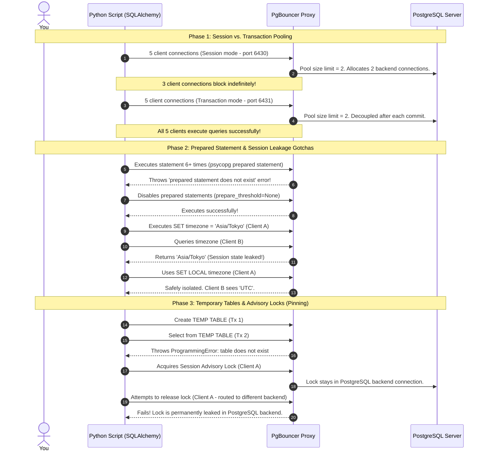

# Practical Lab 012: Connection Multiplexing (RDS Proxy / PgBouncer)

## 📌 Lab Overview & Objectives

In modern cloud architectures—especially serverless (e.g., AWS Lambda) and highly-scalable containerized systems (e.g., FastAPI on ECS/EKS)—database connections are a primary bottleneck. PostgreSQL operates on a **process-based connection model**: each client connection spawns a dedicated backend process (`postgres: user db host`). This design makes connections expensive in both memory (typically 10MB+ RAM per process) and CPU (due to context switching overhead under high concurrency). 

If a system opens hundreds or thousands of client connections directly to PostgreSQL, the database will quickly run out of memory, hit the `max_connections` limit, and drop incoming transactions. To scale database access, we must decouple client-side connections from server-side database connections.

This lab explores **Connection Multiplexing** using **PgBouncer**, which mirrors the core architecture of **AWS RDS Proxy**. You will configure and analyze PgBouncer in **Session Pooling** vs. **Transaction Pooling** modes, debug and resolve the common driver crashes associated with prepared statements, analyze session state leakage, and observe how operations like temporary tables and advisory locks cause connection pinning.

### Key Skills You Will Master

- Configuring and running PgBouncer in both Session and Transaction pooling modes.
- Observing and explaining transaction-level connection multiplexing by mapping multiple client sessions to a minimal backend connection pool.
- Diagnosing and resolving psycopg3/SQLAlchemy prepared statement failures using connection parameters (`prepare_threshold=None`).
- Identifying and mitigating session state leakage using transaction-local configuration (`SET LOCAL`).
- Analyzing the mechanics of connection pinning (caused by temporary tables and advisory locks) and understanding why it degrades proxy performance in AWS RDS.
- Querying and monitoring connection pools through PgBouncer's virtual administrative database (`SHOW POOLS`, `SHOW CLIENTS`).

---

## 🛠️ Prerequisites & Environment Setup

This lab runs in an isolated local environment using Docker.

- **Database Engine**: PostgreSQL 17 (via Docker)
- **Proxy Layer**: PgBouncer (via Docker)
- **Application Layer**: Python 3.13, SQLAlchemy 2.0+, and `psycopg3` (async/sync driver)
- **Dependencies**: Specified in `pyproject.toml` and managed by `uv`

### Workspace Structure

Your lab folder is organized as follows:

```text
labs/012-connection-multiplexing/
├── pyproject.toml               # Lab-specific dependencies
├── docker-compose.yml           # Postgres & PgBouncer (Session & Transaction) containers
├── .env.example                 # Environment variables template
├── .env                         # Configured environment variables
├── app/
│   ├── __init__.py
│   ├── config.py                # Connection URIs configuration for Postgres and PgBouncer ports
│   ├── dependencies.py          # SQLAlchemy engines and schema initializer
│   └── models.py                # ORM model for testing (InventoryItem)
├── scripts/
│   └── diagnostic.sql           # Connection inspection and PgBouncer admin SQL commands
├── lab_step_1.py                # Step 1: Session vs. Transaction pooling concurrency demo
├── lab_step_2.py                # Step 2: Prepared statement failures and session leakage pitfalls
├── lab_step_3.py                # Step 3: Temporary tables, advisory locks, and pinning dynamics
└── README.md                    # Lab workbook (This file)
```

### Initial Bootstrap

1. Open your terminal and navigate to the lab folder:
    ```bash
    cd labs/012-connection-multiplexing
    ```
2. Copy the environment variables template (if not already done):
    ```bash
    cp .env.example .env
    ```
3. Launch the database and proxy containers in the background:
    ```bash
    docker compose up -d
    ```
4. Sync dependencies from the project root:
    ```bash
    cd ../..
    uv sync --all-packages
    ```
5. Activate the virtual environment:
    ```bash
    source .venv/bin/activate
    ```
6. Verify that the database and both PgBouncer instances are online and accepting connections:
    ```bash
    docker exec -it postgres pg_isready -U postgres -d multiplexing_db
    # Check PgBouncer session mode port (6430)
    docker exec -it pgbouncer_session pg_isready -h localhost -p 6432 -U postgres -d multiplexing_db
    # Check PgBouncer transaction mode port (6431)
    docker exec -it pgbouncer_transaction pg_isready -h localhost -p 6432 -U postgres -d multiplexing_db
    ```

---

## 📝 Lab Flow & Sequence

This lab traces database access through different proxy modes and configuration patterns:



---

## 🔬 Core Lab Steps & Content

### Step 1: Session Pooling vs. Transaction Pooling

#### 📘 Step 1 Theory: Decoupling Connections at Different Boundaries
PgBouncer (and AWS RDS Proxy) offers different pooling modes that determine when a physical server connection is returned to the pool:

1. **Session Pooling**: 
   When a client connects to PgBouncer, a physical server connection is assigned to it and remains locked to that client until the client explicitly closes the connection. 
   - **Trade-off**: High compatibility (all PostgreSQL features work). However, if your application keeps connections open (e.g. FastAPI worker processes or idle server connections), you cannot oversubscribe connections. If you have a pool size of 2, only 2 clients can connect at any time, even if they are idle.
2. **Transaction Pooling**:
   A physical server connection is assigned to the client only for the duration of a transaction block (`BEGIN` to `COMMIT`/`ROLLBACK`). As soon as the transaction ends, the physical connection is returned to the pool to serve other clients.
   - **Trade-off**: Extremely high concurrency. 100 client connections can easily share a pool of 5 backend connections, as long as they aren't all actively executing queries at the exact same millisecond. However, session-scoped state is broken or leaks.
3. **Statement Pooling**:
   A physical connection is assigned to the client only for a single query. Multi-statement transactions are completely disabled.
   - **Trade-off**: Almost never used for application code, but sometimes used for analytical workloads.

#### 🧪 Step 1 Lab Execution

Run the automated script to compare both modes. It will spawn 5 threads and try to connect concurrently to the Session pooler and then the Transaction pooler, querying PgBouncer's internal admin stats (`SHOW POOLS`) during the test:

```bash
python labs/012-connection-multiplexing/lab_step_1.py
```

> **Observe**:
> - **Session Pooling (Port 6430)**: Only 2 threads can connect initially. The remaining 3 threads block waiting for a connection. You will see `Client Active: 2` and `Client Waiting: 3` in PgBouncer stats.
> - **Transaction Pooling (Port 6431)**: All 5 threads connect and execute their first transaction immediately, then enter an idle sleep state. In the logs, you will see `Client Active: 5` but `Server Active: 0` (or 1) during the idle phase. This proves that they successfully surrendered their physical backend connections while idle.

---

### Step 2: The Pitfalls of Transaction Pooling (Session State & Prepared Statements)

#### 📘 Step 2 Theory: Drivers, Parameters, and State Leakage
While Transaction Pooling allows massive horizontal scaling, it introduces two major issues for application developers:

##### 1. Prepared Statements Crash
Modern drivers like `psycopg3` use server-side prepared statements to optimize query planning. When a parameterized query is executed multiple times (by default, 5 times in psycopg3), the driver registers it on the database server under a unique identifier. 
In transaction pooling, the driver might prepare a statement on connection A, but in a subsequent transaction, PgBouncer routes the query to connection B. Because connection B has no record of the prepared statement, PostgreSQL throws: `ERROR: prepared statement "..." does not exist`.
- **Resolution**: We must disable server-side prepared statements by setting `prepare_threshold=None` in psycopg3's connection options.

##### 2. Session State Leakage
If a client executes a query that alters the state of the database connection—such as `SET timezone = 'Asia/Tokyo'` or `SET search_path = 'custom_schema'`—that setting is applied to the underlying physical PostgreSQL connection. Under transaction pooling, when the transaction ends, that physical connection goes back to the pool. When another client connects, it will inherit that modified state!
- **Resolution**: Avoid session-altering queries entirely, or use transaction-local settings (`SET LOCAL timezone = ...`), which automatically revert back to database defaults when the transaction block commits or rolls back.

#### 🧪 Step 2 Lab Execution

Run the second test script:

```bash
python labs/012-connection-multiplexing/lab_step_2.py
```

> **Observe**:
> - **Test 1**: Prepared statements are executed 6+ times. The version with prepared statements enabled crashes with an `OperationalError`. The version with `prepare_threshold=None` executes successfully.
> - **Test 2**: Client A alters the timezone using `SET timezone`. Subsequent queries from Client B intermittently return `Asia/Tokyo` instead of `UTC`.
> - **Test 3**: Client A alters the timezone using `SET LOCAL timezone`. Client B queries are safe and always return the default database timezone (`UTC`).

---

### Step 3: Connection Pinning & Observability

#### 📘 Step 3 Theory: Temporary Tables, Advisory Locks, and Pinning Mechanics
In AWS RDS Proxy, the proxy engine inspects traffic to protect session integrity. If a client attempts to use a feature that relies on session state, the proxy automatically **pins** the client connection to a single backend database connection for the remaining duration of the client session. 

When a connection is **pinned**:
- Multiplexing is disabled for that connection.
- The connection behaves exactly like it is in **Session Pooling** mode.
- If too many connections become pinned, the RDS Proxy's backend connection pool will saturate, leading to queuing, timeout errors, and application degradation.

##### Major Pinning Triggers:
1. **Temporary Tables**: Creating a temporary table (`CREATE TEMP TABLE ...`) binds it to a specific backend connection.
2. **Advisory Locks**: Session-scoped advisory locks (`pg_advisory_lock()`) are stored in the backend connection memory.
3. **Prepared Statements**: If PgBouncer or RDS Proxy does not handle them, they would fail, so proxies pin connections when prepared statements are used if not configured to handle them.
4. **LISTEN / NOTIFY**: PostgreSQL asynchronous notifications require a persistent TCP channel.

> **PgBouncer vs. RDS Proxy Warning**:
> Unlike RDS Proxy, PgBouncer does **not** dynamically pin connections when it detects temp tables or advisory locks. Instead, PgBouncer blindly returns the connection to the pool after the transaction commits. This leads to silent corruption: temporary tables disappear in the next transaction, and advisory locks are leaked permanently in the database engine, causing locks that can never be unlocked by the client.

#### 🧪 Step 3 Lab Execution

Run the pinning and failure-mode script:

```bash
python labs/012-connection-multiplexing/lab_step_3.py
```

> **Observe**:
> - **Test 1**: A temporary table created in Tx 1 vanishes in Tx 2, throwing an `UndefinedTable` programming error.
> - **Test 2**: Client A acquires an advisory lock on a PgBouncer connection. Even after Client A finishes its transaction and attempts to unlock it, the lock remains `Granted` and active in `pg_locks` because Client A's unlock command was routed to a different physical backend connection. The lock is leaked until the physical connection is closed.

---

## 🎯 Lab Outcomes & Verification Checklist

To successfully complete this lab, you must produce and verify the following results:

- [ ] **PgBouncer Session Stats**: Document the outputs of `SHOW POOLS` during the Session Pooling experiment (Step 1). Write down the values for `Client Active`, `Client Waiting`, and `Server Active`.
- [ ] **PgBouncer Transaction Stats**: Document the outputs of `SHOW POOLS` during the Transaction Pooling experiment. Explain why client active connections can be greater than server active connections.
- [ ] **Prepared Statement Crash Log**: Copy the exact exception trace thrown when prepared statements are left enabled behind PgBouncer.
- [ ] **Session Leakage Proof**: Document the output of the session leakage test in Step 2. Verify how Client B's returned timezone oscillates depending on routing.
- [ ] **Temporary Table Exception**: Capture the exception thrown when querying a temporary table in transaction pooling.
- [ ] **Advisory Lock Leakage Observation**: Document the lock state in `pg_locks` before and after Client A attempts to run `pg_advisory_unlock()`. Show that the lock remains leaked.

When finished, tear down your sandbox:

```bash
docker compose down -v
```

---

## ❓ Deep-Dive Self-Assessment

1. _If you are developing a FastAPI web application hosted on AWS ECS (Fargate) with auto-scaling, and you deploy an AWS RDS Proxy to sit in front of your PostgreSQL database, why must you still configure the connection pool inside your SQLAlchemy application? What happens if you set your SQLAlchemy pool size to 50 on 20 ECS tasks, but your RDS Proxy max connection pool is capped at 100?_
2. _Why does using `pg_advisory_lock` in transaction pooling cause connection/lock leaks in PgBouncer, but causes connection pinning in AWS RDS Proxy? What is the performance impact of connection pinning on your database cluster during peak traffic?_
3. _Under what circumstances is Session Pooling preferred over Transaction Pooling? How would you solve connection exhaustion if you are forced to use Session Pooling?_
4. _Explain why running `DISCARD ALL` as a `server_reset_query` in PgBouncer solves session state leakage, but why it is typically disabled or avoided in high-performance transaction pooling setups._

---

## 📚 Additional Resources

- [PgBouncer Official Documentation](https://www.pgbouncer.org/)
- [AWS RDS Proxy Documentation: Connection Pinning](https://docs.aws.amazon.com/AmazonRDS/latest/UserGuide/rds-proxy.html#rds-proxy-pinning)
- [psycopg3 documentation: Server-side Prepared Statements](https://www.psycopg.org/psycopg3/docs/advanced/preparing.html)
- [SQLAlchemy 2.0: Working with Engines and Pools](https://docs.sqlalchemy.org/en/20/core/engines.html)
