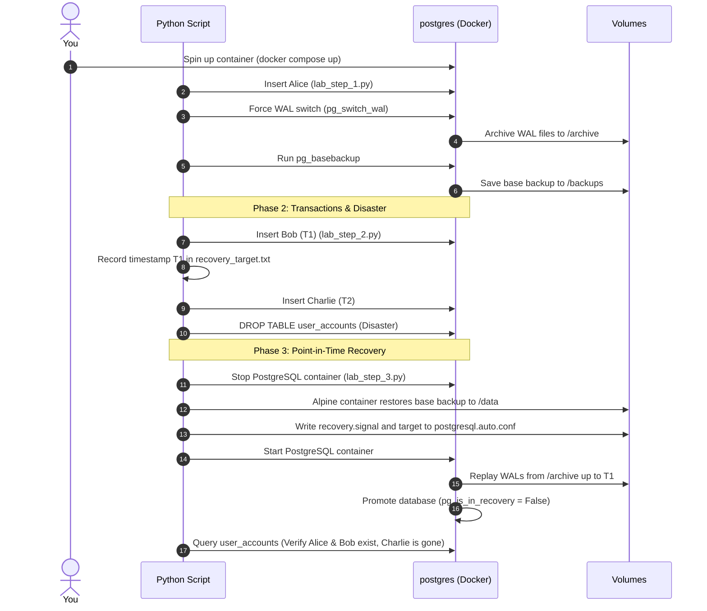

# Practical Lab 013: Backup & Disaster Recovery (WAL Archiving & PITR)

## 📌 Lab Overview & Objectives

In production database environments, data loss is the ultimate failure. Hardware failure, human error (like an accidental `DROP TABLE` run on production), or software bugs can corrupt active database state in seconds. To prevent catastrophic data loss, senior engineers must build resilient systems using physical database backups combined with continuous transaction archiving.

This lab simulates **Point-in-Time Recovery (PITR)** and **Write-Ahead Log (WAL) Archiving** in PostgreSQL 17. You will configure PostgreSQL for continuous archiving (simulating S3 WAL shipping), take a physical base backup, simulate a "disaster" event where a table is dropped, and perform a complete restore of the database to the exact millisecond before the disaster struck.

### Key Skills You Will Master

- Configuring PostgreSQL for **Continuous Archiving** using `archive_mode` and `archive_command`.
- Performing physical database backups using the standard `pg_basebackup` utility.
- Recording and using target points (timestamps/LSNs) to establish **Recovery Point Objectives (RPO)**.
- Simulating database disasters (accidental table drops) and understanding **Recovery Time Objectives (RTO)**.
- Orchestrating physical database recovery using `recovery.signal` and targeting configuration overrides inside `postgresql.auto.conf`.
- Verifying data integrity post-recovery to ensure transaction consistency up to a specific transaction.

---

## 🛠️ Prerequisites & Environment Setup

This lab runs in an isolated local environment using Docker.

- **Database Engine**: PostgreSQL 17 (via Docker)
- **Application Layer**: Python 3.13, SQLAlchemy 2.0+, and `psycopg3` (async/sync driver)
- **Dependencies**: Already specified in the lab's `pyproject.toml` and synchronized using `uv`.

### Workspace Structure

Your lab folder is organized as follows:

```text
labs/013-backup-disaster-recovery/
├── pyproject.toml               # Lab-specific dependencies
├── docker-compose.yml           # PostgreSQL container with archive directories
├── .env.example                 # Connection URI configuration template
├── app/
│   ├── __init__.py
│   ├── config.py                # Database configuration loader
│   ├── dependencies.py          # SQLAlchemy engine and session factories
│   └── models.py                # ORM model for testing (UserAccount)
├── lab_step_1.py                # Step 1: Base backup and archive test script
├── lab_step_2.py                # Step 2: Data generation and disaster simulation
├── lab_step_3.py                # Step 3: Stop, restore, and verify PITR
└── README.md                    # Lab workbook (This file)
```

### Initial Bootstrap:

1. Open your terminal and navigate to the lab folder:
    ```bash
    cd labs/013-backup-disaster-recovery
    ```
2. Copy the environment variables template:
    ```bash
    cp .env.example .env
    ```
3. Launch the database container in the background:
    ```bash
    docker compose up -d
    ```
4. Sync dependencies from the project root:
    ```bash
    cd ../..
    uv sync --all-packages
    ```
5. Activate the virtual environment:
    ```bash
    source .venv/bin/activate
    ```
6. Verify the database node is online and running:
    ```bash
    docker exec -it postgres pg_isready -U postgres -d disaster_recovery
    ```

---

## 📝 Lab Flow & Sequence



---

## 🔬 Core Lab Steps & Content

### Step 1: Continuous Archiving & Physical Base Backups

#### 📘 Step 1 Theory: WAL Archiving & pg_basebackup

Under the hood, PostgreSQL records all database alterations into a circular sequence of **Write-Ahead Log (WAL)** files. This mechanism ensures durability (the **D** in ACID) by writing modifications to disk sequentially before writing them to the main heap blocks.

For backup and recovery:
1. **Continuous Archiving**: By enabling `archive_mode = on` and configuring an `archive_command`, PostgreSQL will automatically execute a command to copy completed WAL files (default size 16MB) to a safe, persistent storage location (e.g. AWS S3, a remote storage mount, or `/var/lib/postgresql/archive` in our lab).
2. **Base Backup (`pg_basebackup`)**: This tool captures a physical file-system copy of the database cluster's active directory (`PGDATA`) while the server is running. A base backup alone is only consistent up to the moment it completes. However, when combined with the archived WAL files generated since the backup started, PostgreSQL can recover the database to *any point in time* in the future by replaying those logs.

> [!IMPORTANT]
> Since PostgreSQL 12, the historical `recovery.conf` configuration file has been deprecated. Recovery parameters are now written directly to `postgresql.auto.conf`, and PostgreSQL enters recovery mode only if an empty file named `recovery.signal` is present in the `PGDATA` directory.

#### 🧪 Step 1 Lab Execution

Ensure your database is running, then run the automated script to insert seed data, force a WAL file archival, and take a physical base backup:

```bash
python labs/013-backup-disaster-recovery/lab_step_1.py
```

> **Observe**:
> - The database settings show `archive_mode = on` and `wal_level = replica`.
> - Forcing a WAL switch with `SELECT pg_switch_wal()` copies a physical log segment file to the `/archive` volume.
> - Running `pg_basebackup` populates `/backups/base_backup` with the raw files required to boot Postgres.

**Key Insight**: A physical base backup does not require taking the database offline. It writes directly to files and records the start/stop LSN (Log Sequence Number) so recovery knows exactly which WAL logs to request first.

---

### Step 2: Transactions and Disaster Simulation

#### 📘 Step 2 Theory: Write-Ahead Logging & RPO/RTO

When designing high-availability database architectures, two metrics guide the backup strategy:
- **Recovery Point Objective (RPO)**: The maximum duration of data loss that is acceptable during an outage. An RPO of 0 means zero data loss. With continuous WAL archiving, the RPO is virtually zero because every committed transaction is written to the WAL stream and archived immediately.
- **Recovery Time Objective (RTO)**: The maximum amount of time it should take to bring the database back online after a failure. Physical backup restores have an RTO proportional to the database file size (to copy the files) and the amount of WAL that needs to be replayed (to catch up to the target).

In this step, we will simulate a timeline of operations:
1. Seed database state (Alice exists in base backup).
2. Start transaction sequence (insert Bob at time `T1`).
3. We record `T1` as our target recovery timestamp.
4. Continue transaction sequence (insert Charlie at time `T2`).
5. A database disaster occurs (accidental table drop) at time `T3`.

Our goal is to restore the database to `T1`, bringing back Bob but excluding Charlie and reversing the table drop disaster.

#### 🧪 Step 2 Lab Execution

Run the script to insert additional records, capture the target timestamp, and trigger the disaster:

```bash
python labs/013-backup-disaster-recovery/lab_step_2.py
```

> **Observe**:
> - The console logs the exact database timestamp `T1` and saves it to `recovery_target.txt`.
> - The database is hit with a `DROP TABLE user_accounts CASCADE` query.
> - Subsequent SELECT queries fail with an error proving that the table is gone.

---

### Step 3: Point-in-Time Recovery (PITR)

#### 📘 Step 3 Theory: recovery.signal and target parameters

To restore a database using PITR, PostgreSQL must boot in **recovery mode**. 

The process involves:
1. **Shutting down the engine** to ensure no active sessions modify database state.
2. **Restoring the base backup files** directly into the `PGDATA` directory.
3. **Specifying target rules** in `postgresql.auto.conf`:
   - `recovery_target_time`: The timestamp up to which we want to replay transactions.
   - `recovery_target_action`: The action to take when the target is reached. Set to `'promote'` so the database automatically transitions out of recovery mode and opens for read-write operations.
4. **Providing a restore command**:
   - `restore_command = 'cp /var/lib/postgresql/archive/%f %p'`. This command tells PostgreSQL how to retrieve missing WAL segments from the archive directory during recovery.
5. **Creating the recovery signal**:
   - Creating an empty file `/var/lib/postgresql/data/recovery.signal` tells PostgreSQL that it should not start up normally, but should instead execute the recovery process.

During boot, PostgreSQL checks for `recovery.signal`, mounts the base backup state, runs the `restore_command` to fetch WAL files, replays the logs up to `recovery_target_time`, removes `recovery.signal`, and promotes itself to a writable primary database.

#### 🧪 Step 3 Lab Execution

Run the recovery script to automate the restoration, boot recovery, and verify results:

```bash
python labs/013-backup-disaster-recovery/lab_step_3.py
```

> **Observe**:
> - The script shuts down the active PostgreSQL database.
> - It uses a helper container to wipe the data volume, restore the base backup, write the target settings to `postgresql.auto.conf`, and touch `recovery.signal`.
> - It restarts the database and monitors `pg_is_in_recovery()`.
> - Once the database is promoted, it verifies that `alice` and `bob` are present, but `charlie` is missing, showing that recovery successfully stopped *exactly* at the target timestamp.

---

## 🎯 Lab Outcomes & Verification Checklist

To successfully complete this lab, you must verify the following:

- [ ] Run `lab_step_1.py` and verify `/var/lib/postgresql/backups/base_backup` contains the physical PG database files.
- [ ] Observe that `recovery_target.txt` has been populated with a timestamp.
- [ ] Trigger the table drop disaster in `lab_step_2.py` and verify queries fail.
- [ ] Run `lab_step_3.py` to restore the cluster, and confirm `postgres` boots up, processes WALs, and deletes `recovery.signal`.
- [ ] Verify that `alice` and `bob` are retrieved successfully, and `charlie` is absent.

Once you are done, tear down the container sandbox:

```bash
docker compose down -v
```

---

## ❓ Deep-Dive Self-Assessment

1. _Why does PostgreSQL require a physical base backup to perform PITR? Why can't you run PITR from a standard logical dump file (like `pg_dump`)?_
2. _What happens if the `recovery_target_time` specified is set to a time before the physical base backup was completed?_
3. _In a busy production cluster generating 100GB of WAL files daily, how would you optimize the `archive_command` to prevent archiving lag from filling up database storage?_
4. _How does AWS RDS handle PITR under the hood? (Hint: Automated hourly snapshots + S3 WAL archiving with a 5-minute RPO)._

---

## 📚 Additional Resources

- [PostgreSQL Documentation: Continuous Archiving and Point-in-Time Recovery](https://www.postgresql.org/docs/current/continuous-archiving.html)
- [PostgreSQL Documentation: pg_basebackup utility](https://www.postgresql.org/docs/current/app-pgbasebackup.html)
- [AWS RDS documentation: Restoring a DB instance to a specified time](https://docs.aws.amazon.com/AmazonRDS/latest/UserGuide/USER_PIT.html)
