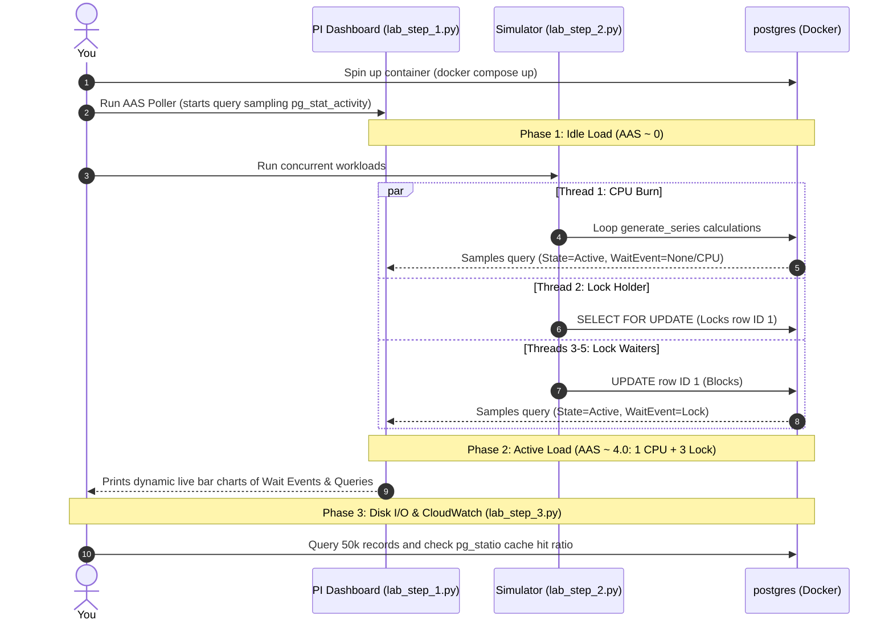

# Practical Lab 014: RDS Diagnostics (AAS & Performance Metrics)

## 📌 Lab Overview & Objectives

In production database environments, you cannot manage what you do not measure. A senior backend engineer does not simply wait for users to complain about slow API responses; they monitor database telemetry. Under managed database environments like AWS RDS, two key diagnostic tools provide insight into database performance: **AWS Performance Insights** (which uses session-based load sampling) and **Amazon CloudWatch** (which monitors host-level hardware resources).

This lab teaches you how to read and interpret database performance metrics by building and running a local simulation of both diagnostic pipelines:
1. **Average Active Sessions (AAS)**: You will implement a high-frequency polling collector that samples `pg_stat_activity` under the hood, reproducing AWS Performance Insights' load graphs, categorized by SQL queries and wait events.
2. **Resource Metrics**: You will run concurrent workloads causing high CPU usage, lock contention, and disk reads to analyze how resource exhaustion propagates to host-level metrics like `DiskQueueDepth`, `ReadLatency`, and `FreeableMemory`.

### Key Skills You Will Master

- Understanding the math behind **Average Active Sessions (AAS)** and how Performance Insights measures database load.
- Identifying and analyzing database wait events (e.g. `Lock`, `IO`, `CPU`) within `pg_catalog.pg_stat_activity`.
- Creating concurrent transaction workloads in Python using thread barriers to trigger lock contention.
- Measuring PostgreSQL **Buffer Cache Hit Ratios** by querying the `pg_statio_all_tables` system catalogs.
- Applying **Little's Law** ($Queue\ Depth = Throughput \times Latency$) to calculate and diagnose storage throughput vs latency bottlenecks.
- Interpreting critical AWS CloudWatch alerts like `FreeableMemory`, `WriteLatency`, `ReadLatency`, and `DiskQueueDepth`.

---

## 🛠️ Prerequisites & Environment Setup

This lab runs in an isolated local environment using Docker.

- **Database Engine**: PostgreSQL 17 (via Docker)
- **Application Layer**: Python 3.13, SQLAlchemy 2.0+, and `psycopg3` (async/sync driver)
- **Dependencies**: Already specified in the lab's `pyproject.toml` and synchronized using `uv`.

### Workspace Structure

Your lab folder is organized as follows:

```text
labs/014-rds-diagnostics/
├── pyproject.toml               # Lab-specific dependencies
├── docker-compose.yml           # PostgreSQL container setup
├── .env.example                 # Connection URI configuration template
├── app/
│   ├── __init__.py
│   ├── config.py                # Database configuration loader
│   ├── dependencies.py          # SQLAlchemy engine and session factories
│   └── models.py                # ORM model for testing (DiagnosticItem)
├── lab_step_1.py                # Step 1: Real-time Performance Insights AAS dashboard
├── lab_step_2.py                # Step 2: Thread-concurrency workload simulator
├── lab_step_3.py                # Step 3: Buffer cache ratio and CloudWatch calculations
└── README.md                    # Lab workbook (This file)
```

### Initial Bootstrap:

1. Open your terminal and navigate to the lab folder:
    ```bash
    cd labs/014-rds-diagnostics
    ```
2. Copy the environment variables template:
    ```bash
    cp .env.example .env
    ```
3. Launch the database container in the background:
    ```bash
    docker compose up -d
    ```
4. Sync dependencies from the project root:
    ```bash
    cd ../..
    uv sync --all-packages
    ```
5. Activate the virtual environment:
    ```bash
    source .venv/bin/activate
    ```
6. Verify the database node is online and running:
    ```bash
    docker exec -it postgres pg_isready -U postgres -d diagnostics_db
    ```

---

## 📝 Lab Flow & Sequence



---

## 🔬 Core Lab Steps & Content

### Step 1: Implementing a Local AAS Collector

#### 📘 Step 1 Theory: Average Active Sessions (AAS) and Wait Events

AWS Performance Insights measures database engine load using a metric called **Average Active Sessions (AAS)**. Instead of measuring CPU percentage directly (which only shows OS-level utilization), AAS answers: *"How many database connections are waiting to execute or running a query at any given moment?"*

To calculate AAS:
1. The tool samples the PostgreSQL active catalog `pg_stat_activity` at high frequency (e.g. once per second).
2. For each sample, it checks the state of every connection. If a connection's state is `'active'`, it is counted.
3. Over a time window, the counts are averaged:
   $$\text{AAS} = \frac{\sum(\text{Active Sessions in Sample})}{\text{Number of Samples}}$$
4. Slicing by **Wait Events**: Every active connection has a `wait_event_type` indicating what it is waiting for. If it is running on the CPU, it is labeled as `CPU/Running`. If it is waiting for a lock to release, it is labeled as `Lock`. If it is reading from disk, it is labeled as `IO`.

> [!TIP]
> A database load graph is easy to read: If your instance has 2 vCPUs, and the AAS is below **2.0**, the database has spare CPU capacity. If the AAS spikes above **2.0**, queries are backing up and waiting. The color coding on the graph (e.g. Red for CPU, Blue for Lock) tells you exactly what is causing the bottleneck.

#### 🧪 Step 1 Lab Execution

Open a terminal window, navigate to the project directory, and run the real-time AAS collector script:

```bash
python labs/014-rds-diagnostics/lab_step_1.py
```

> **Observe**:
> - The dashboard clears the terminal and prints the rolling 10-second Average Active Sessions (AAS).
> - Since no other queries are running, the AAS is `0.00`.
> - Keep this terminal window open and running.

---

### Step 2: Simulating Lock Contention and CPU Bottlenecks

#### 📘 Step 2 Theory: Lock wait events and CPU usage

Different database bottlenecks look completely different in Performance Insights load graphs:

1. **CPU Bottlenecks**: Caused by queries running complex mathematical equations, performing sorting without indexes, or doing sequential scans on massive tables. In `pg_stat_activity`, these queries have `state = 'active'` and `wait_event_type IS NULL`, showing up in the graph as `CPU` load.
2. **Concurrency Bottlenecks (Locks)**: Occur when multiple sessions attempt to update the same row or table concurrently. The first transaction locks the record; all subsequent transactions must wait. In `pg_stat_activity`, these blocked queries show `wait_event_type = 'Lock'` (e.g. wait event `transactionid` or `tuple`). The queries are consuming virtually zero CPU while blocked, but they drive up active session load.

#### 🧪 Step 2 Lab Execution

Open a **second terminal window** and run the concurrent workload simulator:

```bash
python labs/014-rds-diagnostics/lab_step_2.py
```

Now, return to your **first terminal window** running `lab_step_1.py` and watch the dashboard update in real-time.

> **Observe**:
> - The **Total AAS** spikes to approximately `4.00`.
> - The **AAS by Wait Event Type** shows `Lock` at `~3.00` and `CPU/Running` at `~1.00`.
> - The **AAS by Top Queries** lists the `UPDATE ... WHERE id = 1` query as the primary contributor to the lock load.
> - Once the 8-second lock holder releases its lock, the locked queries finish immediately, and the AAS drops back to `0.00`.

**Key Insight**: An AAS of 4.0 means that even though your CPU load might only show one active core working, your application is blocked. Scaling your database instance size (adding vCPUs) will not fix a `Lock` bottleneck; you must optimize your application code to keep transactions short.

---

### Step 3: CloudWatch Metrics (Disk Queue Depth, Latency, FreeableMemory)

#### 📘 Step 3 Theory: Storage metrics, buffer cache hits, Little's Law

AWS CloudWatch monitors host-level database metrics:
* **FreeableMemory**: The amount of RAM available on the instance. If `FreeableMemory` drops to near 0, the OS runs out of file cache space, forcing PostgreSQL to read raw data pages from disk instead of fetching them from memory.
* **Read/Write Latency**: The average time taken for storage disk reads/writes to complete. A healthy SSD (like AWS EBS GP3) has latency under 1ms. If the storage IOPS limit is reached or burst credits are exhausted, latency can spike to 10–20ms.
* **DiskQueueDepth**: The number of I/O requests queued up and waiting to be processed by the disk.

#### Little's Law:
Disk queue depth is mathematically related to storage throughput (IOPS) and disk latency (in seconds):
$$\text{Disk Queue Depth} = \text{IOPS} \times \text{Latency}$$

If latency increases due to disk throttling, the queue depth multiplies. For example, processing 3,000 IOPS:
- At **1ms latency**: Queue Depth = $3000 \times 0.001 = 3.0$ (Healthy).
- At **15ms latency**: Queue Depth = $3000 \times 0.015 = 45.0$ (High contention, queries stall).

#### 🧪 Step 3 Lab Execution

Run the script to analyze the database buffer cache performance and calculate CloudWatch metrics:

```bash
python labs/014-rds-diagnostics/lab_step_3.py
```

> **Observe**:
> - The database seeds 50,000 records.
> - The first query reads files, but subsequent reads query data from PostgreSQL `shared_buffers`, resulting in a **Cache Hit Ratio** close to `100.00%`.
> - The CloudWatch simulator calculates the mathematical escalation of `DiskQueueDepth` when latency increases from 1ms to 15ms.

---

## 🎯 Lab Outcomes & Verification Checklist

To successfully complete this lab, you must verify the following:

- [ ] Start `lab_step_1.py` and confirm the real-time AAS collector dashboard displays successfully.
- [ ] Run `lab_step_2.py` in a separate window, and verify the AAS dashboard displays a load spike of `~4.00` total sessions.
- [ ] Verify that `Lock` events account for `~3.00` AAS, and `CPU/Running` accounts for `~1.00` AAS.
- [ ] Run `lab_step_3.py` and check the printed cache statistics and hit ratios for the user table.
- [ ] Verify that the CloudWatch metric calculations for GP2 vs GP3 disk queue depths are printed correctly.

Once you are done, tear down the container sandbox:

```bash
docker compose down -v
```

---

## ❓ Deep-Dive Self-Assessment

1. _If a database has 8 vCPUs, and the AWS Performance Insights dashboard displays a total AAS of 12.0, with 10.0 sessions categorized under wait event `Lock` and 2.0 sessions under `CPU`, is the database CPU-bound or connection-locked? How would you solve this?_
2. _Why does a high DiskQueueDepth metric on a CloudWatch dashboard usually correlate with a spike in database Read/Write Latency?_
3. _How does increasing the database instance class size (e.g. from `db.t3.medium` to `db.r5.xlarge`) affect the `FreeableMemory` and buffer cache hit ratio?_
4. _If the Performance Insights graph displays high load with wait_event_type `IO` (e.g., event `DataFileRead`), what indices or queries should you look for?_

---

## 📚 Additional Resources

- [AWS User Guide: Monitoring DB Load with Performance Insights](https://docs.aws.amazon.com/AmazonRDS/latest/UserGuide/USER_PerfInsights.html)
- [PostgreSQL Documentation: The Statistics Collector (pg_stat_activity)](https://www.postgresql.org/docs/current/monitoring-stats.html#MONITORING-PG-STAT-ACTIVITY-VIEW)
- [AWS Knowledge Center: How can I troubleshoot high DiskQueueDepth in Amazon RDS?](https://repost.aws/knowledge-center/rds-disk-queue-depth)
