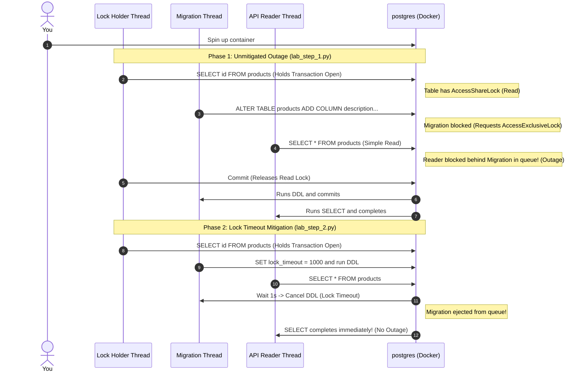

# Practical Lab 015: Alembic Lock Mitigation & Zero-Downtime Migrations

## 📌 Lab Overview & Objectives

In production database systems, changing the schema is like swapping the wheels on a moving train. Every Data Definition Language (DDL) operation—such as adding a column, dropping a constraint, or creating a index—requires acquiring a high-level **exclusive table lock** (`AccessExclusiveLock`). 

When a migration script executes DDL on a busy table:
1. The migration must wait for any active read/write queries on that table to complete.
2. While the migration blocks and waits in the lock queue, **every single subsequent query** (including simple, lightweight `SELECT` queries) is blocked behind it.
3. This creates a cascading lock blockage that exhausts the application's connection pool, resulting in a complete API outage.

This lab teaches you how to mitigate these outages using **Lock Timeouts**. You will simulate a migration blocking scenario, observe a cascading outage, apply a `SET lock_timeout` constraint to gracefully fail blocked migrations, and learn how to integrate this globally inside Alembic migration workflows.

### Key Skills You Will Master

- Understanding the **PostgreSQL Lock Hierarchy** and how lock compatibility triggers queuing.
- Diagnosing cascading lock blockages where simple read queries block behind exclusive locks.
- Configuring transaction-level **Lock Timeouts** (`SET lock_timeout`) to protect database availability.
- Simulating transactional concurrency conflicts using Python thread synchronization.
- Integrating global lock timeouts into Alembic's database migration configurations.

---

## 🛠️ Prerequisites & Environment Setup

This lab runs in an isolated local environment using Docker.

- **Database Engine**: PostgreSQL 17 (via Docker)
- **Application Layer**: Python 3.13, SQLAlchemy 2.0+, and `psycopg3` (async/sync driver)
- **Dependencies**: Already specified in the lab's `pyproject.toml` and synchronized using `uv`.

### Workspace Structure

Your lab folder is organized as follows:

```text
labs/015-schema-evolution/
├── pyproject.toml               # Lab-specific dependencies
├── docker-compose.yml           # PostgreSQL container setup
├── .env.example                 # Connection URI configuration template
├── app/
│   ├── __init__.py
│   ├── config.py                # Database configuration loader
│   ├── dependencies.py          # SQLAlchemy engine and session factories
│   └── models.py                # ORM model for testing (Product)
├── lab_step_1.py                # Step 1: Cascading lock blockage simulation
├── lab_step_2.py                # Step 2: Mitigation using SET lock_timeout
├── lab_step_3.py                # Step 3: Global Alembic integration demonstration
└── README.md                    # Lab workbook (This file)
```

### Initial Bootstrap:

1. Open your terminal and navigate to the lab folder:
    ```bash
    cd labs/015-schema-evolution
    ```
2. Copy the environment variables template:
    ```bash
    cp .env.example .env
    ```
3. Launch the database container in the background:
    ```bash
    docker compose up -d
    ```
4. Sync dependencies from the project root:
    ```bash
    cd ../..
    uv sync --all-packages
    ```
5. Activate the virtual environment:
    ```bash
    source .venv/bin/activate
    ```
6. Verify the database node is online and running:
    ```bash
    docker exec -it postgres pg_isready -U postgres -d schema_evolution_db
    ```

---

## 📝 Lab Flow & Sequence



---

## 🔬 Core Lab Steps & Content

### Step 1: Simulating DDL Lock Blocking & Cascading Outage

#### 📘 Step 1 Theory: PostgreSQL Lock Hierarchy & The Lock Queue

PostgreSQL uses different locking levels to ensure data consistency.
* **`AccessShareLock`**: Acquired by read queries (`SELECT`). Many sessions can hold this lock on the same table concurrently.
* **`AccessExclusiveLock`**: Acquired by DDL statements (like `ALTER TABLE`). This lock is conflict-compatible with **nothing else**—it blocks both readers and writers.

#### The Lock Queue:
When a query requests a lock, it joins a first-in, first-out (FIFO) queue for that table:
1. If Session A holds a `AccessShareLock` (reading), and Session B requests `AccessExclusiveLock` (DDL), Session B must block and wait.
2. If Session C now requests `AccessShareLock` (simple `SELECT`), it should theoretically be compatible with Session A. However, because Session B is already in the queue requesting an exclusive lock, **Session C is blocked behind Session B**.
3. Consequently, a single blocked migration halts all incoming read traffic to the table, causing a cascading API outage.

#### 🧪 Step 1 Lab Execution

Run the script to observe the cascading outage:

```bash
python labs/015-schema-evolution/lab_step_1.py
```

> **Observe**:
> - The `Lock Holder` thread starts a read transaction.
> - The `Migration` thread executes the DDL and blocks.
> - The `API Reader` attempts a simple SELECT and is immediately blocked.
> - The console logs a **CASCADING OUTAGE DETECTED** warning because the simple SELECT takes over 5 seconds to complete!

**Key Insight**: Even a lightweight read query will hang if a DDL change is waiting for a lock on that table. In production, this locks up application connections, leading to database connection pool exhaustion.

---

### Step 2: Implementing Lock Timeouts

#### 📘 Step 2 Theory: `SET lock_timeout` and Queue Ejection

To prevent migrations from taking down the application, we must set a **Lock Timeout**.

By running `SET lock_timeout = '2000'` (2 seconds) before our DDL, we tell PostgreSQL: *"If you cannot acquire the required table locks within 2 seconds of entering the queue, abort the statement and roll back the transaction."*

When the lock timeout expires:
1. The migration transaction fails and rolls back, releasing its position in the lock queue.
2. The blocked read queries waiting behind it in the queue are unblocked instantly and execute without delay.
3. While the migration fails (and can be retried during a lower-traffic window), the application remains online and healthy.

#### 🧪 Step 2 Lab Execution

Run the mitigated script:

```bash
python labs/015-schema-evolution/lab_step_2.py
```

> **Observe**:
> - The `Lock Holder` starts its transaction.
> - The `Migration` sets `lock_timeout = 1000` (1 second) and blocks.
> - After 1 second, the migration fails gracefully with a lock timeout error.
> - The `API Reader` executing the simple SELECT completes **immediately** (taking $< 0.1$ seconds), avoiding any blocking.

---

### Step 3: Integrating Lock Timeouts in Alembic

#### 📘 Step 3 Theory: Global Alembic Configuration

In a production Alembic setup, you should configure a lock timeout globally so developers do not have to write it manually in every migration script.

This is achieved by modifying the `run_migrations_online` function inside Alembic's `env.py` file to inject the configuration into the connection before migrations execute:

```python
# Inside env.py
def run_migrations_online():
    connectable = engine_from_config(
        config.get_section(config.config_ini_section),
        prefix="sqlalchemy.",
        poolclass=pool.NullPool,
    )

    with connectable.connect() as connection:
        # Set lock timeout globally for all migrations executed in this session
        connection.execute(text("SET lock_timeout = '2000'"))  # 2 seconds
        
        context.configure(
            connection=connection, 
            target_metadata=target_metadata
        )

        with context.begin_transaction():
            context.run_migrations()
```

#### 🧪 Step 3 Lab Execution

Run the script to verify the migration execution wrapper:

```bash
python labs/015-schema-evolution/lab_step_3.py
```

> **Observe**:
> - The simulation demonstrates the database connection executing `SET lock_timeout = 1500` before running the migration DDL.
> - The schema layout is updated successfully.

---

## 🎯 Lab Outcomes & Verification Checklist

To successfully complete this lab, you must verify the following:

- [ ] Run `lab_step_1.py` and confirm that the API Reader SELECT statement is blocked (taking $> 4.0$ seconds).
- [ ] Run `lab_step_2.py` and confirm the migration fails due to lock timeout, while the API Reader completes in under 0.5 seconds.
- [ ] Run `lab_step_3.py` and verify that the column is added successfully in a wrapped lock timeout execution context.

Once you are done, tear down the container sandbox:

```bash
docker compose down -v
```

---

## ❓ Deep-Dive Self-Assessment

1. _If a migration is blocked by a long-running analytical query, and fails due to a lock timeout, how does this affect database consistency? Is the schema left in a half-migrated state?_
2. _Why is `AccessExclusiveLock` requested by DDL statements incompatible with the `AccessShareLock` held by `SELECT` queries?_
3. _In addition to `lock_timeout`, PostgreSQL has `statement_timeout` and `idle_in_transaction_session_timeout`. What is the difference between these three timeout parameters?_
4. _How does the `CREATE INDEX CONCURRENTLY` statement avoid locking out application reads and writes? (Hint: It uses multiple transactions and does not request `AccessExclusiveLock`)._

---

## 📚 Additional Resources

- [PostgreSQL Documentation: Explicit Locking (Table-level locks)](https://www.postgresql.org/docs/current/explicit-locking.html#LOCKING-TABLES)
- [PostgreSQL Documentation: Client Connection Defaults (lock_timeout)](https://www.postgresql.org/docs/current/runtime-config-client.html#GUC-LOCK-TIMEOUT)
- [Alembic Documentation: Connection Recipes](https://alembic.sqlalchemy.org/en/latest/cookbook.html)
