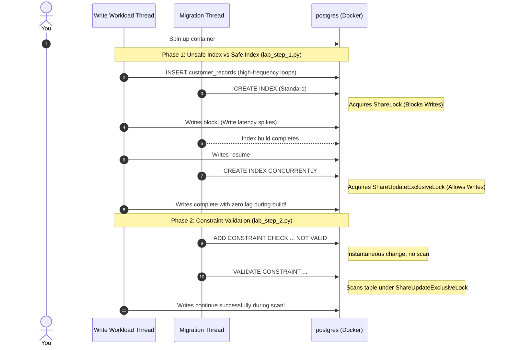

# Practical Lab 016: Safe vs. Unsafe Schema Migrations

## 📌 Lab Overview & Objectives

In production databases with high request traffic and millions of rows, executing a migration is a high-risk operation. Running a DDL command that seems simple (like creating an index or adding a check constraint) can block user writes, cause database connection exhaustion, and trigger cascading application outages.

A senior database engineer understands that schema modifications fall into two categories:
1. **Unsafe Operations**: Commands that acquire high-level table locks (like `AccessExclusiveLock` or `ShareLock`) and perform full table scans or rewrites. These block concurrent user updates for the entire duration of the scan.
2. **Safe Alternatives**: Multi-step migration recipes that achieve the same schema state with zero database write downtime (using non-blocking locks like `ShareUpdateExclusiveLock` or splitting work into throttled batches).

This lab demonstrates how to convert unsafe migrations into safe, zero-downtime workflows by simulating index creation, check constraint additions, and nullable column batch backfills under active transaction loads.

### Key Skills You Will Master

- Identifying the locking behavior and database availability impact of different DDL statements.
- Creating indexes with zero write downtime using PostgreSQL's `CREATE INDEX CONCURRENTLY` (and bypassing isolation transactional blocks using SQLAlchemy `AUTOCOMMIT`).
- Enforcing database integrity rules safely by adding check constraints with `NOT VALID` and validating them under weak non-blocking locks.
- Writing throttled, batch-wise update algorithms in Python to backfill column values on large tables without locking files or bloating transaction logs (WAL).
- Slicing migrations into multi-step zero-downtime execution flows.

---

## 🛠️ Prerequisites & Environment Setup

This lab runs in an isolated local environment using Docker.

- **Database Engine**: PostgreSQL 17 (via Docker)
- **Application Layer**: Python 3.13, SQLAlchemy 2.0+, and `psycopg3` (async/sync driver)
- **Dependencies**: Already specified in the lab's `pyproject.toml` and synchronized using `uv`.

### Workspace Structure

Your lab folder is organized as follows:

```text
labs/016-safe-unsafe-operations/
├── pyproject.toml               # Lab-specific dependencies
├── docker-compose.yml           # PostgreSQL container setup
├── .env.example                 # Connection URI configuration template
├── app/
│   ├── __init__.py
│   ├── config.py                # Database configuration loader
│   ├── dependencies.py          # SQLAlchemy engine and session factories
│   └── models.py                # ORM model for testing (CustomerRecord)
├── lab_step_1.py                # Step 1: Standard vs Concurrent Indexing simulation
├── lab_step_2.py                # Step 2: NOT VALID vs standard Check Constraints
├── lab_step_3.py                # Step 3: Throttled batch backfill and validation sequence
└── README.md                    # Lab workbook (This file)
```

### Initial Bootstrap:

1. Open your terminal and navigate to the lab folder:
    ```bash
    cd labs/016-safe-unsafe-operations
    ```
2. Copy the environment variables template:
    ```bash
    cp .env.example .env
    ```
3. Launch the database container in the background:
    ```bash
    docker compose up -d
    ```
4. Sync dependencies from the project root:
    ```bash
    cd ../..
    uv sync --all-packages
    ```
5. Activate the virtual environment:
    ```bash
    source .venv/bin/activate
    ```
6. Verify the database node is online and running:
    ```bash
    docker exec -it postgres pg_isready -U postgres -d safe_unsafe_db
    ```

---

## 📝 Lab Flow & Sequence



---

## 🔬 Core Lab Steps & Content

### Step 1: Unsafe vs. Safe Index Creation

#### 📘 Step 1 Theory: Standard vs. Concurrent Index Creation

A standard `CREATE INDEX` statement acquires a `ShareLock` on the target table. While reads (`SELECT`) are allowed to run concurrently, **writes (`INSERT`, `UPDATE`, `DELETE`) are blocked** for the entire duration of the index build. On a table with millions of rows, this build can take several minutes or hours, leading to application write failures.

To build an index without downtime:
1. Use **`CREATE INDEX CONCURRENTLY`**. This downgrades the lock requirement to `ShareUpdateExclusiveLock`, which is compatible with normal read and write locks.
2. The database performs a **two-pass sequential scan** of the table:
   * **Pass 1**: Builds the index layout based on existing rows.
   * **Pass 2**: Scans for rows modified/inserted since Pass 1 started and syncs them.
3. Because it manages its own internal transaction phases, **concurrent index builds cannot run inside a transaction block**.

> [!IMPORTANT]
> When executing concurrent index queries via Python (SQLAlchemy/psycopg), you must set the execution isolation level to **`AUTOCOMMIT`** on the connection to bypass transaction blocks. Otherwise, the database will raise an error.

#### 🧪 Step 1 Lab Execution

Run the script to seed 100,000 rows and execute the index simulation:

```bash
python labs/016-safe-unsafe-operations/lab_step_1.py
```

> **Observe**:
> - The database seeds 100,000 records.
> - The background thread executes writes every 50ms.
> - During the standard `CREATE INDEX` build, write latency spikes significantly (writes are blocked).
> - During the `CREATE INDEX CONCURRENTLY` build (run in `AUTOCOMMIT` isolation), write latency remains low and steady, showing no blocking.

---

### Step 2: Adding a Check Constraint Safely using `NOT VALID`

#### 📘 Step 2 Theory: Unsafe constraints vs `NOT VALID`

When you add a check constraint (or foreign key) using standard syntax:
`ALTER TABLE customer_records ADD CONSTRAINT check_balance CHECK (balance >= 0);`
* PostgreSQL acquires an `AccessExclusiveLock`.
* It performs a full table scan to validate that all existing 100,000 rows comply with the check rule.
* This scan blocks all concurrent reads and writes, causing a database-wide write stall on large tables.

The safe alternative is the **`NOT VALID`** split-validation method:
1. **Add the constraint as NOT VALID**:
   `ALTER TABLE customer_records ADD CONSTRAINT check_balance CHECK (balance >= 0) NOT VALID;`
   PostgreSQL updates the catalog entry instantly. It enforces the rule for *new* inserts/updates, but does **not** scan the existing rows. This lock is held for less than a millisecond.
2. **Validate the constraint**:
   `ALTER TABLE customer_records VALIDATE CONSTRAINT check_balance;`
   PostgreSQL scans the table to check old rows under a weak `ShareUpdateExclusiveLock`. This scan runs in the background and allows concurrent read and write operations to execute.

#### 🧪 Step 2 Lab Execution

Run the constraint addition simulation:

```bash
python labs/016-safe-unsafe-operations/lab_step_2.py
```

> **Observe**:
> - The standard constraint addition blocks concurrent updates, creating a write latency spike.
> - The `NOT VALID` addition is instantaneous, and the subsequent `VALIDATE CONSTRAINT` scan runs in the background with zero impact on concurrent update latencies.

---

### Step 3: Safe Column Backfilling & Constraint Addition

#### 📘 Step 3 Theory: Nullable column addition, batch backfilling, and constraint validation

A common production requirement is adding a new column that must be `NOT NULL`. 

Running `ALTER TABLE my_table ADD COLUMN status VARCHAR(20) NOT NULL DEFAULT 'active';` is unsafe on older database engines because it rewrites the entire table on disk, locking it for the duration. (While modern PostgreSQL 11+ optimizes constant defaults by updating the catalog, dynamic defaults or other database engines still trigger table rewrites).

The bulletproof, zero-downtime pattern for adding a non-null column is:
1. **Add the column as Nullable**:
   `ALTER TABLE customer_records ADD COLUMN discount FLOAT DEFAULT NULL;`
   This is an instantaneous catalog change that does not rewrite the table.
2. **Backfill the column in throttled batches**:
   Update records in small, sequential chunks (e.g. 20,000 rows at a time based on ID ranges) and commit each batch. Introduce a small sleep/delay (e.g. 100ms) between batches. This releases row locks, prevents transaction log (WAL) bloat, and lets normal application queries execute.
3. **Add the constraint as `NOT VALID`**:
   `ALTER TABLE customer_records ADD CONSTRAINT discount_not_null CHECK (discount IS NOT NULL) NOT VALID;`
4. **Validate the constraint**:
   `ALTER TABLE customer_records VALIDATE CONSTRAINT discount_not_null;`

#### 🧪 Step 3 Lab Execution

Run the script to verify the safe column backfill and constraint validation workflow:

```bash
python labs/016-safe-unsafe-operations/lab_step_3.py
```

> **Observe**:
> - The column is added as nullable instantly.
> - The Python script performs a batch update of 20,000 records per loop with a 100ms sleep, displaying clear metrics for each batch.
> - The check constraint is added as `NOT VALID` and validated concurrently with zero downtime.

---

## 🎯 Lab Outcomes & Verification Checklist

To successfully complete this lab, you must verify the following:

- [ ] Run `lab_step_1.py` and confirm that standard index builds cause write latency spikes, while concurrent index builds keep write latencies stable.
- [ ] Run `lab_step_2.py` and confirm the `NOT VALID` constraint and validation sequence eliminates write blocking.
- [ ] Run `lab_step_3.py` and observe the batch backfill loop printing chunk ranges and completing successfully.
- [ ] Confirm the database schema displays the validated constraint at the end of Step 3.

Once you are done, tear down the container sandbox:

```bash
docker compose down -v
```

---

## ❓ Deep-Dive Self-Assessment

1. _Why does `CREATE INDEX CONCURRENTLY` require two table scans instead of one? Why can it not be run inside a transaction block?_
2. _What happens to database writes that occur during a `VALIDATE CONSTRAINT` scan? Do they fail if they violate the new constraint?_
3. _In a high-throughput production database, why is backfilling a table of 50 million rows in a single `UPDATE my_table SET column = default_val` statement considered a critical failure mode? (Hint: Think about row locks, WAL size, and replication lag)._
4. _How does the `ShareUpdateExclusiveLock` lock level differ from `AccessExclusiveLock`? Which locks block reads vs. writes?_

---

## 📚 Additional Resources

- [PostgreSQL Documentation: Creating Indexes Concurrently](https://www.postgresql.org/docs/current/sql-createindex.html#SQL-CREATEINDEX-CONCURRENTLY)
- [PostgreSQL Documentation: Alter Table (NOT VALID / VALIDATE CONSTRAINT)](https://www.postgresql.org/docs/current/sql-altertable.html)
- [Alembic Documentation: Batch Operations](https://alembic.sqlalchemy.org/en/latest/batch.html)
