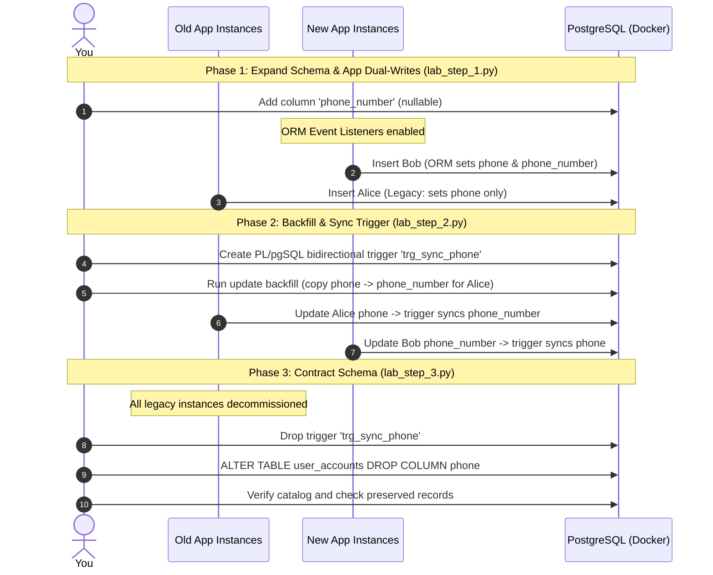

# Practical Lab 017: Renaming Columns and Tables with Zero Downtime

## 📌 Lab Overview & Objectives

In production databases serving high-traffic applications, executing a direct rename of a column or table is a high-risk operation. Running a simple command like:
```sql
ALTER TABLE user_accounts RENAME COLUMN phone TO phone_number;
```
acquires an `AccessExclusiveLock` on the table, blocking all concurrent read and write operations. On a large table, this block can stall application threads and exhaust connection pools. More importantly, a direct rename introduces a critical **breaking change**: any running application instance that still expects the old column `phone` will instantly crash, resulting in application errors and user-facing downtime during a rolling deployment.

To perform a zero-downtime column or table rename, we must decouple the schema migration from the application deployment. This is accomplished using the **Expand/Contract pattern**, which breaks the rename into three distinct phases:

1. **Expand Phase**: Add the new column as a nullable column, and deploy an application update that dual-writes to both the old and new columns.
2. **Transition/Sync Phase**: Backfill existing legacy records, and establish a database-level bidirectional trigger. This trigger ensures that data remains synchronized between the two columns, regardless of whether a query comes from an old version of the app (updating `phone`) or a new version (updating `phone_number`).
3. **Contract Phase**: Once all application instances are updated to read/write only from/to the new column, clean up the database by dropping the synchronization trigger and the old column.

This lab provides hands-on practice implementing each stage of this pattern using PostgreSQL and SQLAlchemy.

### Key Skills You Will Master

- Designing and executing a multi-step Expand/Contract schema evolution plan.
- Implementing ORM-level event listeners in SQLAlchemy to automate application-side dual-writing.
- Creating a PL/pgSQL bidirectional synchronization trigger to bridge the database state during multi-version rolling deployments.
- Backfilling historical records in a safe, non-blocking update sweep.
- Safely contracting the schema by dropping obsolete database artifacts.
- Analyzing the tradeoffs between column renaming and table renaming strategies.

---

## 🛠️ Prerequisites & Environment Setup

This lab runs in an isolated local environment using Docker.

- **Database Engine**: PostgreSQL 17 (via Docker)
- **Application Layer**: Python 3.13, SQLAlchemy 2.0+, and `psycopg3` (sync/async)
- **Dependencies**: Already specified in the lab's `pyproject.toml` and managed by `uv` inside the workspace virtual environment.

### Workspace Structure

Your lab folder is organized as follows:

```text
labs/017-renaming-columns-tables/
├── pyproject.toml               # Lab-specific dependencies
├── docker-compose.yml           # PostgreSQL container setup
├── .env.example                 # Connection URI configuration template
├── app/
│   ├── __init__.py
│   ├── config.py                # Database configuration loader
│   ├── dependencies.py          # SQLAlchemy engine and session factories
│   └── models.py                # ORM model with dual-write event listeners (UserAccount)
├── lab_step_1.py                # Step 1: Expand Phase (column addition and ORM dual-write)
├── lab_step_2.py                # Step 2: Transition Phase (data backfill and DB-level sync trigger)
├── lab_step_3.py                # Step 3: Contract Phase (dropping old columns/triggers)
└── README.md                    # Lab workbook (This file)
```

### Initial Bootstrap:

1. Open your terminal and navigate to the lab folder:
    ```bash
    cd labs/017-renaming-columns-tables
    ```
2. Copy the environment variables template:
    ```bash
    cp .env.example .env
    ```
3. Launch the database container in the background:
    ```bash
    docker compose up -d
    ```
4. Sync dependencies from the project root:
    ```bash
    cd ../..
    uv sync --all-packages
    ```
5. Activate the virtual environment:
    ```bash
    source .venv/bin/activate
    ```
6. Verify the database is online and accepting connections:
    ```bash
    docker exec -it postgres pg_isready -U postgres -d renaming_db
    ```

---

## 📝 Lab Flow & Sequence

The diagram below outlines the transition steps, highlighting how old and new application instances interact with the database during the migration sequence.



---

## 🔬 Core Lab Steps & Content

### Step 1: Expand Phase - Schema and Application Dual-Writing

#### 📘 Step 1 Theory: The Expand Phase

In the first step of a column rename, we must update our schema to support the new column structure without breaking any existing application traffic. This is called the **Expand Phase**:

1. **Schema DDL**: Add the new column as `NULLABLE`. Even if the column is intended to be `NOT NULL` in the final schema, it **must** start as nullable. This is because old application versions that are running concurrently do not know about the new column and will omit it from their `INSERT` statements; if the column were `NOT NULL` without a default value, those inserts would fail.
2. **Application Dual-Writing**: Before making any database changes, configure your application models to write to both the old and new columns. In SQLAlchemy, this is done cleanly using event listeners (such as `before_insert` and `before_update` hooks). When the application receives an update, it populates both columns, ensuring that any new or updated records contain identical data in both fields.

At this point, old application versions continue writing only to the old column (`phone`), while new application versions write to both (`phone` and `phone_number`).

#### 🧪 Step 1 Lab Execution

Run the Step 1 script to simulate the initialization, column creation, and application-level dual-writing tests:

```bash
python labs/017-renaming-columns-tables/lab_step_1.py
```

> **Observe**:
> - The script initializes the table, simulating the legacy state where only the `phone` column is present.
> - An initial record for `alice` is inserted using only the old column.
> - The script executes DDL to add `phone_number` as a nullable column.
> - A new user `bob` is inserted using the SQLAlchemy model containing the dual-write event listener.
> - In the database output, Alice's record has `phone_number` as `None`, whereas Bob's record successfully has both columns populated.

**Key Insight**: At the end of the Expand step, your application is safe to roll out, but historical rows still have missing/null values in the new column, and any legacy application instances still running are only updating the old column.

---

### Step 2: Transition Phase - Data Backfill & Database Triggers

#### 📘 Step 2 Theory: Data Backfill & Database-Level Triggers

Once the application is dual-writing, we must synchronize the old data and handle multi-version client deployments. During a rolling deployment, both old and new code versions will run side-by-side. 

To bridge this gap:
1. **Bidirectional Trigger**: We deploy a PL/pgSQL database trigger. If an old application writes to the old column, the trigger copies the value to the new column. If a new application writes to the new column, the trigger copies it to the old column. This provides database-level synchronization that works regardless of the application version.
2. **Historical Backfill**: We perform a batch update to copy values from the old column to the new column for all historical rows where the new column is `NULL`.

Because the trigger is bidirectional, any update or insert to either column is safely synced to the other.

#### 🧪 Step 2 Lab Execution

Run the Step 2 script to perform the data backfill and set up the database sync trigger:

```bash
python labs/017-renaming-columns-tables/lab_step_2.py
```

> **Observe**:
> - The database runs the update backfill, successfully syncing Alice's historical record.
> - The script creates the bidirectional database trigger `trg_sync_phone`.
> - A raw insert simulating a legacy application query (writing only to `phone`) is executed for `charlie`.
> - The database trigger catches the write and automatically populates `phone_number` with Charlie's phone details.

**Key Insight**: With the database trigger in place, the application code is now safe to be transitioned entirely to the new column. Even if some nodes still write to the old column, the trigger prevents data drift.

---

### Step 3: Contract Phase - Cleanup & Verification

#### 📘 Step 3 Theory: Contract Phase & Safe Column Dropping

The final step is the **Contract Phase**. This is executed after 100% of the application instances have been updated to read and write exclusively from/to the new column, and all references to the old column have been removed from the application code.

Because the old column is no longer accessed by any code:
1. **Drop DB Trigger**: The synchronization trigger is no longer needed and can be safely dropped.
2. **Drop Old Column**: Run `ALTER TABLE ... DROP COLUMN` to remove the old column. This recovers storage space and cleans up the schema.
3. **Verify Catalog**: Check the database catalog to verify the table structure and query the records to ensure no data was lost during the migration process.

#### 🧪 Step 3 Lab Execution

Run the Step 3 script to perform the contract migration and verify the final state of the database:

```bash
python labs/017-renaming-columns-tables/lab_step_3.py
```

> **Observe**:
> - The sync trigger `trg_sync_phone` is dropped.
> - The `phone` column is dropped from the table.
> - The database catalog is queried, showing that only the `id`, `username`, and `phone_number` columns remain.
> - The records for Alice, Bob, and Charlie are fetched, demonstrating that their phone values are fully preserved in the new `phone_number` column.

**Key Insight**: The table schema has evolved with zero downtime, and all historical and newly added data is intact in the renamed column.

---

## 🎯 Lab Outcomes & Verification Checklist

To successfully complete this lab, you must verify the following:

- [ ] Execute `lab_step_1.py` and confirm that `phone_number` is successfully added and that ORM dual-writing works for new inserts.
- [ ] Execute `lab_step_2.py` and verify that historical records are backfilled and that the database-level trigger successfully synchronizes legacy raw SQL inserts.
- [ ] Execute `lab_step_3.py` and confirm that the trigger and old column are dropped, the schema catalog contains only the correct columns, and all user data is preserved.
- [ ] Verify that all code formats and checks pass successfully from the workspace root:
  ```bash
  make check
  ```

Once you have completed the lab, tear down the PostgreSQL container:

```bash
docker compose down -v
```

---

## ❓ Deep-Dive Self-Assessment

1. _Why is the bidirectional database trigger required during a rolling deployment, even if the application code uses ORM event listeners to dual-write? (Hint: Think about what happens when an old version of the app writes a record while a new version is running, or when raw SQL scripts/background jobs bypass the ORM)._
2. _What are the locking implications of dropping a column in PostgreSQL? Does dropping a column immediately reclaim disk space?_
3. _How would you rename a high-traffic **table** (e.g., renaming `users` to `user_accounts`) instead of a column with zero downtime? Outline a multi-step pattern using PostgreSQL views, triggers, or rule systems._
4. _If the backfill process in Step 2 needs to update 100 million records, how should it be executed to avoid locking out normal transactions?_

---

## 📚 Additional Resources

- [PostgreSQL Documentation: CREATE TRIGGER](https://www.postgresql.org/docs/current/sql-createtrigger.html)
- [SQLAlchemy Events Documentation: Mapper Events](https://docs.sqlalchemy.org/en/20/orm/events.html)
- [PostgreSQL Documentation: ALTER TABLE](https://www.postgresql.org/docs/current/sql-altertable.html)
- [Stripe Engineering: Safe Database Migrations](https://stripe.com/blog/safe-database-migrations)
