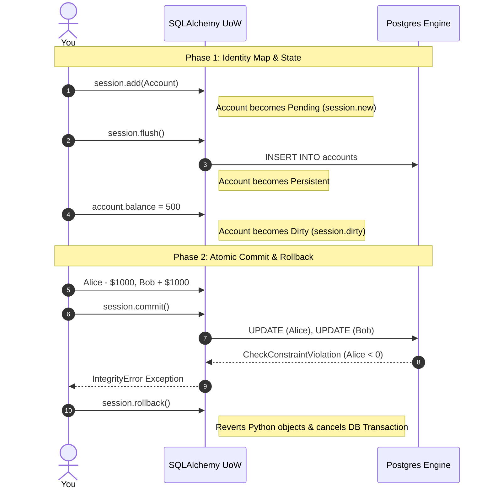

# Practical Lab: Mastering the Unit of Work Lifecycle

## 📌 Lab Overview & Objectives

When bridging object-oriented programming (Python/FastAPI) and relational databases (PostgreSQL), keeping Python objects perfectly in sync with database tables can be difficult. The **Unit of Work** (UoW) pattern solves this. In SQLAlchemy, the `Session` acts as the Unit of Work. It tracks all object changes internally (using an Identity Map) and coordinates sending those changes to the database in a single, efficient, and atomic operation.

In this lab, you will explore the SQLAlchemy Session lifecycle. You will observe how the Session tracks object states (`Transient`, `Pending`, `Persistent`, `Dirty`, `Deleted`), how `flush()` differs from `commit()`, and how to use the UoW pattern to handle atomic transactions (like bank transfers) and rollback safely when database constraints are violated.

### Key Skills You Will Master

- **Identity Map & State Tracking**: Inspecting `session.new`, `session.dirty`, and `session.deleted` to see how SQLAlchemy caches and tracks objects before emitting SQL.
- **Flush vs. Commit**: Understanding when SQL is actually sent to the database vs. when a transaction is permanently saved.
- **Atomic Operations & Rollbacks**: Designing business logic (like a bank transfer) that succeeds or fails as a single unit, properly reverting both Python object states and database states on failure.

---

## 🛠️ Prerequisites & Environment Setup

This lab runs in an isolated local environment to allow intrusive diagnostics without risk.

- **Database Engine**: PostgreSQL 17 (via Docker)
- **Application Layer**: Python 3.13, SQLAlchemy 2.0+
- **Dependencies**: Already specified in the workspace `pyproject.toml` and managed by `uv`

### Workspace Structure

Your lab folder is organized as follows:

```text
relational-database-skills-lab/
└── labs/
    └── 018-unit-of-work-pattern/
        ├── pyproject.toml         # Lab-specific dependencies
        ├── docker-compose.yml     # PostgreSQL container mapped to 5439
        ├── .env.example           # Environment variables template
        ├── app/
        │   ├── __init__.py
        │   ├── config.py          # Database URI loader
        │   ├── dependencies.py    # Session factory and init_db
        │   └── models.py          # SQLAlchemy Account model with constraints
        ├── app/
        │   ├── uow.py             # Custom Unit of Work class
        │   └── repository.py      # Abstracted database interactions
        ├── lab_step_1.py          # Step 1: The Identity Map & State Tracking
        ├── lab_step_2.py          # Step 2: Atomic Commits & Rollback Recovery
        ├── lab_step_3.py          # Step 3: Production Custom UoW Class
        └── README.md              # Lab workbook (This file)
```

### Initial Bootstrap:

1. Open your terminal and navigate to the lab folder:
    ```bash
    cd labs/018-unit-of-work-pattern
    ```
2. Copy the environment variables template and configure if needed:
    ```bash
    cp .env.example .env
    ```
3. Launch the database container in the background:
    ```bash
    docker compose up -d
    ```
4. From the project root, sync dependencies using `uv`:
    ```bash
    cd ../..
    uv sync --all-packages
    ```
5. Activate the virtual environment:
    ```bash
    source .venv/bin/activate
    ```

---

## 📝 Lab Flow & Sequence



---

## 🔬 Core Lab Steps & Content

### Step 1: The Identity Map & State Tracking

#### 📘 Step 1 Theory: SQLAlchemy Object States

The SQLAlchemy Session tracks every object it is managing in an internal cache called the **Identity Map**. As objects move through their lifecycle, they transition between different states:

- **Transient**: An object is created in Python but not attached to any Session. (e.g., `acc = Account(name="Alice")`)
- **Pending**: The object is attached to the Session (`session.add(acc)`), but hasn't been inserted into the database yet. It lives in `session.new`.
- **Persistent**: The object exists in the database and the Session. It has a primary key ID.
- **Dirty**: A persistent object was modified in Python (`acc.balance = 500`), but the `UPDATE` SQL hasn't been sent to the DB yet. It lives in `session.dirty`.
- **Deleted**: The object was marked for deletion (`session.delete(acc)`).

**Flush vs. Commit**:
- `session.flush()`: Sends all pending SQL (`INSERT`, `UPDATE`, `DELETE`) to the database but does **not** commit the transaction. The changes are only visible to your current transaction.
- `session.commit()`: Flushes (if needed) and permanently commits the transaction to the database, making changes visible to all other concurrent connections.

#### 🧪 Step 1 Lab Execution

Run the automated Python script to observe these object states in action:

```bash
python labs/018-unit-of-work-pattern/lab_step_1.py
```

> **Observe**: 
> 1. When the account is added, it sits in `session.new` and has `id=None`.
> 2. After `session.flush()`, SQL is emitted, the `id` is populated from the DB sequence, and it becomes Persistent.
> 3. After changing the balance, it enters `session.dirty`. Calling `flush()` emits the `UPDATE` statement.
> 4. Calling `rollback()` at the end clears the database transaction entirely, demonstrating that `flush()` was not permanent.

---

### Step 2: Atomic Commits & Rollback Recovery

#### 📘 Step 2 Theory: The Atomic Transaction

A Unit of Work must be **Atomic**: either *all* operations succeed, or *none* of them do. 

Imagine a bank transfer: we must subtract money from Alice and add it to Bob. If Alice's account triggers a `CheckConstraint` (e.g., she doesn't have enough money), the database will raise an `IntegrityError` when the session flushes/commits. If we don't handle this correctly, Bob might get the money while Alice's deduction fails, or the application might crash leaving the session in an invalid state (`PendingRollbackError`).

When a database error occurs, we must call `session.rollback()`. In SQLAlchemy, rolling back a session does two critical things:
1. Tells PostgreSQL to `ROLLBACK` the database transaction.
2. Reverts the state of all Python objects in the Identity Map back to their original state (expiring their dirty attributes).

#### 🧪 Step 2 Lab Execution

Run the automated Python script to simulate a failed bank transfer:

```bash
python labs/018-unit-of-work-pattern/lab_step_2.py
```

> **Observe**: 
> 1. The script attempts to transfer $1,000 from Alice (who only has $100) to Bob.
> 2. The `session.commit()` fails because the PostgreSQL `CheckConstraint (balance >= 0)` rejects Alice's negative balance.
> 3. The script catches the `IntegrityError` and calls `session.rollback()`.
> 4. Notice that both the database records AND the Python objects in memory (`alice.balance` and `bob.balance`) are perfectly reverted to their original safe values!

---

### Step 3: Production-Grade Custom Unit of Work

#### 📘 Step 3 Theory: Encapsulating the Session

In enterprise applications, scattering `SessionLocal()` calls and manual `try/except/rollback` blocks throughout your business logic is an anti-pattern. Instead, you build a custom **Unit of Work Class** (`AbstractUnitOfWork` and `SqlAlchemyUnitOfWork`).

By implementing the Python context manager protocol (`__enter__` and `__exit__`), the custom UoW class automatically handles:
1. Creating the session.
2. Instantiating Repositories bound to that session.
3. Calling `commit()` if no exceptions are raised during execution.
4. Calling `rollback()` if any error occurs.
5. Closing the session safely returning connections to the pool.

#### 🧪 Step 3 Lab Execution

Run the automated Python script to see the custom UoW pattern cleanly handle a service-layer operation:

```bash
python labs/018-unit-of-work-pattern/lab_step_3.py
```

> **Observe**: 
> The service layer `transfer_funds()` never imports SQLAlchemy. It simply receives the UoW, runs its business logic on pure python objects, and the UoW's internal context manager automatically handles the commit and rollback on exceptions.

---

## 🎯 Lab Outcomes & Verification Checklist

To successfully complete this lab, you must produce and verify the following results:

- [ ] **Step 1**: Execute `lab_step_1.py` and observe the transition between `Transient` -> `Pending` -> `Persistent` -> `Dirty` states in the console logs.
- [ ] **Step 2**: Execute `lab_step_2.py` and verify that `session.rollback()` prevents Bob from incorrectly receiving money and correctly reverts Alice and Bob's Python objects to their pre-transaction values.
- [ ] **Step 3**: Execute `lab_step_3.py` and observe automated commit/rollback behaviors abstracted away by the custom `SqlAlchemyUnitOfWork` context manager.

When you are finished with your local experiment, tear down your sandbox:

```bash
docker compose down -v
```

---

## ❓ Deep-Dive Self-Assessment

Formulate answers to these production-level questions based on your observations during this lab:

1. _What happens if you modify a persistent object's attribute but forget to call `session.add()` on it before `session.commit()`?_
2. _Why is it a severe anti-pattern in web frameworks like FastAPI to catch a database exception but forget to call `session.rollback()` before reusing the session?_
3. _In a highly concurrent system, if two requests try to modify Alice's balance at the same exact millisecond, how does the Unit of Work interact with PostgreSQL row locks to prevent data corruption?_
