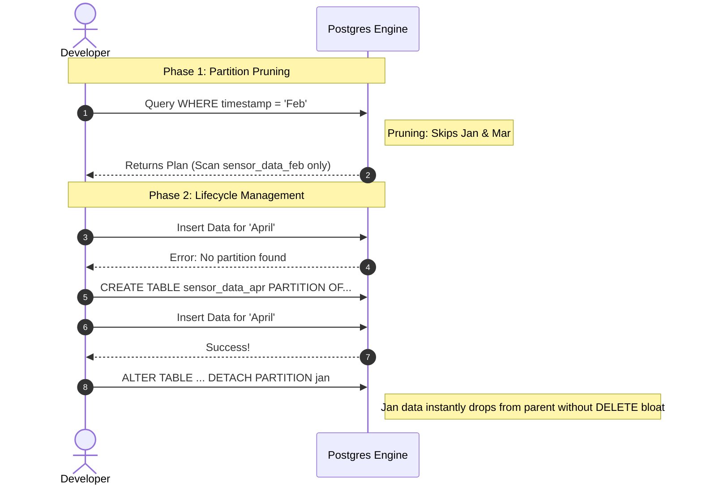

# Practical Lab: Table Partitioning

## 📌 Lab Overview & Objectives

When tables grow to billions of rows, B-Tree indexes become massive and sequential scans become unbearably slow. Additionally, deleting old data (`DELETE FROM table WHERE date < ...`) causes massive table bloat and locks.

**Declarative Table Partitioning** is the PostgreSQL solution. It allows you to logically split one massive table into many smaller physical tables (partitions) based on a key (like a timestamp for timeseries data). To the application, it looks like one table. To the database, it is many fast, manageable tables.

### Key Skills You Will Master

- **Declarative Range Partitioning**: Creating a parent table and dynamically creating child partitions for time-series data.
- **Partition Pruning**: Observing how the PostgreSQL query optimizer completely skips reading child tables that don't match the `WHERE` clause, drastically improving performance.
- **Partition Lifecycle**: Dynamically attaching new partitions for incoming data and safely detaching old partitions to archive/drop them without massive `DELETE` statements or table bloat.

---

## 🛠️ Prerequisites & Environment Setup

### Workspace Structure

Your lab folder is organized as follows:

```text
relational-database-skills-lab/
└── labs/
    └── 019-table-partitioning/
        ├── pyproject.toml
        ├── docker-compose.yml
        ├── .env.example
        ├── app/
        │   ├── config.py
        │   ├── dependencies.py
        │   └── models.py          # Partitioned SQLAlchemy Model
        ├── lab_step_1.py          # Step 1: Range Partitioning & Pruning
        ├── lab_step_2.py          # Step 2: Dynamic Lifecycle (Attach/Detach)
        └── README.md
```

### Initial Bootstrap:

1. Open your terminal and navigate to the lab folder:
    ```bash
    cd labs/019-table-partitioning
    ```
2. Copy the environment variables template:
    ```bash
    cp .env.example .env
    ```
3. Launch the database container in the background:
    ```bash
    docker compose up -d
    ```
4. From the project root, sync dependencies using `uv`:
    ```bash
    cd ../..
    uv sync --all-packages
    ```
5. Activate the virtual environment:
    ```bash
    source .venv/bin/activate
    ```

---

## 📝 Lab Flow & Sequence



---

## 🔬 Core Lab Steps & Content

### Step 1: Range Partitioning & Pruning

#### 📘 Step 1 Theory
In SQLAlchemy, a partitioned table is created by passing `postgresql_partition_by` to `__table_args__`. However, the parent table cannot store data itself. You must create **Child Partitions** using raw SQL (`CREATE TABLE ... PARTITION OF ... FOR VALUES FROM ... TO ...`).

When you query the parent table, PostgreSQL's query planner uses **Partition Pruning**. If your `WHERE` clause filters on the partition key, the planner instantly ignores all child tables that fall outside that range. This is the secret to querying terabytes of data in milliseconds.

#### 🧪 Step 1 Lab Execution
Run the automated Python script:
```bash
python labs/019-table-partitioning/lab_step_1.py
```
> **Observe**: The script seeds data across Jan, Feb, and Mar. When it queries for February data, look at the `EXPLAIN` output. Notice how it only performs a scan on `sensor_data_feb`. The engine completely ignored the existence of Jan and Mar!

---

### Step 2: Dynamic Lifecycle Management

#### 📘 Step 2 Theory
In production, time-series data never stops. You must have a chron job or automation (like `pg_partman`) creating next month's partition before next month arrives. If a record arrives and no partition exists for its timestamp, PostgreSQL will throw an immediate error.

Furthermore, to delete old data (e.g., "keep only 3 months of logs"), running `DELETE FROM table WHERE ...` is catastrophic. It creates massive MVCC bloat and locks rows. With partitioning, you simply run `ALTER TABLE ... DETACH PARTITION`. The partition becomes a standalone table instantly (which you can then safely `DROP TABLE`), wiping out millions of rows in milliseconds with zero bloat.

#### 🧪 Step 2 Lab Execution
Run the automated Python script:
```bash
python labs/019-table-partitioning/lab_step_2.py
```
> **Observe**: 
> 1. We attempt to insert April data, which triggers a routing error because `sensor_data_apr` doesn't exist.
> 2. We dynamically create the partition and the insert succeeds.
> 3. We instantly detach the `sensor_data_jan` partition. The January data is instantly removed from the main table searches, simulating a zero-bloat archival process!

---

## 🎯 Lab Outcomes & Verification Checklist

To successfully complete this lab, you must produce and verify the following results:

- [ ] **Step 1**: Execute `lab_step_1.py` and verify in the console that the `EXPLAIN` plan successfully pruned the partitions.
- [ ] **Step 2**: Execute `lab_step_2.py` and observe the database error when missing a partition, followed by the successful dynamic creation and detachment.

When you are finished with your local experiment, tear down your sandbox:

```bash
docker compose down -v
```

---

## ❓ Deep-Dive Self-Assessment

Formulate answers to these production-level questions based on your observations during this lab:

1. _What happens to a global B-Tree index on the parent table when you detach a partition, and why does PostgreSQL 11+ recommend avoiding global indexes in favor of partition-local indexes?_
2. _If you run `DELETE FROM sensor_data WHERE timestamp < '2023-02-01'` instead of detaching the partition, what happens at the MVCC layer, and how does this affect autovacuum and table bloat?_
3. _In a highly concurrent system, if you try to attach a new partition using `ALTER TABLE ... ATTACH PARTITION` while massive `SELECT` queries are scanning the parent table, what lock does PostgreSQL take, and how does this affect application availability?_
