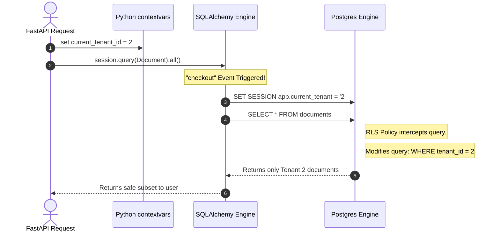

# Practical Lab: Row-Level Security (RLS) & Multi-Tenant Architecture

## 📌 Lab Overview & Objectives

In modern B2B SaaS applications, a single database often stores data for hundreds of different companies (tenants). The greatest fear of any SaaS engineer is a catastrophic data leak: accidentally displaying Company A's highly confidential data to Company B because a developer forgot to add `.filter_by(tenant_id=...)` to an ORM query.

**Row-Level Security (RLS)** pushes tenant isolation directly into the PostgreSQL engine. When properly configured, it becomes mathematically impossible for a developer to accidentally leak data, because the database physically hides rows that don't belong to the active tenant.

### Key Skills You Will Master

- **RLS Mechanics**: Enabling RLS, forcing it for superusers, and writing dynamic `USING` policies based on PostgreSQL custom session variables (`current_setting()`).
- **SQLAlchemy Event Hooks**: Using `contextvars` and SQLAlchemy's `checkout` event to inject the active tenant ID transparently into the database connection.
- **Bulletproof Architecture**: Completely decoupling tenant isolation from your business logic so your service layer never has to think about `tenant_id` filters again.

---

## 🛠️ Prerequisites & Environment Setup

### Workspace Structure

Your lab folder is organized as follows:

```text
relational-database-skills-lab/
└── labs/
    └── 020-row-level-security/
        ├── pyproject.toml
        ├── docker-compose.yml
        ├── .env.example
        ├── app/
        │   ├── config.py
        │   ├── dependencies.py    # DDL scripts to enable RLS
        │   └── models.py          # Tenant & Document models
        ├── lab_step_1.py          # Step 1: RLS Enforcement at the SQL Layer
        ├── lab_step_2.py          # Step 2: Transparent SQLAlchemy Integration
        └── README.md
```

### Initial Bootstrap:

1. Open your terminal and navigate to the lab folder:
    ```bash
    cd labs/020-row-level-security
    ```
2. Copy the environment variables template:
    ```bash
    cp .env.example .env
    ```
3. Launch the database container in the background:
    ```bash
    docker compose up -d
    ```
4. From the project root, sync dependencies using `uv`:
    ```bash
    cd ../..
    uv sync --all-packages
    ```
5. Activate the virtual environment:
    ```bash
    source .venv/bin/activate
    ```

---

## 📝 Lab Flow & Sequence



---

## 🔬 Core Lab Steps & Content

### Step 1: RLS Enforcement at the SQL Layer

#### 📘 Step 1 Theory
By default, a `SELECT * FROM table` returns every row. 
When you execute `ALTER TABLE ... ENABLE ROW LEVEL SECURITY;`, PostgreSQL begins intercepting all queries to that table. 

You define a policy dictating visibility:
```sql
CREATE POLICY tenant_isolation_policy ON documents
USING (tenant_id = current_setting('app.current_tenant', true)::integer);
```
This policy acts as an invisible, non-bypassable `WHERE` clause appended to every query. If a connection hasn't configured the `app.current_tenant` variable, the query safely returns 0 rows.

#### 🧪 Step 1 Lab Execution
Run the first step to initialize the schema and test the raw SQL enforcement:
```bash
python labs/020-row-level-security/lab_step_1.py
```
> **Observe**: 
> 1. The script attempts to read the table without setting the context variable. Even though data exists, PostgreSQL returns 0 rows.
> 2. The script explicitly executes `SET LOCAL app.current_tenant = '1'` and queries the database again. It instantly sees Tenant 1's documents without needing a `WHERE` clause in Python.

---

### Step 2: Transparent SQLAlchemy Integration

#### 📘 Step 2 Theory
Manually calling `session.execute(text("SET LOCAL..."))` before every query is exhausting and error-prone. 
Instead, we use Python's built-in `contextvars` (which are safe for asynchronous FastAPI concurrency) to hold the tenant ID for the duration of the HTTP request.

We then attach an **Event Listener** to the SQLAlchemy `Engine`. Every time a Session checks out a database connection from the pool, SQLAlchemy automatically reads the `contextvar` and injects the `SET SESSION app.current_tenant = X` command into PostgreSQL before releasing the connection to your application code.

#### 🧪 Step 2 Lab Execution
Run the second script to simulate concurrent API requests:
```bash
python labs/020-row-level-security/lab_step_2.py
```
> **Observe**: 
> Look at the `fetch_documents()` function in the script. Notice how it is completely naked: `session.query(Document).all()`. It knows absolutely nothing about tenants! Yet, when simulating the request for Stark Industries (Tenant 2), it magically only returns Iron Man schematics.

---

## 🎯 Lab Outcomes & Verification Checklist

To successfully complete this lab, you must produce and verify the following results:

- [ ] **Step 1**: Execute `lab_step_1.py` and verify that RLS safely blocks access when no tenant context is provided.
- [ ] **Step 2**: Execute `lab_step_2.py` and observe the SQLAlchemy `checkout` event automatically applying the context variables to isolate the responses.

When you are finished with your local experiment, tear down your sandbox:

```bash
docker compose down -v
```

---

## ❓ Deep-Dive Self-Assessment

Formulate answers to these production-level questions based on your observations during this lab:

1. _Why must we use `FORCE ROW LEVEL SECURITY` during this lab? If we didn't force it, who would bypass the security policies?_
2. _Why is using Python's `contextvars` absolutely critical for this pattern in a modern async framework like FastAPI, rather than using a global Python variable or a class attribute?_
3. _In `lab_step_2.py`, our event listener uses `SET SESSION` rather than `SET LOCAL`. If a connection is returned to the connection pool and checked out by a totally different request, what security vulnerability could occur if the event listener forgets to call `RESET app.current_tenant`?_
