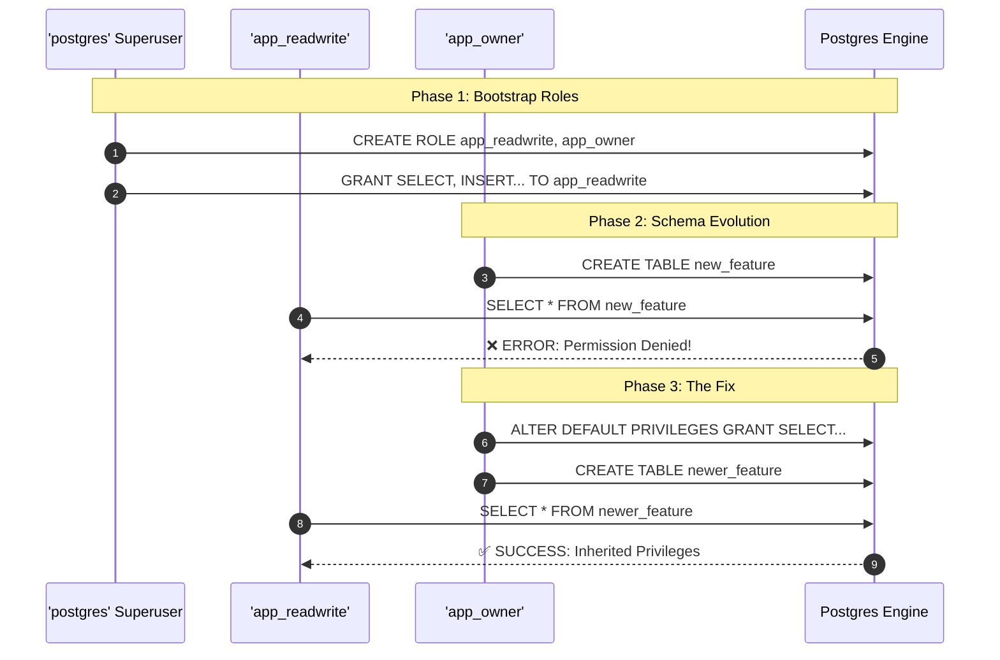

# Practical Lab: Role-Based Access Control (RBAC) & Default Privileges

## 📌 Lab Overview & Objectives

One of the most common anti-patterns in application development is configuring the application ORM (SQLAlchemy, Prisma, Hibernate) to connect to the production database using the `postgres` superuser account. 

If the application suffers a SQL injection vulnerability or a compromised dependency, the attacker gains full control over the database schema, user accounts, and server files. 

A Senior Database Engineer strictly adheres to the **Principle of Least Privilege**. In this lab, we will design a professional Role-Based Access Control (RBAC) architecture and explore the subtle trap of PostgreSQL's `DEFAULT PRIVILEGES` that catches many teams during their first Alembic migration.

### Key Skills You Will Master

- **Role Architecture**: Creating dedicated `app_owner` (for migrations), `app_readwrite` (for the API), and `app_readonly` (for BI/Analytics) roles.
- **Granular Permissions**: Restricting DDL (Schema modification) access and limiting DML (Data modification) access.
- **Default Privileges**: Preventing the classic "Permission Denied" outage that occurs when a new table is created but the application role isn't automatically granted access to it.

---

## 🛠️ Prerequisites & Environment Setup

### Workspace Structure

Your lab folder is organized as follows:

```text
relational-database-skills-lab/
└── labs/
    └── 021-role-based-access-control/
        ├── pyproject.toml
        ├── docker-compose.yml
        ├── .env.example
        ├── app/
        │   ├── config.py
        │   ├── dependencies.py    # DDL scripts to create roles and grants
        │   └── models.py          # Employee model
        ├── lab_step_1.py          # Step 1: Testing connection permissions
        ├── lab_step_2.py          # Step 2: The Default Privileges trap
        └── README.md
```

### Initial Bootstrap:

1. Open your terminal and navigate to the lab folder:
    ```bash
    cd labs/021-role-based-access-control
    ```
2. Copy the environment variables template:
    ```bash
    cp .env.example .env
    ```
3. Launch the database container in the background:
    ```bash
    docker compose up -d
    ```
4. From the project root, sync dependencies using `uv`:
    ```bash
    cd ../..
    uv sync --all-packages
    ```
5. Activate the virtual environment:
    ```bash
    source .venv/bin/activate
    ```

---

## 📝 Lab Flow & Sequence



---

## 🔬 Core Lab Steps & Content

### Step 1: Role Restrictions and The Principle of Least Privilege

#### 📘 Step 1 Theory
In a mature architecture, you separate database access into three tiers:
1. **Migrator/Owner (`app_owner`)**: Used exclusively by CI/CD tools running Alembic. It owns the tables and has permission to execute `ALTER TABLE`, `DROP TABLE`, and `CREATE TABLE`.
2. **Application (`app_readwrite`)**: Used by the live FastAPI application. It can `SELECT`, `INSERT`, `UPDATE`, and `DELETE` records, but it is physically prevented from modifying the schema.
3. **Analytics (`app_readonly`)**: Used by BI tools (like Metabase or Tableau) or internal dashboard replicas. It is physically restricted to `SELECT` only.

#### 🧪 Step 1 Lab Execution
Run the first step to initialize the roles and test their boundaries:
```bash
python labs/021-role-based-access-control/lab_step_1.py
```
> **Observe**: 
> The script tests the three roles against Read, Write, and DDL operations.
> Notice that `app_readonly` gracefully fails on `INSERT`.
> Crucially, notice that `app_readwrite` successfully inserts data, but gracefully fails with a `ProgrammingError` when attempting an `ALTER TABLE` statement. A compromised API cannot destroy your schema!

---

### Step 2: The Default Privileges Trap

#### 📘 Step 2 Theory
When you run `GRANT SELECT ON ALL TABLES IN SCHEMA public TO app_readwrite;`, PostgreSQL grants those permissions to the tables that exist **at that exact millisecond**.

When your team merges a new PR and Alembic creates a brand new table tomorrow, `app_readwrite` will have absolutely zero access to it. When the API attempts to query the new table, it will crash with a `Permission Denied` error.

To fix this, you must instruct PostgreSQL to automatically apply grants to any future tables created by the migration role using `ALTER DEFAULT PRIVILEGES`.

#### 🧪 Step 2 Lab Execution
Run the second script to simulate a migration and the resulting application crash:
```bash
python labs/021-role-based-access-control/lab_step_2.py
```
> **Observe**: 
> 1. The script simulates an Alembic migration by connecting as `app_owner` and creating the `departments` table.
> 2. The API connects as `app_readwrite` and is immediately denied access to `departments`.
> 3. The `app_owner` configures `ALTER DEFAULT PRIVILEGES`.
> 4. `app_owner` creates another table (`locations`), and this time, the API inherits access automatically!

---

## 🎯 Lab Outcomes & Verification Checklist

To successfully complete this lab, you must produce and verify the following results:

- [ ] **Step 1**: Execute `lab_step_1.py` and verify that the `app_readwrite` role cannot execute schema-altering DDL statements.
- [ ] **Step 2**: Execute `lab_step_2.py` and observe the difference in API access between tables created before and after configuring `DEFAULT PRIVILEGES`.

When you are finished with your local experiment, tear down your sandbox:

```bash
docker compose down -v
```

---

## ❓ Deep-Dive Self-Assessment

Formulate answers to these production-level questions based on your observations during this lab:

1. _If a developer connects to the database using pgAdmin using the `app_readonly` credentials, could they theoretically delete data if they exploit a vulnerability in the pgAdmin client?_
2. _In `lab_step_2.py`, we explicitly ran `ALTER DEFAULT PRIVILEGES FOR ROLE app_owner`. What would happen if the DB Admin (`postgres` superuser) created a new table manually instead of `app_owner`? Would the API be able to read it?_
3. _Why do we need to grant `USAGE` and `SELECT` on `SEQUENCES` separately from tables in PostgreSQL? What specific SQLAlchemy/ORM operation would fail if we forgot to grant sequence access?_
