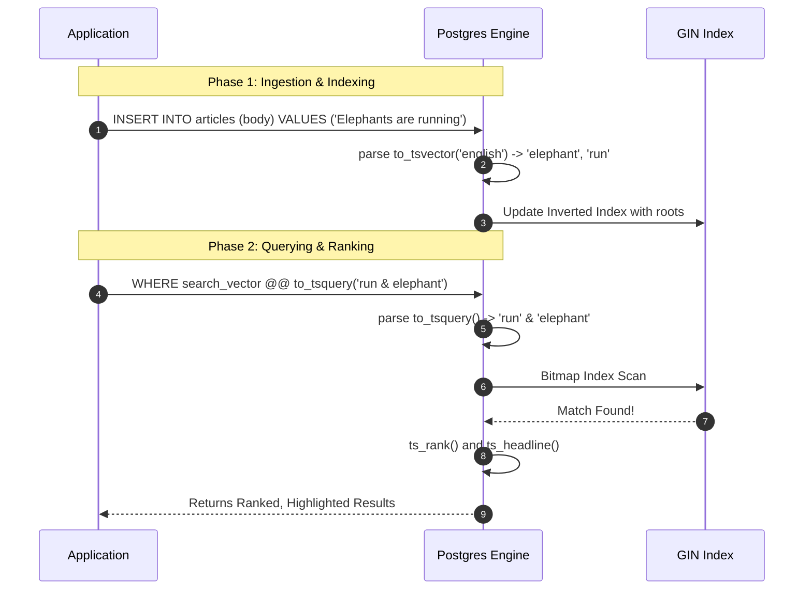

# Practical Lab: Native Full-Text Search (FTS)

## 📌 Lab Overview & Objectives

When applications need powerful search capabilities (ranking, typo tolerance, stemming), engineers often immediately reach for an external microservice like Elasticsearch or Algolia. However, managing a secondary search cluster introduces massive operational overhead, data synchronization lags, and infrastructure costs.

PostgreSQL has a world-class **Native Full-Text Search (FTS)** engine built right in. In this lab, we will explore how to build a production-grade search experience purely within PostgreSQL using `tsvector`, `tsquery`, and GIN indexes.

### Key Skills You Will Master

- **Lexemes & Stemming**: Understanding how PostgreSQL parses language, drops stop-words, and stems words to their root forms.
- **GIN Indexing**: Leveraging Generalized Inverted Indexes for lightning-fast keyword lookups.
- **Search UX**: Implementing `ts_rank` to sort results by relevance and `ts_headline` to generate highlighted snippets for the UI.

---

## 🛠️ Prerequisites & Environment Setup

### Workspace Structure

Your lab folder is organized as follows:

```text
relational-database-skills-lab/
└── labs/
    └── 022-full-text-search/
        ├── pyproject.toml
        ├── docker-compose.yml
        ├── .env.example
        ├── app/
        │   ├── config.py
        │   ├── dependencies.py    # Session and init_db
        │   └── models.py          # Article model with Computed TSVECTOR
        ├── lab_step_1.py          # Step 1: Lexemes and GIN Indexes
        ├── lab_step_2.py          # Step 2: Ranking and Snippets
        └── README.md
```

### Initial Bootstrap:

1. Open your terminal and navigate to the lab folder:
    ```bash
    cd labs/022-full-text-search
    ```
2. Copy the environment variables template:
    ```bash
    cp .env.example .env
    ```
3. Launch the database container in the background:
    ```bash
    docker compose up -d
    ```
4. From the project root, sync dependencies using `uv`:
    ```bash
    cd ../..
    uv sync --all-packages
    ```
5. Activate the virtual environment:
    ```bash
    source .venv/bin/activate
    ```

---

## 📝 Lab Flow & Sequence



---

## 🔬 Core Lab Steps & Content

### Step 1: Text Search Primitives and GIN Indexing

#### 📘 Step 1 Theory
Using `LIKE '%term%'` or `ILIKE` requires PostgreSQL to perform a **Sequential Scan**, reading every single row on disk because B-Tree indexes cannot process leading wildcards. This is catastrophic for large tables.

PostgreSQL FTS solves this using two specific data types:
1. **`tsvector` (The Document)**: A sorted list of distinct *lexemes* (words reduced to their root stem, with stop words like "the" and "a" removed).
2. **`tsquery` (The Search Term)**: A boolean query string representing the user's search intent (e.g., `'elephant & running'`).

To make this fast, we generate a `tsvector` column automatically when rows are inserted, and apply a **GIN (Generalized Inverted Index)** to it. The GIN index stores a mapping of every single word root to the IDs of the rows that contain it.

#### 🧪 Step 1 Lab Execution
Run the first script to see the difference in execution plans:
```bash
python labs/022-full-text-search/lab_step_1.py
```
> **Observe**: 
> 1. The `ILIKE '%database%'` query forces a `Seq Scan`.
> 2. The `@@ to_tsquery('database')` query instantly uses a `Bitmap Index Scan` on the GIN index.

---

### Step 2: Advanced Search (Ranking and Highlighting)

#### 📘 Step 2 Theory
A search engine isn't just about finding data; it's about presenting it well.
PostgreSQL provides powerful native functions for this:
- **`ts_rank()`**: Calculates a score based on how frequently the search terms appear in the document and how close together they are.
- **`ts_headline()`**: Scans the matched document and returns an HTML-formatted snippet surrounding the exact matched terms (e.g., `...an open-source relational <b>database</b>...`).

#### 🧪 Step 2 Lab Execution
Run the second script to generate professional search responses:
```bash
python labs/022-full-text-search/lab_step_2.py
```
> **Observe**: 
> 1. Look at the raw string parsing. Notice how 'databases' became 'databas' and 'searching' became 'search'. This allows users to type "searched" and successfully match documents containing "searching"!
> 2. Observe the `ts_rank` output, sorting results dynamically by relevance.
> 3. Observe the `ts_headline` output, providing perfectly formatted snippets ready to render in your UI.

---

## 🎯 Lab Outcomes & Verification Checklist

To successfully complete this lab, you must produce and verify the following results:

- [ ] **Step 1**: Execute `lab_step_1.py` and analyze the EXPLAIN outputs to verify the GIN Index is being used.
- [ ] **Step 2**: Execute `lab_step_2.py` and verify the stemming behavior of the English dictionary parser.

When you are finished with your local experiment, tear down your sandbox:

```bash
docker compose down -v
```

---

## ❓ Deep-Dive Self-Assessment

Formulate answers to these production-level questions based on your observations during this lab:

1. _Why do we use an automatically `GENERATED ALWAYS AS (...) STORED` column for the `tsvector` data instead of computing `to_tsvector()` on the fly inside the `WHERE` clause during a `SELECT` query?_
2. _GIN indexes are notorious for slowing down high-frequency `INSERT` operations. Why does updating an inverted index take more CPU/Memory than updating a standard B-Tree index?_
3. _If you were building a global application, how would you handle storing and searching documents written in different languages (e.g., Spanish vs. English) within the same table regarding `tsvector` generation?_
