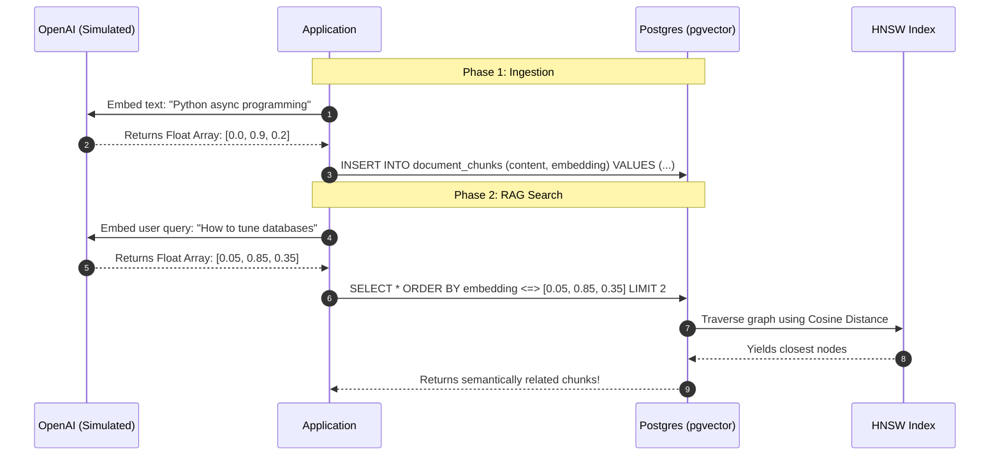

# Practical Lab: AI Workloads & Vector Search with pgvector

## 📌 Lab Overview & Objectives

With the explosion of Large Language Models (LLMs), "Retrieval-Augmented Generation" (RAG) has become a core competency for Backend Engineers. 

While many managed "Vector Databases" exist (Pinecone, Milvus), adopting a completely new database architecture introduces extreme complexity, data synchronization nightmares, and high costs.

The PostgreSQL extension **`pgvector`** completely eliminates the need for a dedicated Vector Database. It allows you to store high-dimensional embeddings and perform lightning-fast similarity searches right alongside your relational data.

### Key Skills You Will Master

- **Vector Primitives**: Using the `Vector` data type to store embeddings generated by LLMs.
- **Similarity Searching (KNN)**: Using the Cosine Distance operator (`<=>`) via SQLAlchemy to find semantically similar documents.
- **ANN Indexing (HNSW)**: Solving the $O(N)$ scanning bottleneck by building Hierarchical Navigable Small World indexes for sub-millisecond vector lookups at massive scale.

---

## 🛠️ Prerequisites & Environment Setup

### Workspace Structure

Your lab folder is organized as follows:

```text
relational-database-skills-lab/
└── labs/
    └── 023-pgvector-ai-workloads/
        ├── pyproject.toml         # Includes 'pgvector' and 'numpy' dependencies
        ├── docker-compose.yml     # Uses the official 'pgvector/pgvector' Docker image
        ├── .env.example
        ├── app/
        │   ├── config.py
        │   ├── dependencies.py    # Executes 'CREATE EXTENSION vector'
        │   └── models.py          # DocumentChunk with a Vector(3) column
        ├── lab_step_1.py          # Step 1: K-Nearest Neighbor (KNN) search
        ├── lab_step_2.py          # Step 2: HNSW Indexing
        └── README.md
```

### Initial Bootstrap:

1. Open your terminal and navigate to the lab folder:
    ```bash
    cd labs/023-pgvector-ai-workloads
    ```
2. Copy the environment variables template:
    ```bash
    cp .env.example .env
    ```
3. Launch the database container in the background (Note: this downloads the special `pgvector` image!):
    ```bash
    docker compose up -d
    ```
4. From the project root, sync dependencies using `uv`:
    ```bash
    cd ../..
    uv sync --all-packages
    ```
5. Activate the virtual environment:
    ```bash
    source .venv/bin/activate
    ```

---

## 📝 Lab Flow & Sequence



---

## 🔬 Core Lab Steps & Content

### Step 1: K-Nearest Neighbor (KNN) Search

#### 📘 Step 1 Theory
An LLM takes text and converts it into an array of floating-point numbers (a Vector) that represents the "semantic meaning" of the text. 
To find texts that mean similar things, we calculate the mathematical distance between their vectors in high-dimensional space.

`pgvector` provides operators to calculate this directly inside SQL:
- `<->` : Euclidean Distance (L2)
- `<#>` : Negative Inner Product
- `<=>` : **Cosine Distance** (The industry standard for text embeddings like OpenAI's `text-embedding-3`).

We sort the entire table by this distance and use `LIMIT` to grab the closest ones. This is known as Exact Nearest Neighbor (KNN).

#### 🧪 Step 1 Lab Execution
Run the first script to insert 3D vectors and search against them:
```bash
python labs/023-pgvector-ai-workloads/lab_step_1.py
```
> **Observe**: 
> 1. We seeded 5 distinct concepts (Pets, Programming, Baking).
> 2. We simulated a user searching for "database tuning", yielding a specific query vector.
> 3. SQLAlchemy successfully generated an `ORDER BY embedding <=> query_vector` statement.
> 4. The database mathematically returned the Python and SQLAlchemy documents as the closest matches, entirely ignoring the text strings themselves!

---

### Step 2: Approximate Nearest Neighbor (HNSW) Indexing

#### 📘 Step 2 Theory
The exact KNN query we ran in Step 1 forces PostgreSQL to calculate the cosine distance between the query vector and **every single row in the table**, and then sort the results. This is an $O(N)$ operation (a `Seq Scan`). If you have 10 million documents, a single search could take seconds.

To solve this, `pgvector` supports **HNSW (Hierarchical Navigable Small World)** indexing.
HNSW builds a multi-layered graph of your vectors. When you search, it doesn't scan the table; it "navigates" through the graph layers, finding the approximate nearest neighbors in $O(\log N)$ time.

#### 🧪 Step 2 Lab Execution
Run the second script to analyze the performance bottleneck and fix it:
```bash
python labs/023-pgvector-ai-workloads/lab_step_2.py
```
> **Observe**: 
> 1. The script runs an `EXPLAIN` on the sorting operation, confirming the devastating `Seq Scan` and `Sort`.
> 2. It executes a `CREATE INDEX ... USING hnsw (embedding vector_cosine_ops)`.
> 3. It re-runs the `EXPLAIN`, proving that PostgreSQL will now use a blazing-fast `Index Scan` on the HNSW graph to find similarities!

---

## 🎯 Lab Outcomes & Verification Checklist

To successfully complete this lab, you must produce and verify the following results:

- [ ] **Step 1**: Execute `lab_step_1.py` and verify that the Cosine Distance operator correctly prioritizes the programming documents over the baking/pet documents.
- [ ] **Step 2**: Execute `lab_step_2.py` and observe the transition from a `Seq Scan` to an `Index Scan` after building the HNSW index.

When you are finished with your local experiment, tear down your sandbox:

```bash
docker compose down -v
```

---

## ❓ Deep-Dive Self-Assessment

Formulate answers to these production-level questions based on your observations during this lab:

1. _Why does `pgvector` require us to explicitly specify the `vector_cosine_ops` operator class when building the HNSW index if we want to sort by `<=>`?_
2. _HNSW is an "Approximate" Nearest Neighbor (ANN) algorithm. What is the engineering trade-off between an Exact KNN search (Seq Scan) and an ANN search (HNSW Index)?_
3. _In a real RAG application, you often want to filter by tenant ID *before* performing the similarity search (e.g., `WHERE tenant_id = 5 ORDER BY embedding <=> query`). How does applying a standard `WHERE` clause complicate the efficiency of an HNSW index?_
